## Resumen

En este trabajo se propone un enfoque basado en aprendizaje profundo para mejorar la calidad de los espectros de baja resolución captados por los fotómetros azul y rojo (BP/RP; Blue Photometer / Red Photometer) del satélite Gaia, aproximándolos a espectros de mayor resolución equivalentes a los del sondeo digital del cielo Sloan (SDSS; Sloan Digital Sky Survey). Para ello se ha construido un conjunto de datos propio con más de 55 000 pares de espectros emparejados de Gaia y SDSS, obtenido al cruzar la tercera liberación de datos (DR; Data Release) de Gaia (DR3) con la decimotercera de SDSS (DR13) mediante la tabla oficial de mejores vecinos, y depurado con criterios de calidad basados en la relación señal-ruido (SNR; Signal-to-Noise Ratio) y en la coherencia entre ambas fuentes. Sobre este conjunto se han entrenado y comparado tres arquitecturas de red neuronal: una red densa, una red convolucional unidimensional y una red recurrente.

Los resultados muestran que ninguna de las arquitecturas destacó de forma unívoca en todos los criterios de evaluación. La red convolucional U-Net obtuvo los mejores valores de pérdida y de error medio en entrenamiento, validación y test, y reprodujo regiones de emisión y absorción que el espectro de entrada de Gaia no registraba, aunque generó predicciones más suavizadas que el resto de modelos. La red densa con normalización por la mediana de cada espectro quedó en segunda posición en esas métricas, pero fue la mejor en las dos evaluaciones independientes del entrenamiento: el chi-cuadrado normalizado frente al espectro real de SDSS, con una mediana de 1.52 sobre el conjunto de test, y la estimación de parámetros astrofísicos con la librería *iSpec*, con errores relativos medianos del 0.23% en la temperatura efectiva, 0.09% en la gravedad superficial y errores absolutos en torno a 0.02 dex en la metalicidad. Las diferencias entre arquitecturas fueron pequeñas bajo *iSpec*, lo que indica que todas conservaron la información física del espectro real, y la similitud entre las métricas de entrenamiento, validación y test descarta el sobreajuste. Estos resultados demuestran la viabilidad de emplear redes neuronales para trasladar el detalle de las observaciones terrestres de alta resolución al extenso catálogo de Gaia.

## Abstract

This work proposes a deep learning-based approach to improve the quality of the low-resolution spectra captured by the blue and red photometers (BP/RP) of the Gaia satellite, approximating them to higher-resolution spectra equivalent to those of the Sloan Digital Sky Survey (SDSS). To this end, a dedicated dataset of more than 55,000 matched pairs of Gaia and SDSS spectra has been built by cross-matching the third Gaia data release (DR3) with the thirteenth SDSS data release (DR13) through the official best-neighbour table, and refined with quality criteria based on the signal-to-noise ratio (SNR) and on the consistency between both sources. Three neural network architectures have been trained and compared on this dataset: a dense network, a one-dimensional convolutional network and a recurrent network.

The results show that no single architecture stood out across every evaluation criterion. The convolutional U-Net achieved the best loss and mean error values on the training, validation and test sets, and reproduced emission and absorption regions that the input Gaia spectrum did not record, although it produced smoother predictions than the other models. The dense network with a per-spectrum median normalization came second on those metrics, but was the best on the two evaluations that are independent of training: the normalized chi-squared against the real SDSS spectrum, with a median of 1.52 on the test set, and the estimation of astrophysical parameters with the *iSpec* library, with median relative errors of 0.23% in effective temperature and 0.09% in surface gravity, and absolute errors of around 0.02 dex in metallicity. The differences between architectures were small under *iSpec*, indicating that all of them retained the physical information of the real spectrum, and the similarity of the metrics obtained on the training, validation, and test sets rules out overfitting. These results demonstrate the feasibility of using neural networks to transfer the detail of high-resolution ground-based observations to the vast Gaia catalogue.

## Organización del trabajo en grupo

<!--
Igual que el Resumen/Abstract, esta tabla no forma parte del cuerpo de la
memoria: `_filters/process_group_work.lua` la extrae a los metadatos
`group_work` y `_partials/group-work.typ` la renderiza con el formato
requerido por la plantilla grupal (páginas VII-VIII). Columna
"Responsables" pendiente de rellenar por los autores.
-->

Este trabajo fue desarrollado de manera conjunta por los dos autores. Para coordinar el desarrollo se mantuvieron reuniones periódicas de seguimiento, junto con las revisiones con el director del trabajo, y se empleó un repositorio de control de versiones compartido tanto para el código como para la memoria, donde los avances de cada autor se integraron mediante revisiones cruzadas.

En cuanto al reparto concreto de las tareas, el desarrollo del código usado se dividió principalmente en dos bloques. Por un lado, Javier se encargó de la creación del proceso de extracción de los datos para el entrenamiento del modelo, incluyendo la extracción de datos de Gaia y del [SDSS]{.acr} y su descarga. 
En cambio, Carla se centró en el preprocesado de dicha base de datos y el diseño de las redes neuronales densas y recurrentes, incluyendo el ajuste de los hiperparámetros y la evaluación de los resultados obtenidos. Javier intervino en la creación de las arquitecturas convolucionales estudiadas.

Por otro lado, la elaboración de la memoria también se repartió entre los dos autores. Carla desarrolló los apartados de introducción, contexto, discusión y conclusiones. Mientras que Javier trabajó en el estado del arte, metodología y objetivos. 

Los capítulos 4 y 5, llamados *Descripción del experiento* y *Descipción de los resultados*, fueron redactados por ambos autores teniendo en cuenta quien desarrolló principalmente el código relacionado con cada subapartado. 

Aunque las tareas se hayan repartido entre ambos autores, el desarrollo no se llevó a cabo de forma independiente. Tanto la memoria como el código utilizado fueron revisados de manera cruzada, permitiendo a ambos autores aportar ideas y posibles mejoras sobre el trabajo. Por tanto, las divisiones descritas anteriormente indican el autor principal del apartado o código, pero no implican que dichas partes hubieran sido desarrolladas únicamente por esa persona. Gracias a las revisiones se detectaron errores, mejoras y ajustes que debían incorporarse con tal de mantener un formato común y asegurar coherencia en el proyecto.

| Apartado de la memoria | Responsables |
|---|---|
| Introducción | Carla Sequero|
| Contexto y estado del arte | J. Javier Cacho |
| Objetivos concretos y metodología de trabajo | J. Javier Cacho |
| Descripción del experimento | Carla Sequero, J. Javier Cacho |
| Descripción de los resultados | Carla Sequero, J. Javier Cacho |
| Discusión | Carla Sequero |
| Conclusiones y trabajo futuro | Carla Sequero |

<!--
El "Índice de acrónimos" se genera en las páginas preliminares (tras el Índice
de Tablas), desde `_partials/acronyms.typ`, leyendo `_acronyms.yml`.
Para referenciar un acrónimo en el texto: [ESA]{.acr}
La primera aparición se expande encabezada por el término en español
—p. ej. «Agencia Espacial Europea (ESA; European Space Agency)»—
y las siguientes muestran solo la sigla.
-->

## Introducción
 
En diciembre de 2013 comenzó la misión Gaia [@gaiaDR1] con el objetivo de crear un mapa que permitiera conocer más detalles del Sistema Solar y la Vía Láctea. Esta misión es considerada la sucesora de Hipparcos dentro de la [ESA]{.acr}, siendo este el primer satélite dedicado a la astrometría. Dicha misión fue puesta en marcha en 1989 y finalizó en 1993. Los datos que Gaia aporta son 200 veces más precisos que los obtenidos por dicho satélite, pero aun así, de menor calidad que los obtenidos por otros proyectos actuales.  

La propia agencia [ESA]{.acr} describió en el reporte publicado en 2013 donde explicaban detalles de la misión de Gaia [@ESA_Gaia_BR296_2013] que antes de estudiar un objeto celeste, es necesario poder ubicarlo en el plano, de lo contrario solo tendrían un conjunto de datos sin sentido pertenecientes a un mismo conjunto, pero sin un orden o punto de referencia, en sus propias palabras, describieron lo siguiente: 

>"Antes de que los astrónomos puedan estudiar un objeto celeste, deben saber dónde encontrarlo. Sin este conocimiento, los astrónomos vagarían en vano en lo que Galileo alguna vez llamó un oscuro laberinto"
 

Por este motivo, la misión principal de Gaia se puede considerar muy útil para continuar desarrollando estudios y conocimientos acerca del universo.  

Más allá de este objetivo, Gaia ha podido aportar descubrimientos de objetos celestes que anteriormente no conocíamos.
Esta misión ha proporcionado uno de los catálogos más extensos y precisos hasta la fecha [@Gaia_DR3_Summary_2023], no solo aportando datos astrométricos, sino que también fotométricos y espectrofotométricos.

Otras misiones, como ahora la iniciada en el año 2000 con [SDSS]{.acr}, son capaces de proporcionar mediciones con mayor resolución que Gaia, pero con un número de objetos observados y una cobertura del cielo mucho menores [@SDSS_release1].
De este hecho parte la idea del trabajo que se desarrolla a continuación.

Si se pudiese definir una similitud entre los espectros obtenidos por Gaia y [SDSS]{.acr}, conseguiríamos combinar lo mejor de ambos proyectos, el rango espacial que Gaia ha sido capaz de conseguir junto a la calidad y detalle que [SDSS]{.acr} conlleva. 
En este contexto, gracias a los avances constantes de la inteligencia artificial, en este trabajo propusimos explorar técnicas que nos permitieran llevar a cabo este objetivo; convertir espectros de Gaia en su equivalente [SDSS]{.acr}.

### Motivación

A lo largo de 2026 se publicarán los últimos datos recolectados por Gaia en un último DR4 y catálogo final DR5. Se calcula que a lo largo de la misión, unos 2 000 millones de estrellas y otros objetos celestes fueron captados por el satélite. 
Gracias a los datos recolectados, se dispone de una imagen reconstruida sobre cómo un observador vería nuestra galaxia desde el exterior de esta. Esta hazaña se ha conseguido a base de un conjunto de datos donde la información del cuerpo celeste parte fundamentalmente de dos espectros de baja resolución.
La espectroscopía es una de las herramientas principales de la astrofísica para extraer información acerca de los cuerpos astronómicos. Gracias a la distribución de la luz en función de la longitud de onda, se pueden conocer detalles clave acerca de los objetos estudiados, como por ejemplo su composición, la temperatura y la gravedad superficial [@RecioBlanco2016]. 

La motivación de este trabajo partió de explorar si técnicas de aprendizaje automático podían aprender a relacionar la gran cantidad de datos captados por Gaia y los espectros de mayor calidad de [SDSS]{.acr}. Si se modelaba la relación entre ambos datos, se conseguiría mejorar la información obtenida a partir de los datos recolectados por Gaia. 

### Planteamiento del trabajo
El objetivo principal del trabajo que se desarrolla a continuación fue diseñar un modelo basado en redes neuronales que consiguiese convertir espectros de Gaia en espectros equivalentes a los de [SDSS]{.acr}. De esta forma conseguiríamos encontrar un modelo que relacionase los datos captados por ambos proyectos.

Para llevarlo a cabo, primero debíamos entender las características de ambas fuentes de información, dado que los datos que usaríamos debían estar correlacionados entre ambos conjuntos de datos. 
En concreto nos centramos en la tercera [DR]{.acr} de Gaia (Gaia DR3) [@Gaia_DR3_Summary_2023] y la decimotercera de [SDSS]{.acr} (DR13) [@DR13sdss], debido a que estos son los que en el DR3 de Gaia ya se encontraban semi comparados, o por lo menos las asociaciones de vecindad hechas.
Para ser exactos, tratamos de relacionar los espectros de baja resolución de Gaia DR3 y los espectros ópticos de [SDSS]{.acr} DR13.

Para realizar este trabajo seleccionamos el conjunto de datos de Gaia como base de estudio por diferentes motivos, por un lado, estas observaciones son parte de un estudio actual y al mismo tiempo la forma de acceder a los datos es relativamente sencilla, pero por otro, es muy destacable la gran cantidad de información y cuerpos observados que Gaia dispone. Esto nos permitió tener una buena base para tratar de sacar comparaciones con otros satélites y al mismo tiempo justifica la magnitud del efecto que tendría su mejora.

### Estructura del trabajo

El resto de este documento se organiza de la siguiente manera:

En el Capítulo 2 se explican los fundamentos teóricos necesarios para entender los espectros estelares y los conjuntos de datos empleados, y se revisa el estado del arte de los modelos generativos y del aprendizaje profundo aplicados a la astronomía.

En el Capítulo 3 se definen el objetivo general y los objetivos específicos del trabajo, así como la metodología seguida para alcanzarlos, aportando detalles acerca de los datos y librerías usadas.

En el Capítulo 4 se describe el proyecto piloto a realizar, junto con los requisitos mínimos aplicados sobre los datos y los modelos estudiados, el trabajo realizado en cada etapa de la metodología, la herramienta *software* construida para la extracción de los datos y el entrenamiento del modelo.

En el Capítulo 5 se evalúan los resultados obtenidos por cada uno de los modelos estudiados frente a las observaciones reales de [SDSS]{.acr}.

En el Capítulo 6 se realiza una discusión acerca de los resultados obtenidos en el apartado anterior, comparando los datos de cada modelo.

Finalmente, en el Capítulo 7 se recogen las conclusiones del trabajo y se proponen posibles líneas de trabajo futuro.

Todo el material desarrollado —el código de extracción de los datos, el entrenamiento y la evaluación de los modelos — está disponible públicamente en el repositorio del trabajo [@sequeroCacho2026repositorio].

## Contexto y estado del arte

En esta sección se da un contexto al problema anteriormente descrito, comenzando desde la base del conocimiento necesario para entender los datos, hasta las técnicas que se usarán para el desarrollo del modelo de aprendizaje automático. 

Por otro lado, también exploraremos trabajos ya publicados que contengan estudios de alta utilidad para el presente. 

### Contexto del problema

A continuación nos centraremos en desarrollar términos relativos a los espectros estelares, su interpretación y cómo se obtienen y definen en las bases de datos de cada proyecto.

#### Espectros estelares
Podemos definir un espectro estelar como la función que relaciona el flujo captado de una estrella en función de la longitud de onda. Gracias a dicha función, se obtiene la distribución de la energía que emite el cuerpo celeste según el rango óptico dado, lo que permite estudiar ciertas características del cuerpo. Por ejemplo, si nos centramos en los picos del gráfico resultante de su representación, se puede analizar la composición del cuerpo o metalicidad, dado que cada elemento emite o absorbe luz en diferentes rangos. Al mismo tiempo, de este dato también se puede estudiar la temperatura en la que se encuentra dicho elemento. 
Por otro lado, si nos centramos en la anchura de las líneas, hablaríamos de datos como la gravedad superficial.
Estas relaciones han sido estudiadas por muchos científicos a lo largo de los años, como por ejemplo @carroll2017modernastrophysics, quienes recogen de forma amplia las áreas principales de la astrofísica.

En la @fig-espectro-ejemplo se muestra un ejemplo de espectro estelar observado por [SDSS]{.acr}, donde se pueden apreciar las líneas de absorción mencionadas.

:::{#fig-espectro-ejemplo}

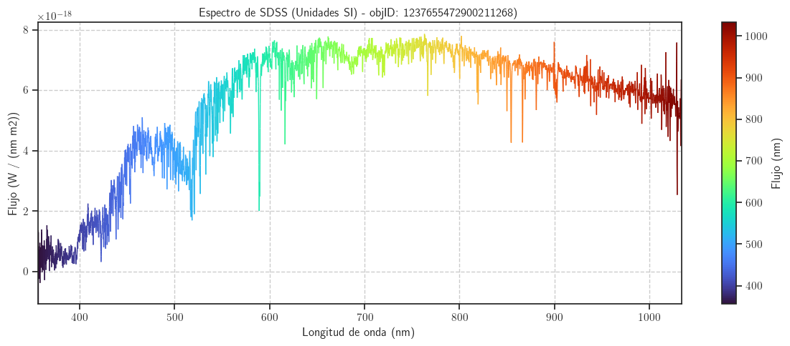

*Fuente: Elaboración propia*

Ejemplo de espectro estelar observado por [SDSS]{.acr .short}
:::

Algunos estudios trataron de crear herramientas automatizadas para la obtención de los datos anteriormente mencionados. Por ejemplo @lee2008segue lo intentó con la sexta liberación datos de [SDSS]{.acr}.

Paralelamente, en la unidad de control número 8 de Gaia se trata de establecer la misma relación, como se puede observar en el trabajo llevado a cabo por @witten2023bprp, donde llegaron a identificar de manera detallada la proporción de composición metálica de las estrellas observadas.

Para cuantificar la calidad de las observaciones, se utiliza la [SNR]{.acr}. Esta medida se expresa como el cociente entre el flujo observado y su error correspondiente. Una [SNR]{.acr} baja indica que en los datos observados predomina el ruido, por lo que son poco precisos, mientras que un valor alto indica lo contrario, poco ruido y una mayor precisión.
Si definimos el error como $\sigma$ y suponemos que el error sigue una distribución normal, $F \pm \sigma$ contendría alrededor del 68% de los valores reales, $F \pm 2\sigma$ el 95% y $F \pm 3\sigma$ el 99.7% de los datos. 
Bajo esta nomenclatura $\mathrm{SNR}=F/\sigma$ y el error relativo de un espectro sería su inversa, $\mathrm{error\ relativo}=\sigma/F$, indicando la incertidumbre expresada en porcentaje del tamaño de la muestra

En los siguientes apartados comentaremos los datos espectrales de Gaia y [SDSS]{.acr}.

#### Datos espectrales de Gaia

El satélite Gaia consta de 3 instrumentos para detectar la luz que recogen sus telescopios [@Gaia_DR3_Summary_2023]. El primero, conocido como astrómetro, mide las posiciones estelares en el cielo, el [RVS]{.acr} medirá las velocidades radiales y, por último, el instrumento fotométrico aportará dos espectros de baja resolución de dos bandas ópticas, la azul y la roja. Cabe destacar que, debido al movimiento rotativo de Gaia, se toman unas 70 mediciones fotométricas de cada cuerpo celeste. Estos espectros son preprocesados y tratados por diferentes unidades de coordinación antes de formar parte del conjunto de datos que nosotros usaremos en este trabajo, por lo que el ruido de fondo ya habrá sido reducido significativamente.

El satélite en cuestión se encuentra en una posición espacial conocida como el segundo punto de Lagrange, ubicada a 1.5 millones de kilómetros de la Tierra y donde las fuerzas gravitacionales del Sol, la Tierra y la Luna están en equilibrio. Por otro lado, el satélite, el Sol y la Tierra siempre van a permanecer alineados, impidiendo así que ninguno de los cuerpos celestes mencionados se interponga en el campo de visión de Gaia. 

La espectrofotometría en la que nos basaremos durante el desarrollo de este trabajo es la del [BP/RP]{.acr}, también denominados [XP]{.acr}. Como hemos comentado, estos datos proceden del fotómetro azul y del rojo, lo que permite cubrir entre los 330 y 680 nm gracias al espectro azul y de los 640 a 1050 nm gracias al rojo [@zhang2023parameters]. 
Estos datos se representan por aproximadamente 110 elementos efectivos de resolución [@deangeli2023bprp], con un poder de resolución variable según la longitud de onda de aproximadamente R $\sim$ 50 - 160. 
Este detalle conlleva que en la tercera liberación de datos de Gaia no obtengamos directamente una tabla de relación flujo - longitud de onda, sino que los espectros vienen dados por coeficientes [XP]{.acr} que deben transformarse con ayuda de librerías como *GaiaXPy* [@deangeli2022gaiabprp].

#### Datos espectrales de [SDSS]{.acr .short}
En contraposición a Gaia, este trabajo también usará y analizará datos conseguidos gracias a [SDSS]{.acr}, proyecto iniciado con el mismo objetivo que Gaia, crear un mapa tridimensional, pero, a diferencia de este, basado en observaciones terrestres. En este caso, el mapa actual creado gracias a este sondeo contiene más de 930 000 galaxias.

La primera operación bajo el nombre [SDSS]{.acr} comenzó en el año 2000, y sigue activo con su quinta fase [SDSS]{.acr}-V, que tiene planteado llegar a su fin en 2027 [@sdsscollaboration2025nineteenthdatareleasesloan].

Aunque la última publicación de datos de [SDSS]{.acr} sea la número 19, tal y como hemos comentado anteriormente, dado que el análisis de cruce de datos de Gaia DR3 se ha llevado a cabo con el DR13 de [SDSS]{.acr}, este será usado durante el estudio aunque no pertenezca a la fase más avanzada del proyecto sino a la cuarta. 

A diferencia de Gaia, [SDSS]{.acr} proporciona directamente espectros ópticos en longitud de onda y flujo, y estos datos se almacenan distribuidos a lo largo de archivos del [FITS]{.acr}. En esta base se pueden encontrar variables como la longitud de onda y el flujo espectral.

Dentro del proyecto de [SDSS]{.acr}, el [MANGA]{.acr} se encarga de procesar los datos con tal de crear el mapa estelar, en su artículo original para [SDSS]{.acr}-IV [@manga2015] encontramos que el rango espectral aproximado de [SDSS]{.acr} se mantiene entre los 360 y 1030 nm y su resolución se encuentra en R $\sim$ 2000.

#### Comparativa de los espectros de Gaia y [SDSS]{.acr .short}
Gaia y [SDSS]{.acr} comparten gran parte de su rango óptico pero con datos captados con estrategias e instrumentos diferentes. Esto se enfatiza cuando comparamos los espectros observados por cada proyecto acerca del mismo cuerpo celeste. En la @fig-gaia-sdss se muestra un ejemplo aleatorio.

:::{#fig-gaia-sdss}

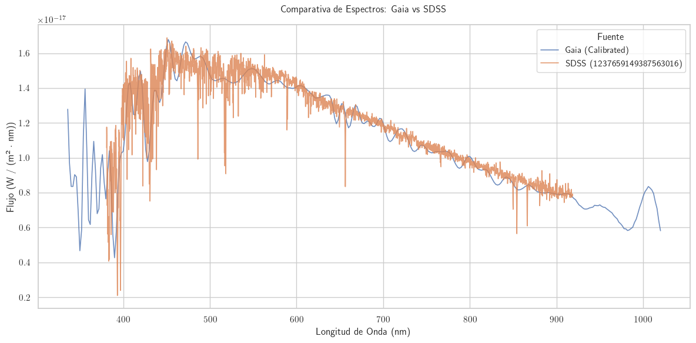

*Fuente: Elaboración propia*

Ejemplo aleatorio del espectro captado de un mismo cuerpo por Gaia y [SDSS]{.acr .short}
:::

Podemos observar como claramente el intervalo que [SDSS]{.acr} cubre es muy similar a Gaia, pero existe una gran diferencia en cuanto a la suavidad de las curvas representadas. Como vemos, [SDSS]{.acr} incluye muchos más detalles que Gaia, su espectro tiene una resolución superior. 
Por otro lado, si nos fijamos en los datos captados en los extremos de visión de Gaia, notamos la posibilidad de que en rangos inferiores a 400 nm estemos observando artefactos u obteniendo mediciones muy poco precisas. Lo mismo sucede en valores superiores a 950 nm. Diversos estudios han observado una menor precisión y un error mayor en intervalos muy similares a los mencionados en este trabajo, por ejemplo el artículo de @Huang2024.

A lo largo del trabajo, para garantizar que los datos analizados correspondiesen al mismo objeto astronómico, se empleó la tabla de cruce oficial de DR3 denominada *gaiadr3.sdssdr13_best_neighbour* que se puede consultar en el archivo de Gaia [@gaiaDR3sdssBestNeighbourDataset]. Esta tabla contiene para cada cuerpo observado por Gaia, el vecino más cercano en [SDSS]{.acr} DR13, es decir, el que cuenta con una mayor probabilidad de que estén describiendo el mismo cuerpo celeste. El procedimiento con el cual se establece esta vecindad se encuentra descrito en la documentación oficial de Gaia DR3 [@Gaia_DR3_Documentation_2023], que puede consultarse en el propio archivo de Gaia. Dentro de este conjunto, definiremos un umbral de aceptación dado por la distancia angular, fijado en 2 segundos de arco.

### Estado del arte

En los últimos años, la astronomía se ha beneficiado de las técnicas de aprendizaje automático, principalmente en tareas tradicionales como clasificación y agrupamiento. Por ejemplo, @djorgovski2022applications señalan que "una amplia variedad de métodos de clasificación y agrupamiento se ha aplicado a estas tareas, y sigue siendo un área de investigación muy activa". En efecto, muchos esfuerzos han estado enfocados en reconocer tipos de estrellas o galaxias, identificar eventos transitorios, y diferenciar estrellas de galaxias, aprovechando catálogos masivos con miles de características. Estos enfoques basados en aprendizaje automático clásico han permitido lidiar con el flujo de datos de observaciones astronómicas mediante el uso de la clasificación supervisada o el agrupamiento no supervisado.

#### Modelos generativos en Astronomía

Paralelamente, ha crecido el interés en generar datos astronómicos sintéticos mediante modelos generativos. En particular, la [GAN]{.acr} se ha aplicado con éxito en algunos contextos. Por ejemplo, @garcia2022improving propusieron un método de aumento de datos basado en [GAN]{.acr} para generar curvas de luz sintéticas de estrellas variables y mostraron cómo su modelo logra producir variaciones realistas de luminosidad, mejorando significativamente la precisión que alcanza la clasificación cuando se entrena con estos datos sintéticos adicionales. Esto ejemplifica cómo las [GAN]{.acr} pueden crear nuevos ejemplos de baja complejidad (en este caso series temporales) para compensar la escasez de datos etiquetados.

Asimismo, dada la enorme base de datos espectrales de baja resolución de la misión Gaia (más de 220 millones de espectros [BP/RP]{.acr} en Gaia DR3), se han desarrollado modelos generativos específicos para estos datos. @laroche2025closing introdujeron un *autoencoder* variacional generativo no supervisado que aprende directamente de los espectros Gaia sin necesidad de etiquetas estelares. Su arquitectura sigue el esquema *encoder-decoder* propio de los *autoencoders* variacionales: un codificador comprime los coeficientes de los espectros [BP/RP]{.acr} en un espacio latente de baja dimensión y un decodificador reconstruye el espectro a partir de dicha representación, entrenándose ambos de forma conjunta mediante la optimización de la [ELBO]{.acr}. Su modelo reproduce los espectros [BP/RP]{.acr} y detecta patrones en áreas donde el aprendizaje supervisado falla debido a la falta de referencias. De hecho, antes de este trabajo la única aproximación generativa para los espectros de Gaia era supervisada: @zhang2023parameters entrenaron un modelo capaz de generar el espectro [XP]{.acr} a partir de los parámetros estelares, apoyándose para ello en un conjunto reducido de estrellas de Gaia que cuentan con una observación equivalente en el sondeo espectroscópico terrestre LAMOST, del cual se obtuvieron dichos parámetros de referencia. Estos desarrollos recientes demuestran que los modelos generativos pueden explorar el conjunto masivo de datos Gaia para *aproximar* datos de mayor resolución. 

#### Aprendizaje profundo en Astrofísica

A pesar de estos avances, el uso de redes neuronales profundas en astronomía sigue siendo relativamente reciente y sujeto a debate. @ting2025deep destaca que, aunque estas técnicas ofrecen *perspectivas diversas* y capacidades de modelar relaciones complejas, todavía enfrentan retos importantes. Según Ting, la astronomía ha entrado en una era de datos sin precedentes, lo que ha impulsado a muchos investigadores a adoptar métodos de aprendizaje profundo para procesar observaciones modernas. Sin embargo, las reacciones varían: algunos científicos ven estas redes profundas como herramientas transformadoras, mientras que otros se muestran escépticos sobre sus verdaderas ventajas. En este contexto, se advierte que aunque las arquitecturas neuronales pueden incorporar sesgos físicos (simetrías, leyes de conservación) en su diseño para generalizar mejor, sigue siendo necesario evaluar cuidadosamente sus resultados. En resumen, el aprendizaje profundo en astrofísica está emergiendo como una vía prometedora que aún se encuentra en una fase exploratoria y que requiere una validación rigurosa antes de tener una aceptación generalizada en este dominio.

Dentro de las evoluciones recientes encontramos el trabajo @grassi2026differentiable, en el que se explora la integración de modelos físicos dentro de arquitecturas de aprendizaje automático, mediante el desarrollo de un modelo geométrico 3D completamente diferenciable para la interpretación de cubos de datos espectrales moleculares. Mediante el uso de librerías de diferenciación automática como JAX, generaron observaciones sintéticas a partir de campos de densidad y velocidad parametrizados, optimizándolos iterativamente para reproducir con precisión las observaciones astronómicas reales. Aunque este enfoque orientado a la física difiere de las redes neuronales generativas utilizadas para relacionar directamente las bandas fotométricas con espectros de alta resolución, subraya la importancia de emplear modelos computacionales avanzados y generación sintética de datos para sortear las limitaciones instrumentales y extraer propiedades subyacentes de las señales astrofísicas, especialmente para la comprensión de la composición química de los objetos celestes radiando dichas señales.

El ejemplo más cercano al enfoque propuesto en este trabajo lo encontramos en un trabajo muy reciente de @haghjoo2026learning. En esta propuesta, se usó el conjunto de datos del [JADES]{.acr} [@curtis2025jades] que proporciona imágenes y espectroscopía profunda combinando observaciones de la cámara (NIRCam) y el espectrógrafo (NIRSpec) del [JWST]{.acr}. Este sondeo es ideal para el estudio porque observa los mismos objetivos de galaxias utilizando una combinación de espectroscopía de prisma de baja resolución (R ~ 30–300) y modos de red de difracción de media resolución (R ~ 1000; mediante los instrumentos G140M, G235M y G395M). A partir de estas observaciones emparejadas, los investigadores seleccionaron una muestra inicial de 1 187 pares de espectros coincidentes, la cual fue ampliada posteriormente a 24 927 muestras mediante técnicas de mejora de datos para el entrenamiento del modelo, tal y como se ilustra en la @fig-jades-mejora-datos.

:::{#fig-jades-mejora-datos}

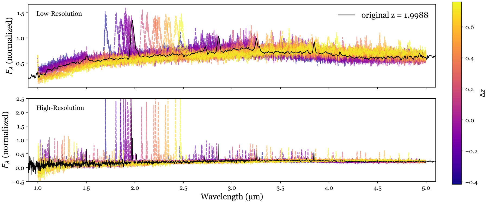

*Fuente: @haghjoo2026learning*

Ejemplo del procedimiento de mejora de datos aplicado a un par de espectros [JADES]{.acr .short} de baja y alta resolución: sobre el espectro original (negro) se generan veinte realizaciones sintéticas (líneas de color) mediante desplazamientos aleatorios del corrimiento al rojo y perturbaciones de flujo.
:::

Este planteamiento guarda un notable paralelismo con el que se persigue en el presente trabajo: en ambos casos se dispone de observaciones reales emparejadas del mismo objeto en baja y en alta resolución, y el objetivo es entrenar un modelo que aprenda a recuperar el detalle de la observación de alta resolución a partir de la de baja resolución. La diferencia principal reside en la escala y naturaleza de los datos de partida: mientras que @haghjoo2026learning contaban únicamente con 1 187 pares reales y recurrieron a la mejora de datos para ampliar el conjunto de entrenamiento, en este trabajo se dispone de decenas de miles de pares reales de espectros Gaia-[SDSS]{.acr}, lo que permite abordar el problema directamente con los datos observados sin necesidad de generar realizaciones sintéticas adicionales.

Para llevar a cabo este estudio, los investigadores desarrollaron una red neuronal profunda personalizada de tres etapas, diseñada específicamente para procesar datos unidimensionales. La primera etapa emplea una [CNN]{.acr} residual (1D ResNet-CNN) que genera una reconstrucción preliminar y conservadora del espectro. La segunda etapa utiliza otra red convolucional para inferir el corrimiento al rojo (*redshift*), contextualizando así la posición física de los elementos. Finalmente, la tercera etapa de refinamiento divide el trabajo en dos ramas: un modelo basado en mecanismos de atención (*Transformer encoder*) que procesa de manera aislada las líneas de emisión, y otra red convolucional que ajusta suavemente el continuo del espectro. En total, esta arquitectura por fases cuenta con unos 2,5 millones de parámetros y está diseñada para aplicar correcciones basadas en la física, evitando que la [IA]{.acr} "alucine" datos inexistentes.  

Los resultados demostraron que este modelo es capaz de recuperar con éxito detalles de alta resolución a partir de observaciones de baja calidad. El sistema logró desmezclar y separar de manera efectiva líneas de emisión que aparecían fusionadas en los datos originales (como el doblete de [O III] y Hβ), mejorando sistemáticamente la [SNR]{.acr} en todas las líneas de diagnóstico clave. Además, los espectros superresueltos generados por la [IA]{.acr} alcanzaron niveles de ruido comparables a las observaciones reales de alta resolución y permitieron realizar estimaciones del corrimiento al rojo mucho más precisas, reduciendo a la mitad la dispersión de errores y disminuyendo significativamente los casos atípicos frente a los datos de entrada.

### Conclusiones

La integración y estandarización de catálogos astronómicos masivos representa un desafío técnico fundamental, especialmente al trabajar con fuentes de naturalezas distintas como Gaia y [SDSS]{.acr}. Mientras que Gaia provee un volumen de datos astrométricos, fotométricos y espectroscópicos sin precedentes, sus espectros [BP/RP]{.acr} operan en resoluciones bajas y requieren complejos procesos de calibración para mitigar el ruido espacial y las fluctuaciones. Cabe matizar que el espectrómetro [RVS]{.acr} de Gaia alcanza una resolución incluso mayor que la de [SDSS]{.acr}, pero al requerir estrellas más brillantes dispone de muchas menos fuentes observadas. En contraste, [SDSS]{.acr} aporta espectros ópticos de mayor resolución que los [BP/RP]{.acr}. La necesidad de interconectar ambas misiones define el núcleo de este estudio: establecer una relación sólida capaz de traducir y equiparar los espectros de baja resolución de Gaia con los espectros de mayor resolución de [SDSS]{.acr}.

Para abordar este asunto, el análisis del estado del arte evidencia una transición desde el uso de estas herramientas únicamente para clasificación o agrupamiento clásico hacia el uso de las [GAN]{.acr} y los *autoencoders* variacionales, que recientemente han demostrado su utilidad para la generación de datos sintéticos realistas y se establecen ya como herramientas útiles para la calibración y otras áreas relevantes en el estudio astronómico.

Avanzando aún más allá, el éxito reciente en la mejora de resolución de datos del telescopio [JWST]{.acr} mediante modelos generativos muestra que la aplicación de estas técnicas representa una solución viable que puede ser también aplicada en el contexto del catálogo astronómico que ofrece Gaia.  

El propósito de la propuesta planteada en este documento es profundizar en la aplicación de estas técnicas novedosas ofreciendo soluciones útiles que aporten mejoras tangibles en el ámbito de la astronomía, específicamente para la mejora de las señales contenidas en el amplio catálogo que Gaia nos ofrece.

## Objetivos concretos y metodología de trabajo

En este capítulo se detalla el objetivo principal de este trabajo y su desglose en objetivos más específicos para alcanzarlo.

También se expone la metodología empleada para afrontar dichos objetivos.

### Objetivo general
El objetivo general de este trabajo consistió en desarrollar un modelo basado en aprendizaje automático que permitiese aproximar el flujo calibrado captado por los fotómetros de baja resolución [BP/RP]{.acr} de Gaia a un espectro de resolución más alta, similar al proporcionado por las observaciones de mayor calidad de [SDSS]{.acr}.

### Objetivos específicos
Para alcanzar el objetivo propuesto, se debían alcanzar previamente los siguientes objetivos intermedios.

- Análisis estructural de la base de datos de Gaia y [SDSS]{.acr}:

El análisis y comprensión de las observaciones y la manera en la que estaban organizadas en los repositorios de Gaia y [SDSS]{.acr} eran fundamentales para entender cuáles eran los datos relevantes a extraer.  

Era también necesario comprender la relación entre las mediciones de ambos sondeos astronómicos para usar observaciones coincidentes, referidas a los mismos objetos del catálogo de objetos celestes.

- Preselección de los datos:

Una vez se obtuvo cierta comprensión de los datos, se pudo hacer una valoración más precisa de cuál era la calidad de los mismos, y qué valores no reunían los requisitos para incluirse en el conjunto de datos de entrenamiento. 

Así, se debían definir unos parámetros para excluir los datos menos relevantes para el objetivo principal.

- Extracción de los datos:

Tras haber comprendido qué servicios se podían usar para la extracción de los datos y haber reducido el conjunto de entrada atendiendo a su calidad, el siguiente paso consistió en la extracción de los mismos, usando métodos que optimizasen la descarga de los datos orientados a minimizar el tiempo y los posibles errores que los servicios ofrecidos por los proyectos de Gaia y [SDSS]{.acr} presentaban.

- Preprocesado de los datos:

Una vez extraídos los datos, fue necesario realizar cierto preprocesado de los mismos para mejorar el entrenamiento.

Puesto que en la preselección de las observaciones se tuvieron en cuenta criterios de calidad, y Gaia DR3 ofrecía datos ya procesados y relaciones con [SDSS]{.acr}, el preprocesado en este caso consistió en la selección de observaciones de suficiente calidad como para ser introducidas al modelo, teniendo en cuenta criterios como por ejemplo la [SNR]{.acr}.

- Preparación de los conjuntos de entrenamiento, test y validación:

Una vez los datos estuvieron listos, fue necesario realizar el reparto entre los distintos conjuntos de datos. En concreto se necesitó un conjunto de entrenamiento para encontrar los mejores parámetros de los modelos propuestos, un conjunto de validación para seleccionar el modelo con mejores resultados y tener indicativos en caso de sobreajuste y, finalmente, un conjunto de test con el que estimar la calidad del modelo seleccionado a partir de datos no observados previamente.

- Selección del modelo de redes neuronales más adecuado:

Para el caso expuesto se consideró que las redes neuronales podían aportar una solución novedosa gracias a su no-linealidad.

- Entrenamiento, refinamiento y validación del modelo:

La red neuronal entrenada requirió de un proceso de optimización y ajuste de los hiperparámetros para dar una solución satisfactoria. Asimismo, se llevó a cabo un proceso de validación de los resultados a partir del conjunto de datos creado.

### Metodología de trabajo

De acuerdo a los objetivos expuestos, la metodología empleada para desarrollar este trabajo se estructuró en las siguientes etapas. Las particularidades y la implementación concreta de cada una de ellas se recogen en el Capítulo 4.

1. Análisis exploratorio de los datos: mediante cuadernos *Jupyter* colaborativos se estudió la organización de los repositorios de Gaia y [SDSS]{.acr}, los servicios disponibles para su consulta y la manera de emparejar las observaciones de ambos proyectos referidas a un mismo objeto celeste.

2. Preselección de los datos: a partir del análisis previo se definieron filtros de calidad sobre el cruce de catálogos, con el objetivo de maximizar la fiabilidad de los pares de espectros utilizados.

3. Extracción de los datos: descarga por lotes de los espectros emparejados, de manera reproducible y tolerante a las limitaciones de los servicios públicos de consulta. Esta etapa partió deliberadamente del catálogo espectroscópico de [SDSS]{.acr} y no del cruce fotométrico de Gaia, ya que este último constituyó inicialmente el cuello de botella del proceso: al buscar el espectro de [SDSS]{.acr} correspondiente a cada fuente fotométrica de Gaia, más del 98% de los candidatos carecían de una observación espectroscópica real, dejando un conjunto de datos prácticamente vacío. Invirtiendo el sentido de la consulta —partiendo de [SDSS]{.acr} y buscando la contrapartida en Gaia— se garantizó que cada candidato dispusiera de espectro desde el inicio, lo que elevó la tasa de coincidencia con Gaia a un 20-50%, muy por encima del 1% obtenido con el planteamiento original.

4. Preprocesado de los datos: limpieza de anomalías y artefactos, y homogeneización de los espectros de ambas fuentes para que fueran directamente comparables. En esta etapa se comparó la [SNR]{.acr} de los espectros: cada observatorio puede medir el mismo objeto un número distinto de veces y en condiciones diferentes, por lo que la [SNR]{.acr} puede variar entre observaciones de un mismo cuerpo. Por ello, los pares de espectros que se usaron para entrenar y evaluar el modelo debían presentar una [SNR]{.acr} equivalente.

5. Preparación de los conjuntos de entrenamiento, validación y test: partición del conjunto de datos garantizando una distribución homogénea de las muestras y de manera reproducible.

6. Entrenamiento, refinamiento y validación del modelo: proceso iterativo de optimización y ajuste de hiperparámetros, evaluando el modelo sobre el conjunto de validación y reservando el conjunto de test para la evaluación final.

## Descripción del experimento

En este capítulo se describen los requisitos necesarios para desarrollar el experimento y se detalla el trabajo realizado en cada una de las etapas definidas en la metodología. 

### Definición de los requisitos

Para un correcto desarrollo del experimento, es necesario garantizar una serie de requisitos mínimos. Estos se describen a continuación según el ámbito al que hacen referencia.

#### Requisitos del conjunto de datos

El conjunto de datos usado para el entrenamiento del modelo debía estar formado por pares de espectros de Gaia y [SDSS]{.acr} que correspondiera al mismo objeto astronómico. Para garantizar esta correspondencia se debía usar el catálogo de cruce de datos que Gaia incluye en su tercera liberación de datos, en concreto, la tabla de mejores vecinos entre Gaia DR3 y [SDSS]{.acr} DR13. 

Cada muestra usada debía contener, como mínimo, el identificador de este objeto dentro de su base de datos, el espectro, la malla de longitud de onda correspondiente y la [SNR]{.acr} del espectro. En el caso de [SDSS]{.acr} la [SNR]{.acr} se obtuvo a partir de la variable *ivar*.
El identificador del objeto dependía de la base de datos, ya que en Gaia era suficiente con el *source_id*, mientras que en [SDSS]{.acr} se necesitaban *specObjID*, *plate*, *mjd* y *fiberID* que hacen referencia al identificador único del objeto en la base de datos de [SDSS]{.acr}, el número de placa usada en la observación, la fecha de observación y el número de fibra dentro de la placa asignada al objeto observado.

El conjunto de datos original debía ser almacenado en un formato que fuera eficiente para su uso en el modelo. En este trabajo se consideró el formato HDF5, ya que permite organizar en un solo fichero todos los datos necesarios para su entrenamiento. 

Por último, fue necesaria la aplicación de criterios de calidad y el preprocesado del conjunto de datos a usar.

#### Requisitos de calidad

Una vez extraído el conjunto de datos inicial, las parejas de espectros debían pasar una serie de requisitos mínimos de calidad para ser usadas en el entrenamiento del modelo.

En primer lugar, los espectros debían contener valores numéricos válidos en todo el rango usado, con lo que se descartaron aquellos datos que contenían valores nulos o infinitos. Del mismo modo, se descartaron aquellas observaciones que contenían posibles anomalías en el flujo, como por ejemplo picos extremos o que no encajaban en la tendencia general de la muestra. Al mismo tiempo, también se descartó el caso contrario, muestras donde había una clara falta de variabilidad en el flujo, es decir, por ejemplo, que este fuera un valor constante. Un claro ejemplo se puede observar en la @fig-descarte-constante, donde se aprecia como el espectro captado por [SDSS]{.acr} es nulo:

:::{#fig-descarte-constante}

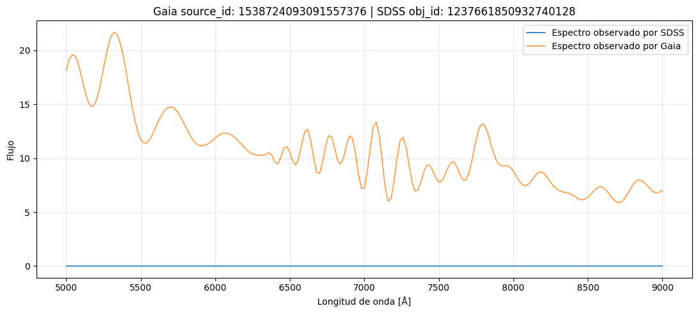

*Fuente: Elaboración propia*

Ejemplo de espectros donde el espectro de [SDSS]{.acr .short} es constante 0.
::: 

Por otro lado, las parejas de espectros de Gaia y [SDSS]{.acr} debían ser coherentes en cuanto a la escala del flujo. Aunque ambos instrumentos presentan resoluciones diferentes, al tratarse de observaciones hechas al mismo cuerpo estelar, la relación entre los flujos no debía situarse en valores extremos. 
Para descartar aquellas muestras que no fueran coherentes, se comparó la media del flujo de ambos espectros y se descartaron aquellos pares cuya relación se encontraba fuera de los límites definidos con el percentil 99 del conjunto de datos. En la @fig-descarte-escala encontramos un ejemplo de lo que se evitó gracias a esta restricción.

:::{#fig-descarte-escala}

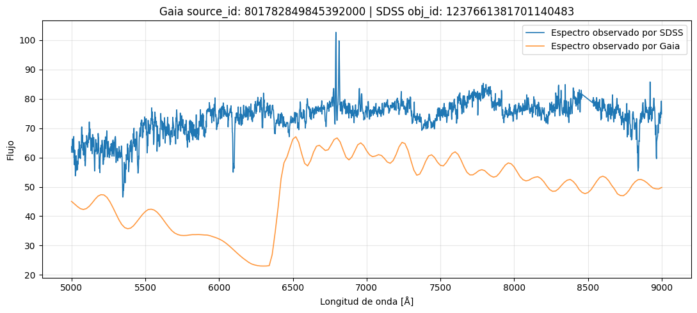

*Fuente: Elaboración propia*

Ejemplo de espectros donde la escala de Gaia y [SDSS]{.acr .short} es diferente.
::: 

En gran parte de los descartes que se realizaron, se usaron los percentiles 95 o 99 para establecer los límites tolerables. Al definirlos de esta forma, no se escogió un valor arbitrario fijo, sino que se tuvo en cuenta el comportamiento estadístico de la muestra, permitiendo extender su uso en casos futuros.

Asimismo, debían tenerse en cuenta la [SNR]{.acr} de las observaciones. Este dato indica la calidad de la señal respecto al ruido, por lo que si este valor es muy bajo, la información del espectro asociado es poco fiable. Respecto a esto, se impusieron dos criterios: por un lado, se descartaron aquellos datos con los valores de [SNR]{.acr} por debajo del percentil 1. Por otro, dado que el modelo trataba de aprender la correspondencia entre las observaciones de Gaia y [SDSS]{.acr} y estos observan los objetos de formas diferentes y no bajo las mismas condiciones, las mediciones pueden presentar niveles de ruido diferentes aun tratándose del mismo cuerpo celeste, por lo que se descartaron aquellos pares en los que la relación entre la media de [SNR]{.acr} de ambos instrumentos fuera mayor al percentil 95 o inferior al 5.

Finalmente, los espectros se recortaron a los rangos de longitud de onda comunes entre Gaia y [SDSS]{.acr} y así se evitó que la generación de datos de salida se viera afectada por la falta de datos de entrada. Al mismo tiempo, se descartaron los intervalos iniciales y finales del rango espectral, ya que en estas zonas suelen aparecer con mayor frecuencia anomalías u observaciones de artefactos. En concreto, se restringirá el intervalo de entrenamiento entre los 500 y 900 nm. 

#### Requisitos del modelo

El modelo basado en redes neuronales debía resolver un problema de regresión multivariante, en el que la entrada fuera un vector de flujo de Gaia y la salida se correspondiera con el espectro de [SDSS]{.acr}. 

Para mejorar la estabilidad del entrenamiento, el modelo debía trabajar con datos normalizados tanto de entrada como de salida. 
Durante el desarrollo de los modelos, diversas funciones de normalización fueron evaluadas.

La separación de los grupos de entrenamiento, validación y test debía llevarse a cabo de forma aleatoria para garantizar la variabilidad dentro de las muestras usadas para entrenar y evaluar el modelo.  El objetivo de esta separación aleatoria era que los conjuntos fueran estadísticamente equivalentes, es decir, el conjunto de entrenamiento debía ser representativo de los conjuntos de validación y test.

La arquitectura y diseño del modelo debían tener capacidad suficiente como para aprender las relaciones entre el espectro de entrada y salida, pero sin llegar a memorizar el conjunto de entrenamiento para así evitar el sobreajuste. 

El modelo debía evaluarse con métricas cuantitativas apropiadas al tipo de dato y al mismo tiempo con un análisis visual de los resultados. 

### Preparación del conjunto de datos

La construcción del conjunto de datos de entrenamiento se automatizó mediante un flujo reproducible y tolerante a fallos, organizado en seis etapas encadenadas. Cada etapa consumía el resultado de la anterior y guardaba su salida en disco de inmediato, de manera que una ejecución interrumpida podía reanudarse desde la primera etapa incompleta sin repetir el trabajo ya realizado. 
A grandes rasgos dicho flujo obtía la referencia de los objetos con espectro en [SDSS]{.acr}, localizaba la contrapartida de cada uno en Gaia, descargaba los espectros para los objetos referenciados de [SDSS]{.acr}, depuraba el listado conservando solo los pares completos, obtienía los espectros calibrados de Gaia y combinaba ambas fuentes en un único conjunto de datos listo para su uso en el ajuste de la red neuronal. A continuación se describe paso a paso el funcionamiento del código creado.

#### Obtención de los objetos con espectro de [SDSS]{.acr .short}

La primera etapa partía del catálogo espectroscópico de [SDSS]{.acr} y recopilaba los metadatos de todos sus espectros primarios. Comenzar por este catálogo garantizaba que cada objeto considerado dispusiera realmente de una observación espectral de [SDSS]{.acr}, lo que evitaba la enorme pérdida de muestras que se produciría al partir del cruce fotométrico en sentido contrario. El resultado fue la lista de candidatos con espectro de [SDSS]{.acr} confirmado.

#### Cruce inverso con Gaia

A partir de esa lista, la segunda etapa consultó el archivo de Gaia en sentido inverso mediante el [ADQL]{.acr}: para cada objeto de [SDSS]{.acr} buscaba la observación del mismo objeto realizada por Gaia que además dispusiera de espectro [BP/RP]{.acr}. La búsqueda se realizó localizando el identificador fotométrico de cada objeto de [SDSS]{.acr} en la tabla de cruce oficial *gaiadr3.sdssdr13_best_neighbour*, descrita en la sección de conjuntos de datos, y aplicando el umbral de aceptación de 2 segundos de arco de distancia angular allí definido; de las fuentes así emparejadas se conservaron solo aquellas que publicaban el espectro [BP/RP]{.acr} continuo. Así se conservó únicamente la intersección de cuerpos observados por ambos proyectos, que constituyó el cruce sobre el que se trabajó.

#### Descarga de los espectros de [SDSS]{.acr .short}.

La tercera etapa descargó el espectro de [SDSS]{.acr} para cada objeto emparejado. Las descargas se realizaron en paralelo y cada espectro se almacenó en cuanto se obtuvo, de modo que el proceso es fue frente a las interrupciones y a las limitaciones de los servicios públicos de consulta.

#### Depuración de referencias

Como no todas las descargas culminaron con éxito, la cuarta etapa depuró el listado de pares y conservó exclusivamente aquellos cuyo espectro de [SDSS]{.acr} se había obtenido correctamente. El resultado fue la tabla de referencia definitiva que vincula cada objeto entre ambos sistemas.

#### Espectros calibrados de Gaia

La quinta etapa recuperó los espectros de Gaia de los objetos ya depurados. Dado que Gaia no proporciona directamente la relación entre flujo y longitud de onda, sino una representación mediante coeficientes, en esta etapa dichos espectros se calibraron para obtener el flujo continuo equivalente y poder usarlo en el modelo.

#### Transformación a datos de entrenamiento

Finalmente, la sexta etapa homogeneizó y combinó ambas fuentes: los espectros de [SDSS]{.acr} se remuestrearon a una rejilla común de longitudes de onda y se guardaron junto a los de Gaia correspondientes en un único fichero con un formato optimizado HDF5. Este fichero es además acumulativo, de forma que sucesivas ejecuciones incorporan los pares nuevos sin descartar los ya almacenados.

Este proceso de extracción permitió reunir un conjunto de datos real con más de 55 000 pares de espectros emparejados de Gaia y [SDSS]{.acr}.

#### Análisis visual de los datos obtenidos

Para analizar la distribución física de los datos usados en el entrenamiento del modelo, se usó una representación del [HR]{.acr} (@hertzsprung1911wellenlaengen y @russell1914spectra). Este diagrama representa la relación entre la luminosidad de las estrellas (eje Y) y su temperatura o color (eje X).

En concreto, se consideró la fuente de datos de Gaia. En el eje horizontal se graficó la variable *bp_rp*, que corresponde al índice de color obtenido a partir de la diferencia entre las medias de las magnitudes de BP y RP. Cuanto menor sea este valor, más azul y caliente será la estrella, mientras que los valores mayores representan estrellas rojas y frías.

En el eje vertical se representó la variable *phot_g_mean_mag*, la magnitud media aparente en la banda G, que indica lo brillante que se aprecia la estrella en las observaciones realizadas. Este valor depende de variables como, por ejemplo, la distancia y la luminosidad de la estrella, aunque también se puede ver afectado por la extinción y absorción estelar. 
Dado que el diagrama [HR]{.acr} se usó meramente con objetivos descriptivos, para eliminar el efecto debido a la distancia y obtener la magnitud absoluta, se usó el paralaje de cada una, sin tener en cuenta el efecto de la extinción estelar.

La fórmula usada partió de la representación del diagrama [HR]{.acr} realizada en el trabajo de @GaiaCollaboration2018HRD. En este artículo se usa la siguiente fórmula para representar todas las observaciones como si se encontrasen a una misma distancia de referencia: 
$$ M_G = m_G + 5 + 5\log_{10}\left(\frac{\varpi}{1000}\right) $$

Aplicando las propiedades de los logaritmos a la fórmula anterior:

$$ M_G = m_G + 5 + 5\left[\log_{10}(\varpi)-\log_{10}(1000)\right] $$

Como $\log_{10}(1000)=3$, se obtiene: 

$$ M_G = m_G + 5 + 5\log_{10}(\varpi)-15 $$

y, simplificando la expresión :

$$ M_G = m_G + 5\log_{10}(\varpi)-10 $$

Donde $\mathrm{m_G}$ corresponde *phot_g_mean_mag* y $\varpi$ es el paralaje expresado en milisegundos de arco.

Tras esta modificación, aquellas estrellas más luminosas, presentaban valores más bajos, incluso negativos, mientras que las menos luminosas se mantuvieron en valores más altos y positivos. 

El diagrama de los datos usados en este estudio es el que se observa en la @fig-HR-diagram:

:::{#fig-HR-diagram}

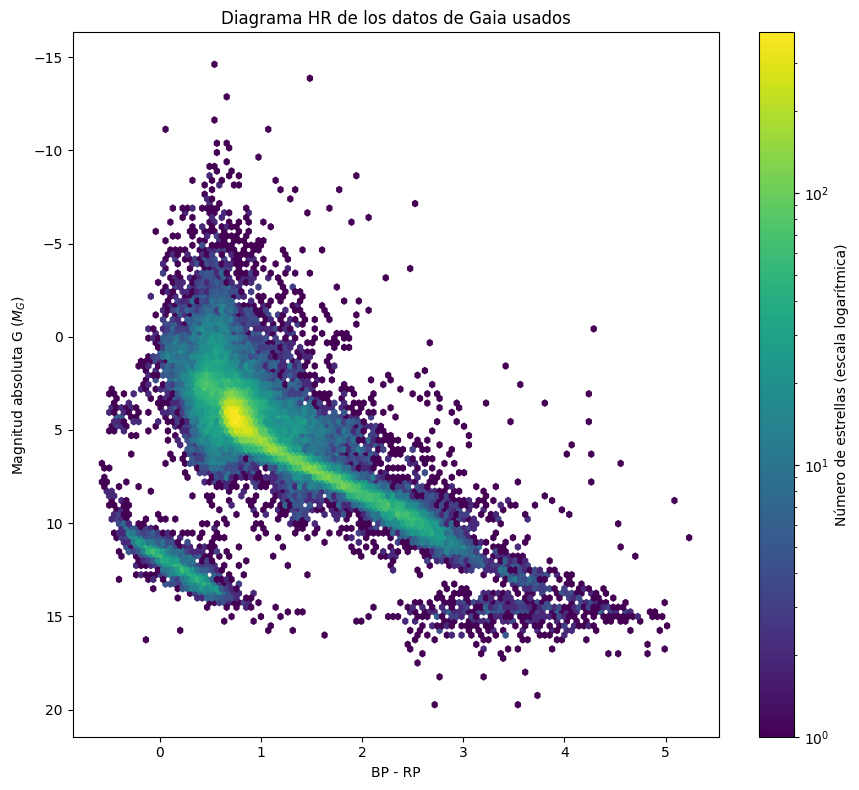

*Fuente: Elaboración propia*

Diagrama [HR]{.acr .short} de las observaciones de Gaia contenidas en la base de datos
:::

En este se apreció como el conjunto de datos no estaba formado por un único tipo de estrella, sino que presentaba objetos con propiedades físicas diferentes. Si bien es cierto, destacaba un grupo mayoritario correspondiente a la secuencia principal, tal y como se aprecia en la parte central del gráfico. 
Además, se apreció un segundo grupo menos numeroso en la parte inferior izquierda, indicando la presencia de enanas blancas en el conjunto de datos.

En contraposición a estos grupos de observaciones, las estrellas gigantes parecían estar representadas en menor grado, ya que no se observó una acumulación de puntos por encima de la secuencia principal.
Esto implicó que el modelo desarrollado fuera entrenado principalmente sobre enanas blancas y estrellas de la secuencia principal. Para extender su aplicación a estrellas gigantes, debería incorporarse una muestra representativa de este tipo de cuerpo estelar y entrenar el modelo de nuevo.

Debido a esta diversidad, el modelo debía adaptarse a fuentes de distintas características, con lo que no se trató de un entrenamiento especializado en un solo tipo de estrella. Sin embargo, la capacidad de predicción podía verse afectada por el porcentaje de representación de cada población.

Al mismo tiempo, se observaron algunos datos dispersos y distantes de las regiones más pobladas, los cuales podían corresponder a objetos con menos representación en la base de datos, es decir, observaciones atípicas para el modelo.

### Análisis de la [SNR]{.acr .short} de los datos obtenidos

Una vez creado y filtrado el conjunto de datos, para analizar la calidad de los espectros, se usó la [SNR]{.acr} y el error relativo. 
En primer lugar, para los espectros de Gaia, se calculó la [SNR]{.acr} a partir del flujo y de la incertidumbre proporcionada por la librería *GaiaXPy*. La mediana obtenida fue de 20.04, representando un error relativo del 5%. 
Para [SDSS]{.acr}, la [SNR]{.acr} se calculó a partir del flujo y la varianza inversa ($1/\mathrm{V_F}$). A partir de estas variables, se definió el error como $\sigma = \sqrt{\mathrm{V_F}}$, calculándose la [SNR]{.acr} como $\mathrm{SNR} = \operatorname{median}\left(\frac{F}{\sigma}\right)$.

 Para calcular la relación entre el flujo y el ruido, se descartaron los valores donde la varianza o la varianza inversa de [SDSS]{.acr} eran cero. De este cálculo, se obtuvo un error relativo del 2.9% y un [SNR]{.acr} de 34.76. 

Observamos a continuación en la @fig-SNR-gaia-sdss la distribución del [SNR]{.acr} en los espectros de Gaia y [SDSS]{.acr}. 

:::{#fig-SNR-gaia-sdss}

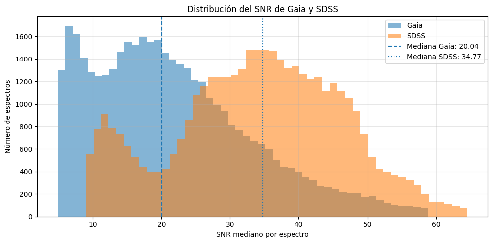

*Fuente: Elaboración propia*

Distribución de la [SNR]{.acr .short} de los espectros de Gaia y [SDSS]{.acr .short}
:::

En esta gráfica se pudo observar la distribución del valor mediano de [SNR]{.acr} de los espectros del conjunto de datos. Se pudo apreciar como [SDSS]{.acr} tenía una distribución centrada en valores más grandes, mientras que Gaia se ubicaba en valores inferiores. Esta observación era la esperada dadas las características de ambos instrumentos.

Por otro lado, se valoró el error relativo mediano según la longitud de onda. En la @fig-error-rel-gaia se aprecian los valores que se obtuvieron para Gaia. 

:::{#fig-error-rel-gaia}

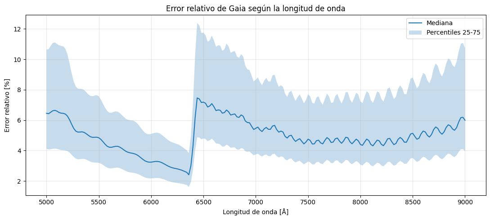

*Fuente: Elaboración propia*

Distribución del error relativo según la longitud de onda de los espectros de Gaia
:::

La evolución del error relativo no fue uniforme. Cerca de los 6500 Å se observó un salto. Este hecho coincidió con el rango en el que se solapan las mediciones de BP y RP. La discontinuidad podía deberse al proceso con el que se solapan ambos espectros. 
Además, cabe destacar que los valores menores se encontraban en la zona del salto, alcanzando el mínimo sobre los 6400Å. Después del salto, en el que el error incrementó bruscamente, el error relativo volvió a ser descendiente y parecía mantenerse constante en la zona central del espectro rojo, volviendo a aumentar en las longitudes de onda más elevadas.
Asimismo, los percentiles 25 y 75 indicaron que la variabilidad era más alta en la zona del salto que en los extremos de la longitud espectral analizada y menor cerca del final del rango del espectro azul. 

En la @fig-error-rel-sdss encontramos la distribución de [SDSS]{.acr}. 

:::{#fig-error-rel-sdss}

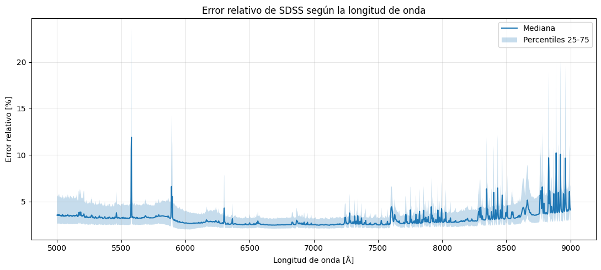

*Fuente: Elaboración propia*

Distribución del error relativo según la longitud de onda de los espectros de [SDSS]{.acr .short}
:::

A diferencia de Gaia, el error relativo se mantuvo mayormente constante a lo largo de todo el intervalo estudiado, teniendo una tendencia creciente a partir de los 8000 Å.
Por otro lado, el mínimo se alcanzó entre los 6000 y 7500 Å. 
A partir de los 9000 Å la mediana fue más inestable y la banda de los percentiles 25 y 75 se ensanchó. Este dato implica que los datos son menos precisos en el extremo rojo del flujo. 

Sobreponiendo el espectro del mismo objeto observado por Gaia y [SDSS]{.acr} con su respectiva banda +-error, obtuvimos los gráficos observados en la @fig-error-margins. 

:::{#fig-error-margins}

::::{layout-row="[[1],[1]]"}

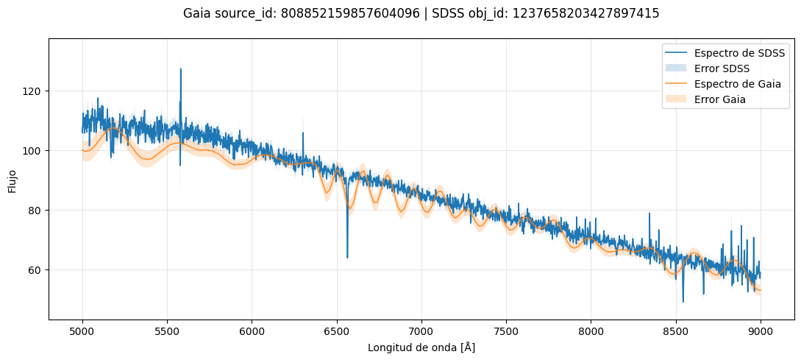

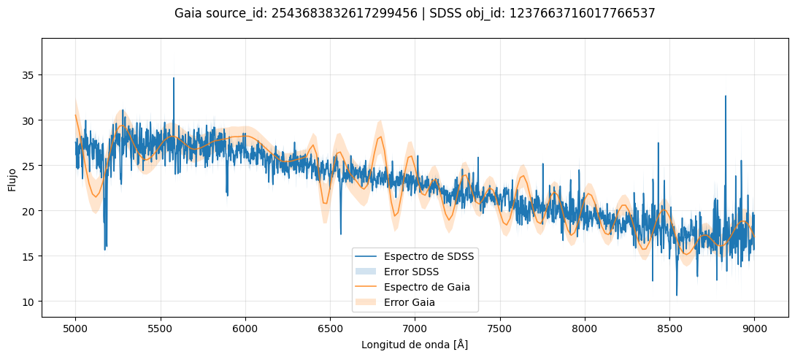

::::

*Fuente: Elaboración propia*

Ejemplos de los espectros observados por Gaia y [SDSS]{.acr .short} con bandas de error
:::

En estos se observó cómo la banda de error de Gaia tendía a ser más ancha y constante, mientras que [SDSS]{.acr} presentaba picos donde la imprecisión era destacable.

### Entrenamiento del modelo

Una vez se dispuso de la base de datos con los pares de espectros de Gaia y [SDSS]{.acr}, se procedió con el preprocesamiento de los datos, diseño y entrenamiento del modelo de redes neuronales. 
El objetivo era conseguir un modelo que aprendiese una transformación entre los datos de entrada de Gaia y el espectro de [SDSS]{.acr} asociado. Así pues, el modelo planteado recibía como entrada un vector con el flujo de Gaia y obtenía como salida un vector con una aproximación del flujo correspondiente al espectro de [SDSS]{.acr}.

De cara a la preparación de la base para el entrenamiento del modelo, se definieron 3 subconjuntos: entrenamiento, test y validación. 
El 80% de los datos se usó para el entrenamiento del modelo, mientras que el 20% restante fue dividido de forma aleatoria entre los conjuntos de test y validación, siendo cada uno un 10% de los datos originales.
 

#### Planteamiento general del entrenamiento
Para encontrar el modelo óptimo, se realizaron diversas pruebas con tal de analizar como afectaban al rendimiento del modelo. 
En primer lugar, se probaron diferentes funciones de normalización para facilitar el entrenamiento de la red neuronal, ya que las variables de entrada y salida se situaban en escalas similares cercanas a 1 y las funciones de pérdida se ubicaban en valores de más fácil interpretación.
Como punto de partida, se aplicó una normalización global a través de la media y desviación típica de los datos del conjunto de entrenamiento. Esta opción no proporcionó malos resultados (tal y como se puede observar en los próximos apartados) y tenía la ventaja de que se podía deshacer la normalización sin necesidad de conocer los valores del conjunto de test, pero al tratarse de un proceso demasiado generalizado para la variabilidad de valores de los espectros, se probaron otros enfoques. Por ejemplo, se consideró la normalización espectro a espectro, en la que cada flujo se normalizaba en su propia escala con la mediana de sus datos o su máximo. 

Las diferentes pruebas de normalización se realizaron durante el ensayo del modelo neuronal denso, dado que era el más simple y rápido de entrenar para poder observar los resultados de pequeñas modificaciones como esta.
Una vez se definió la normalización más efectiva, fue usada en modelos posteriores. 

Probamos también la adición de los datos de la [SNR]{.acr} del espectro de Gaia como parte del conjunto de entrada. En este caso, los resultados obtenidos no mejoraron significativamente, por lo que se descartó y continuó el estudio sin este dato de entrada.

#### Modelo base: red neuronal densa
Después de un procedimiento de prueba y error, el modelo que mejores resultados obtuvo dentro de la categoría de red neuronal densa, estaba formado por una capa de entrada del tamaño de los datos de Gaia, varias capas intermedias (una con 512 neuronas y tres más con 1024) y finalmente una capa de salida con tantos puntos como el espectro de [SDSS]{.acr} a predecir.
Además, se probaron diferentes funciones de activación, siendo ELU y LeakyReLU las que obtuvieron mejores resultados debido a que no anulan completamente las neuronas con valores negativos, a diferencia de ReLU, cuyo uso fue descartado. En el problema de regresión al que nos enfrentamos, las desviaciones pueden ser positivas y negativas respecto a la media, así que el uso de los métodos mencionados anteriormente favorecía el aprendizaje.

La @fig-arquitectura-densa recoge la arquitectura resultante. Cada recuadro rotula una capa con su clase y el tamaño de su salida, cada círculo es una neurona, los puntos suspensivos representan las restantes y los rectángulos de los extremos son los tensores de entrada y de salida. La entrada son los 201 puntos del espectro [XP]{.acr} de Gaia, las cuatro capas ocultas alternan LeakyReLU y ELU, y la capa de salida, lineal, produce de una vez los 2666 puntos de la malla de [SDSS]{.acr}, por lo que concentra la mitad de los 5,46 millones de parámetros del modelo. Cada neurona está conectada con todas las de la capa siguiente: la red no asume ninguna relación entre puntos vecinos del espectro y tiene que aprenderla de los datos, que es lo que distingue a esta arquitectura de las convolucionales y recurrentes que se describen en otras secciones.

:::{#fig-arquitectura-densa}

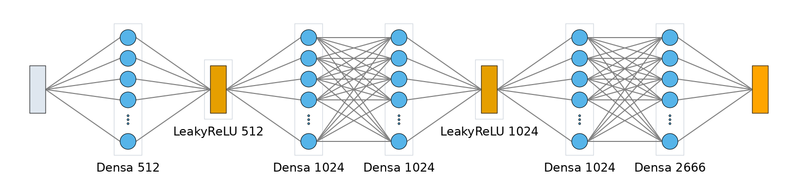

*Fuente: Elaboración propia*

Arquitectura del modelo denso
:::

La función de pérdida definida fue Huber [@huber1964robust], que combina el error cuadrático medio para errores pequeños, y el error absoluto medio para errores más grandes. La función matemática que la define es la siguiente:

$$
L_{\delta}(a)=
\begin{cases}
\frac{1}{2}a^2, & \text{si } |a| \leq \delta \\
\delta \left(|a|-\frac{1}{2}\delta\right), & \text{si } |a| > \delta
\end{cases}
$$

donde *a* representa el error entre el valor real y predicho, y $\delta$ define el valor frontera en el que la función deja de estar definida como el [MSE]{.acr} y pasa a ser más similar al [MAE]{.acr}. En este caso, se definió $\delta$ como 1.

Este comportamiento permite rebajar la penalización en aquellos casos en los que los espectros tengan desviaciones anómalas que no deban definir el comportamiento del modelo. 
Se consideró el optimizador Adam [@kingma2014adam] con una tasa de aprendizaje de 0.0001 y una limitación a 1 en la norma de los gradientes con el objetivo de evitar las actualizaciones excesivas.

El entrenamiento se realizó con lotes de 64 muestras y un máximo de 50 épocas. Para evitar un sobreentrenamiento del modelo, definimos una función de parada temprana que monitoreaba la pérdida del set de validación y detenía el entrenamiento si después de 5 épocas no había mejorado como mínimo un 0.0001. De la misma forma, añadimos una función de disminución de la tasa de aprendizaje cuando la variable controlada durante el entrenamiento se estancaba durante dos épocas. 

#### Modelo convolucional

Como segunda arquitectura se planteó un modelo basado en capas convolucionales de una dimensión. La motivación de este enfoque residía en la propia naturaleza de los espectros: las estructuras que los caracterizan, como las líneas de absorción y emisión o la forma local del continuo, son patrones locales que pueden aparecer en cualquier punto del rango de longitudes de onda. Las convoluciones explotaban precisamente esta localidad, ya que aplicaban los mismos filtros a lo largo de todo el espectro, lo que reducía drásticamente el número de parámetros respecto a una red densa y favorecía que el modelo generalizase los patrones aprendidos en una zona del espectro a las demás.

De esta arquitectura se desarrollaron dos versiones: el modelo convolucional 1D, una red residual de campo receptivo local, y el modelo convolucional U-Net, que ampliaba el campo receptivo a todo el espectro e incorporaba la información de incertidumbre de ambos instrumentos.

##### Modelo convolucional 1D

El diseño siguió un planteamiento de superresolución análogo al de la primera etapa del modelo de @haghjoo2026learning. En primer lugar, el espectro de Gaia se interpoló linealmente sobre la malla de longitudes de onda de [SDSS]{.acr}, obteniendo así una versión de baja resolución alineada punto a punto con la salida esperada. La red recibía este espectro interpolado y aprendía únicamente la corrección que debía aplicarse sobre él, gracias a una conexión residual global que sumaba la entrada interpolada a la salida de la red. De esta forma el modelo no necesitaba aprender la forma general del continuo, que ya venía dada por la interpolación, y podía concentrar su capacidad en recuperar el detalle espectral que la resolución de Gaia no captaba.

En cuanto a la arquitectura interna, el modelo se componía de una capa convolucional inicial de 64 filtros con un núcleo de tamaño 9, seguida de cuatro bloques residuales. Cada bloque contenía dos convoluciones de 64 filtros con núcleo de tamaño 7 y activación ELU, junto con un atajo que sumaba la entrada del bloque a su salida para facilitar la propagación del gradiente. Una última capa convolucional con un único filtro y núcleo de tamaño 5 generaba la corrección final. En total, la red contaba con aproximadamente 230 000 parámetros entrenables, una cifra muy inferior a la del modelo denso descrito anteriormente.

La @fig-arquitectura-cnn recoge las 21 capas de la red, coloreadas según la operación de cada una. La red no submuestrea en ningún punto: los 2666 puntos de la malla de [SDSS]{.acr} se conservan de la entrada a la salida, y el número de filtros se mantiene en 64 en toda la parte central. El patrón se repite en los cuatro bloques residuales, idénticos entre sí: dos convoluciones de 64 filtros con núcleo de tamaño 7, la suma del atajo y la activación ELU. Cierran la red la convolución final de un filtro, que produce la corrección, y la suma del flujo interpolado.

:::{#fig-arquitectura-cnn}

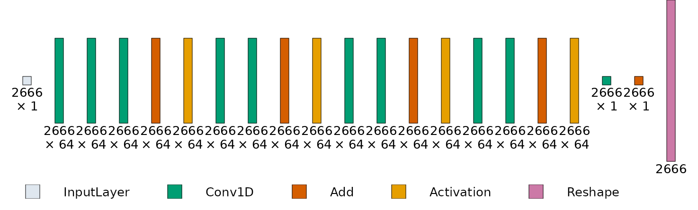

*Fuente: Elaboración propia*

Arquitectura del modelo convolucional 1D
:::

Respecto a la normalización, se aplicó la misma normalización a través de la mediana de cada espectro.

El resto de la configuración del entrenamiento se mantuvo idéntica a la del modelo base: función de pérdida Huber con $\delta = 1$, optimizador Adam con tasa de aprendizaje de 0.0001 y limitación a 1 de la norma de los gradientes, lotes de 64 muestras, un máximo de 50 épocas y las mismas funciones de parada temprana y reducción de la tasa de aprendizaje.

##### Modelo convolucional U-Net

Como veremos en el apartado de evaluación, el modelo convolucional 1D se estancó en una corrección suave del espectro interpolado. La segunda versión atacó las causas de ese estancamiento incorporando la información de incertidumbre de ambos instrumentos, que hasta entonces no se había utilizado, mediante tres mejoras:

1. **Pérdida ponderada por la varianza inversa de [SDSS]{.acr}**. El espectro objetivo no era el espectro verdadero de la estrella, sino una observación con ruido, y ese ruido varía mucho entre píxeles. Ponderando la pérdida de Huber con la varianza inversa de cada píxel, los puntos ruidosos del objetivo pesaban menos y los píxeles marcados como inválidos por [SDSS]{.acr} (varianza inversa nula) quedaban enmascarados, de modo que la red aprende el espectro subyacente y no la realización concreta del ruido. Los pesos se reescalaron con la normalización de cada espectro, se ajustaron para que su media sobre los píxeles válidos fuera 1 (así todos los objetos contribuían por igual y los pesos solo redistribuían la importancia entre píxeles) y se recortaron superiormente para evitar que unos pocos píxeles de varianza muy baja dominasen el entrenamiento.

2. **Canal de entrada adicional con el error de flujo de Gaia**. Junto al flujo interpolado, la red recibía el error observacional de Gaia interpolado sobre la misma malla, lo que le permitía saber qué zonas de su entrada eran fiables y modular la corrección en consecuencia.

3. **Mejora de datos con ruido realista**. En cada época se perturbaba el flujo de Gaia con ruido gaussiano de amplitud igual a su error observacional, lo que multiplicaba de forma efectiva el conjunto de entrenamiento y obligaba a la red a ser robusta frente al nivel de ruido real del instrumento. Para que esta perturbación fuera estadísticamente correcta, se aplicaba sobre la malla nativa de Gaia y la interpolación se realizaba después, en cada época, expresada como una matriz lineal fija dentro del propio flujo de datos de entrenamiento.

La arquitectura evolucionó de la pila de bloques residuales a una U-Net de una dimensión [@ronneberger2015unet]. El codificador partía de una convolución inicial de 64 filtros y encadenaba tres niveles de submuestreo por convolución con paso 2 (64, 96, 128 y 160 filtros); el cuello de botella aplicaba dos bloques residuales que veían el espectro completo a un octavo de su resolución; y el decodificador recuperaba la resolución original en tres niveles de sobremuestreo, concatenando en cada uno la conexión del nivel equivalente del codificador. Cada bloque residual incorporaba además atención de canal de tipo *squeeze-and-excitation* [@hu2018squeeze], que recalibraba la importancia relativa de los filtros en función del contenido global del espectro. Con los tres niveles de submuestreo, el campo receptivo cubría todo el rango de longitudes de onda, por lo que la red podía corregir tanto el detalle de las líneas como el desajuste de continuo a gran escala entre Gaia y [SDSS]{.acr}, algo fuera del alcance del campo receptivo local del modelo 1D. Se mantuvo la conexión residual global sobre el espectro interpolado, y el modelo alcanzó aproximadamente 2,3 millones de parámetros entrenables, una capacidad muy superior a la del modelo convolucional 1D aunque todavía del orden de la mitad que la del modelo denso.

La red se organizaba por niveles. La entrada tenía ahora dos canales, el flujo y el error de Gaia interpolados sobre la malla de [SDSS]{.acr}, y se rellenaba hasta 2672 puntos, múltiplo de 8, para que los tres submuestreos sean exactos. La primera mitad era el codificador: en cada nivel, una convolución de paso 2 reduce a la mitad la longitud del espectro (2672, 1336, 668 y 334 puntos) mientras crece el número de filtros (64, 96, 128 y 160). Le sigue el cuello de botella, y después el decodificador, simétrico, que en cada nivel sobremuestreaba por dos y concatenaba la conexión de salto del nivel equivalente. La conexión residual global unía la entrada con la salida, que recortaba el relleno inicial antes de sumar el flujo interpolado. Cada bloque residual con atención de canal estaba formado por: las dos convoluciones, el módulo *squeeze-and-excitation*, que resumía cada canal en su media global y aprendía con dos capas densas el factor con el que reescalarlo, y el atajo que sumaba la entrada del bloque a su salida.

El modelo consta de 95 capas de doce tipos distintos, cuya secuencia completa se recoge en la @fig-arquitectura-unet, con una barra por capa del color de la operación que realiza. El patrón se repite en los ocho bloques residuales —dos convoluciones, las cuatro capas del módulo de atención de canal, la suma del atajo y la activación—, y el crecimiento del número de filtros desde los 64 del primer nivel del codificador hasta los 160 del cuello de botella, al que es proporcional la altura de las barras.

:::{#fig-arquitectura-unet}

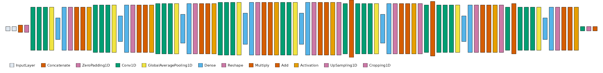

*Fuente: Elaboración propia*

Arquitectura del modelo convolucional U-Net
:::

Esta fue, con diferencia, la arquitectura más compleja de las estudiadas: 95 capas frente a las 21 del modelo convolucional 1D o la decena escasa de los modelos denso y recurrentes, con 27 convoluciones repartidas en cuatro niveles de resolución. Esa complejidad se tradujo en un coste computacional muy superior al del resto de modelos, y ello a pesar de que el modelo no era el que más parámetros tenía: sus 2,3 millones quedaban lejos de los 5,46 del modelo denso o los 5,65 del recurrente con atención. La diferencia radica en dónde trabaja la red. Los modelos denso y recurrentes comprimen los 201 puntos de Gaia en un vector de unos cientos de valores y solo lo expanden en la capa de salida, mientras que la U-Net aplicaba sus convoluciones sobre secuencias de hasta 2672 puntos, y cada filtro recorría la secuencia entera en cada una de las capas. Haciendo que el entrenamiento tomase más tiempo, tanto por el coste de cada época como por el número de épocas que necesitó hasta que la pérdida de validación dejó de mejorar.

La configuración del entrenamiento conservó la función de pérdida Huber con $\delta = 1$ (ahora ponderada por píxel), las mismas métricas [MAE]{.acr} y [MSE]{.acr} sin ponderar para mantener la comparabilidad con el resto de modelos, el optimizador Adam con limitación a 1 de la norma de los gradientes y los lotes de 64 muestras. Al ser un modelo de mayor capacidad, se amplió el presupuesto de entrenamiento: tasa de aprendizaje inicial de 0.0003, un máximo de 100 épocas, parada temprana con paciencia de 10 épocas y reducción de la tasa de aprendizaje a la mitad tras 4 épocas sin mejora.

#### Modelo recurrente
Además de las estructuras anteriormente mencionadas, se evaluaron modelos basados en la [RNN]{.acr}. En estos, cada espectro se consideró como una secuencia en función de la longitud de onda, donde cada longitud de onda era un paso de la secuencia y flujo correspondiente era la variable de entrada. Esta arquitectura permitió conservar información de pasos anteriores de la secuencia [@schmidt2019rnn].

Los primeros intentos de arquitectura recurrente se basaron en capas recurrentes simples y en la [GRU]{.acr}. A diferencia de las capas recurrentes simples, las [GRU]{.acr} incluyen mecanismos internos que condicionan que información de los pasos anteriores debe descartarse y cuál conservarse.
En estas, las funciones de pérdida, optimizador y parada temprana se mantuvieron igual que las descritas en las redes neuronales densas, dado que habían presentado un buen funcionamiento con estos modelos. 

El primero de los modelos recurrentes seleccionados estaba formado por una capa de [GRU]{.acr} de dimensión 128. A continuación una capa densa de 512 neuronas, seguida de funciones de activación LeakyReLU intercaladas por otra capa densa de 1024 neuronas. Finalmente, se añadió una capa densa de salida del tamaño de los espectros de [SDSS]{.acr}.

La @fig-arquitectura-gru esquematiza este modelo. La entrada es el espectro de Gaia visto como una secuencia de 201 pasos con una sola variable por paso, el flujo, de modo que el orden de los puntos, la longitud de onda creciente, sí forma parte del dato. La capa [GRU]{.acr} recorre esos 201 puntos arrastrando un estado interno y devuelve únicamente el último, un resumen de 128 valores del espectro completo, que la cabeza densa expande hasta los 2666 puntos de [SDSS]{.acr}. La celda [GRU]{.acr} hace en cada paso lo siguiente: sus dos puertas, ambas con activación sigmoide, deciden cuánto del estado anterior se conserva y cuánto entra en el estado candidato, y son las que le permiten arrastrar información de un extremo del espectro al otro sin que el gradiente se desvanezca por el camino.

:::{#fig-arquitectura-gru}

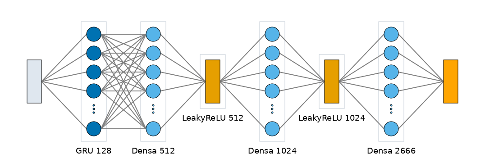

*Fuente: Elaboración propia*

Arquitectura del modelo recurrente basado en una capa [GRU]{.acr .short}
:::

Por otro lado, se probaron variantes bidireccionales de la arquitectura recurrente [@schuster1997bidirectional]. Esta capa procesa la secuencia de puntos en ambos sentidos, en sentido creciente y decreciente de longitud de onda. Se incluyeron versiones con y sin capas de normalización internas.
En el modelo bidireccional destacado se utilizó una capa [GRU]{.acr} bidireccional con dimensión 128. A continuación se incorporó la misma cabeza densa del modelo base, cuatro capas de 512, 1024, 1024 y 1024 neuronas que alternan las funciones de activación LeakyReLU y ELU. Igual que en los casos anteriores, la capa de salida disponía del mismo tamaño que la dimensión de los espectros de [SDSS]{.acr}.

La @fig-arquitectura-birnn muestra esta arquitectura. Las dos lecturas del espectro, en sentido creciente y decreciente de la longitud de onda, son en el modelo una única capa bidireccional que envuelve a la [GRU]{.acr}: cada una devuelve su último estado y los dos se concatenan en un resumen de 256 valores. Con una sola dirección, ese resumen lo escribe una capa que al llegar al extremo rojo lleva 201 pasos acumulados y uno solo al empezar por el azul; con las dos, cada extremo del espectro está igual de cerca de una de las lecturas.

:::{#fig-arquitectura-birnn}

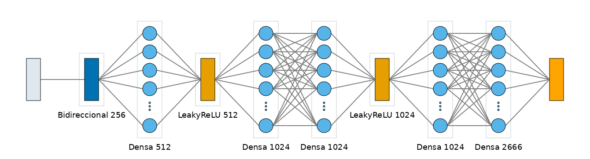

*Fuente: Elaboración propia*

Arquitectura del modelo recurrente bidireccional
:::

Finalmente, se evaluaron arquitecturas con mecanismos de atención [@vaswani2017attention], permitiendo que no se resumiese el entrenamiento en el último estado recurrente, sino que el modelo conservase información de todos los pasos de la secuencia y asignase pesos a aquellas regiones del espectro que se consideraban más importantes para la predicción.  

El modelo con atención seleccionado estaba formado por dos capas [GRU]{.acr} bidireccionales, la primera de dimensión 128 y la segunda 64 en cada dirección. Sobre su salida se aplicó el mecanismo de atención, que generó un vector de dimensión 128. 
El vector fue procesado por la misma cabeza densa que el modelo bidireccional, las cuatro capas de 512, 1024, 1024 y 1024 neuronas con las activaciones LeakyReLU y ELU alternadas.

La @fig-arquitectura-attention esquematiza el modelo. Las dos capas bidireccionales devuelven ahora la secuencia completa de estados, 201 de 256 valores la primera y 201 de 128 la segunda, uno por punto del espectro, y el resumen del espectro deja de ser el último estado para convertirse en una media ponderada de los 201 con unos pesos que la propia red aprende. Ese mecanismo son tres pasos: una capa densa de una sola neurona, compartida por todos los pasos, puntúa cada estado; una *softmax* sobre los 201 pasos convierte las puntuaciones en pesos que suman uno; y el resumen es la suma de los estados ponderada por esos pesos. Es todo lo que la atención añade en parámetros: 129 sobre los 5,65 millones del modelo.

:::{#fig-arquitectura-attention}

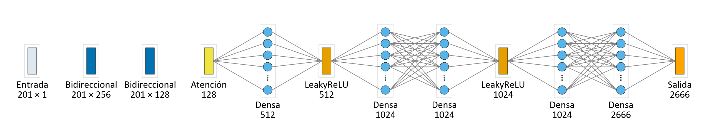

*Fuente: Elaboración propia*

Arquitectura del modelo recurrente bidireccional con atención
:::

En la arquitectura de estos dos últimos modelos mencionados, se redujeron las épocas de espera dado que la diferencia entre esperar 2 o 4 épocas no reflejaba mejoras en las estadísticas pero sí en el tiempo de entrenamiento.

## Descripción de los resultados

Una vez entrenadas las distintas opciones de red neuronal, fue necesario evaluar el rendimiento para determinar qué aproximación era la más adecuada al problema que se habían planteado. 

Para hacerlo, se consideraron diversos caminos. Por un lado, se analizaron las métricas obtenidas durante el entrenamiento, como por ejemplo los valores de la función de pérdida, [MAE]{.acr} o [MSE]{.acr}. No obstante, debía tenerse en cuenta que se habían usado diferentes funciones de normalización, por lo que no en todos los casos estas métricas se podían comparar directamente. 

Para evitar este problema, la evaluación se basó también en otras técnicas. La primera fue una comparativa visual de los espectros respecto al real de [SDSS]{.acr} tras deshacer la normalización, esto permitió comprobar si el modelo se ajustaba correctamente a la forma global del espectro y a sus zonas de emisión y absorción. Para comprobar el comportamiento del modelo con diferentes tipos de estrellas, se seleccionaron dos ejemplos de cada grupo señalizado en el diagrama de la @fig-HR-grupos.

:::{#fig-HR-grupos}

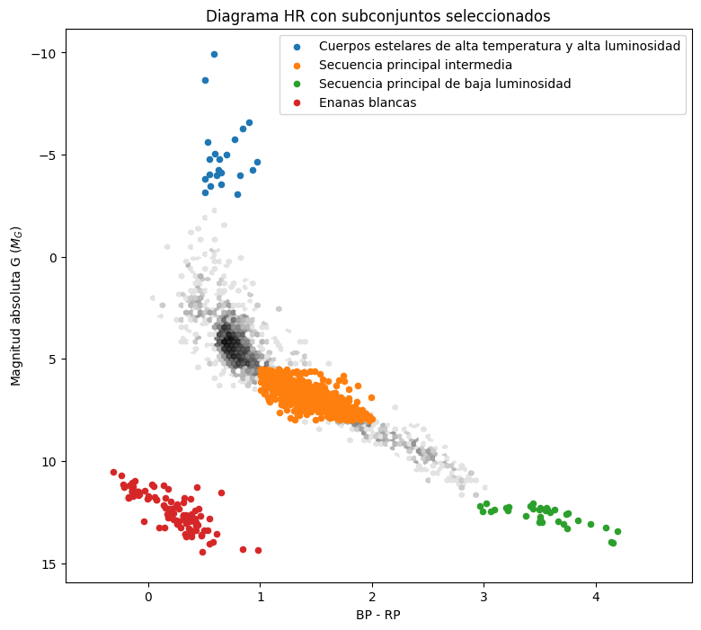

*Fuente: Elaboración propia*

Selección de diferentes regiones representativas del diagrama [HR]{.acr .short} a partir del color BP - RP y la magnitud absoluta G.
:::

Se usó también el estadístico chi-cuadrado definido como:
$$\chi^2 = \sum_{i=1}^{N} \frac{\left(f_{\mathrm{real},i}-f_{\mathrm{pred},i}\right)^2}{\sigma_i^2} $$
 
 con la intención de evaluar el error entre el espectro real de [SDSS]{.acr} y el espectro predicho por los modelos. Este estadístico nos permitió cuantificar cuanto se desvían los espectros teniendo en cuenta la incertidumbre asociada a cada punto.

Por último, se empleó la librería *ISpec* [@blancocuaresma2014ispec] para estimar parámetros físicos de los objetos observados, en concreto la temperatura efectiva, la gravedad superficial y la metalicidad. El objetivo fue comparar los datos obtenidos con las predicciones y el espectro real. De esta forma no se valoró solo la similitud de los espectros por sí mismos, sino que también se tuvo en cuenta si las predicciones se aproximaban a la información astrofísica que se obtenía del espectro de [SDSS]{.acr} original.
Para hacerlo se ordenaron aleatoriamente los espectros predichos con los modelos, de esta permutación, se trataron de aproximar 250 espectros a sus datos astrofísicos a partir de *iSpec*. Para tratar de coger siempre los mismos espectros, se intentó generar las aproximaciones siguiendo el orden de la lista permutada. En caso de que un espectro obtuviera algún tipo de error que no permitiera generar *iSpec*, se saltaba al siguiente.
Las estadísticas usadas en los siguientes apartados constaron de tres errores: el error relativo de *Teff* y *log(g)* y el error absoluto de M/H. Para los dos primeros casos, el error relativo permitía expresar la desviación respecto al valor real teniendo en cuenta la escala de la magnitud estudiada. En cambio, para M/H, se empleó el error absoluto debido a que generalmente esta variable tomaba valores positivos, negativos y cercanos a cero.

### Resultados obtenidos con el modelo base

En este aparado se comentan los resultados más significativos obtenidos del entrenamiento de una arquitectura de red neuronal densa y la adición de la [SNR]{.acr}.

Aunque las métricas de la función de pérdida, [MAE]{.acr} y [MSE]{.acr} permitieron evaluar los modelos, en el caso de comparar modelos con diferentes funciones de normalización, estos datos debe ser considerados con cautela. Al cambiar el escalado de los datos, también se vio afectada la escala de las métricas. Por ese motivo, en este caso las métricas de entrenamiento sirvieron solo como apoyo, no como criterio principal.

#### Arquitectura densa con diferentes normalizaciones

La primera opción de normalización evaluada fue la normalización estándard. Consistía en calcular la media ($\mu$) y la desviación estándar ($\sigma$) del conjunto de entrenamiento y utilizar estos valores para normalizar los datos de entrenamiento, validación y test. La fórmula empleada fue la siguiente:

$$ F_{\mathrm{norm}} = \frac{F-\mu}{\sigma} $$

Que nos permitió desnormalizar los espectros siguiendo el proceso inverso:

$$ F_{\mathrm{pred}} = F_{\mathrm{pred,norm}}\sigma+\mu $$

Durante el entrenamiento se pudo observar una evolución estable de las métricas controladas, tanto en el conjunto de entrenamiento como el de validación. Se observa esta disminución constante representada en la @fig-metricas-red-densa.

En la última época llevada a cabo, se obtuvo una pérdida del conjunto de entrenamiento muy similar a la del conjunto de validación.
Una vez finalizado el entrenamiento del modelo, se evaluó su eficacia sobre el conjunto de test. Los valores obtenidos fueron muy cercanos a los de la muestra de validación y entrenamiento como podemos observar en la @tbl-met-dense-glob, reforzando la idea de que el modelo tenía un comportamiento estable ante los datos que no había sido vistos con anterioridad. 

:::{#fig-metricas-red-densa}

::::{layout="[[-1,5,-1],[-1,5,-1],[-1,5,-1]]"}

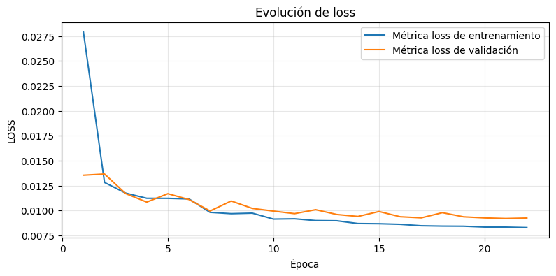

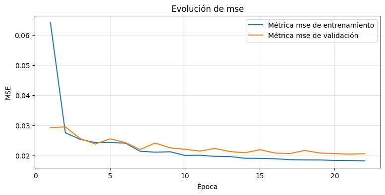

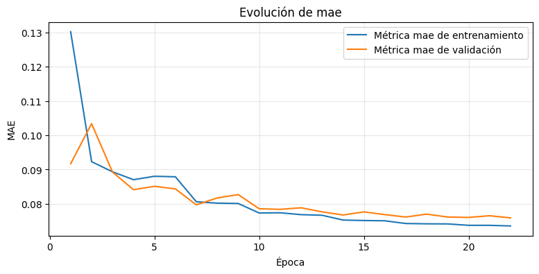

::::

*Fuente: Elaboración propia*

Gráfica de la evolución de las métricas del modelo de redes neuronales densas con normalización global.
:::

::: {#tbl-met-dense-glob}

| Conjunto de datos | Pérdida | [MAE]{.acr} | [MSE]{.acr} |
|---|---:|---:|---:|
| Entrenamiento | 0.0083 | 0.0736 | 0.0183 |
| Validación | 0.0092 | 0.0759 | 0.0206 |
| Test | 0.0100 | 0.0778 | 0.0217 |

*Fuente: Elaboración propia*

Resultados obtenidos con el modelo denso con la normalización global para los diferentes conjuntos de datos.
:::

Cabe destacar que las métricas calculadas se definen sobre espectros normalizados, por lo que no mantienen la escala de las unidades de flujo originales. Sin embargo, su uso fue necesario para poder valorar de forma comprensible la eficacia de los diferentes modelos estudiados.

En las gráficas detalladas de las @fig-dense-global-left, @fig-dense-global-central, @fig-dense-global-right y @fig-dense-global-wd se muestra una comparación por cada uno de los cuatro grupos de objetos definidos sobre el diagrama [HR]{.acr}, donde se observan superpuestos los datos de entrada del modelo, es decir el espectro captado por Gaia, el espectro de [SDSS]{.acr} real y el generado a partir del modelo entrenado. Cada grupo aportó dos observaciones del conjunto de test, identificadas con el nombre celeste y el tipo de objeto que les asigna SIMBAD: [LM*]{.acr} en los dos tramos de la secuencia central, [RR*]{.acr} y [QSO]{.acr} en el grupo de paralaje pequeño, y [WD*]{.acr} en el grupo restante.

:::{#fig-dense-global-left}

::::{layout-nrow="2"}

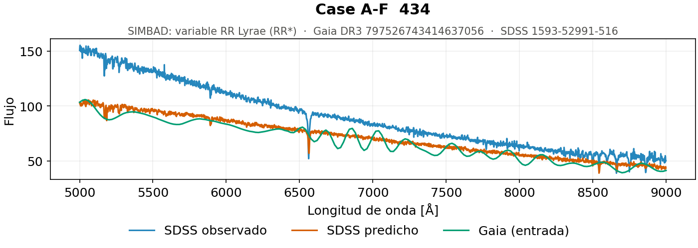

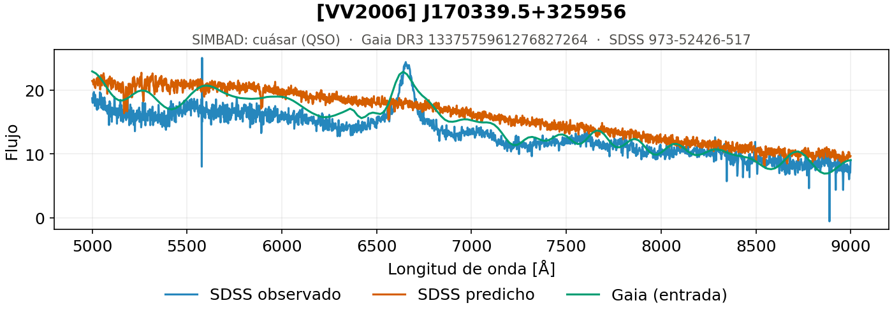

::::

*Fuente: Elaboración propia*

Secuencia central, alta luminosidad y alta temperatura. Espectros generados por el modelo de redes neuronales densas con normalización global para los objetos con paralaje no significativo, por debajo de 0,01 mas, cuya magnitud absoluta no es fiable: SIMBAD identifica la pareja como una [RR*]{.acr .short} y un [QSO]{.acr .short}, y no como estrellas de la secuencia principal.
:::

:::{#fig-dense-global-central}

::::{layout-nrow="2"}

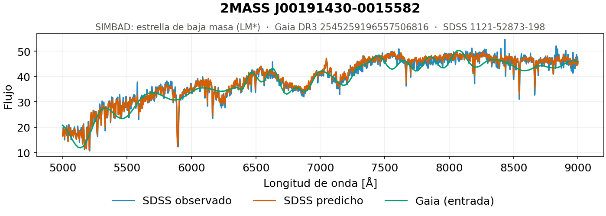

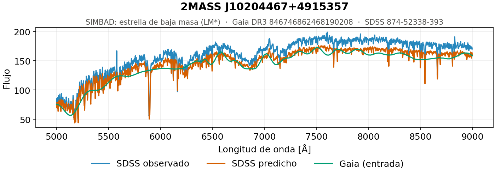

::::

*Fuente: Elaboración propia*

Secuencia central. Espectros generados por el modelo de redes neuronales densas con normalización global para el tramo central de la secuencia, el grupo más poblado de la muestra con 655 objetos, formado por estrellas de baja masa con temperaturas efectivas en torno a 4 500 K.
:::

:::{#fig-dense-global-right}

::::{layout-nrow="2"}

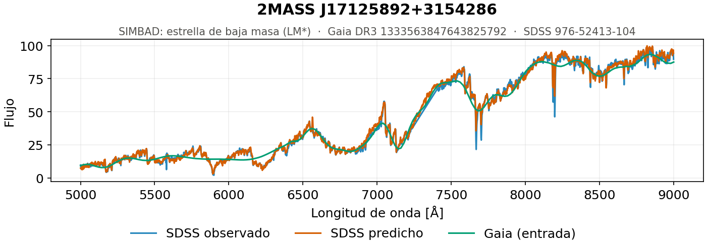

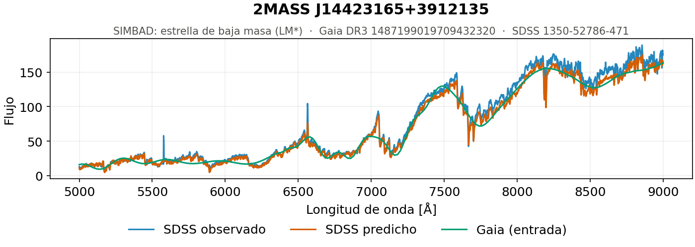

::::

*Fuente: Elaboración propia*

Secuencia central, baja luminosidad y baja temperatura. Espectros generados por el modelo de redes neuronales densas con normalización global para el extremo frío de la secuencia, con estrellas de baja masa de unos 3 100 K y paralajes de entre 8 y 27 mas, es decir, objetos cercanos y poco luminosos.
:::

:::{#fig-dense-global-wd}

::::{layout-nrow="2"}

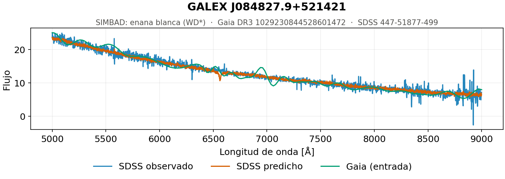

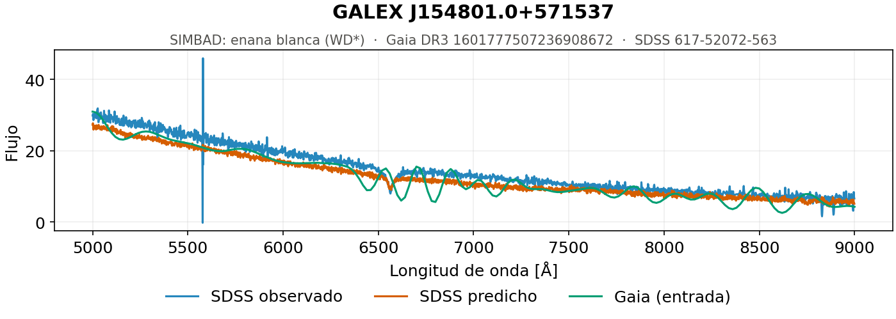

::::

*Fuente: Elaboración propia*

Enanas blancas. Espectros generados por el modelo de redes neuronales densas con normalización global para las enanas blancas, objetos calientes y poco luminosos cuyo espectro es un continuo decreciente con muy pocos rasgos.
:::

Por un lado, en azul encontramos el espectro que el modelo pretendía predecir, los puntos de [SDSS]{.acr} una vez habían sido recortados. Por otro, en verde podemos ver la entrada que recibía el modelo, siendo esta el espectro calibrado de Gaia. Los puntos de Gaia fueron convertidos a la misma unidad de medida de flujo que [SDSS]{.acr} para poder representar ambos espectros en la misma gráfica, pero en los datos originales, se usaban escalas diferentes. 
Finalmente, en naranja encontramos el espectro predicho por el modelo. 

En los dos primeros espectros mostrados (@fig-dense-global-left), correspondientes a los tipos [RR*]{.acr} y [QSO]{.acr}, el ajuste del espectro predicho no captaba gran parte de la morfología de estos flujos. En el de tipo [QSO]{.acr} no detectaba la línea de emisión que encontramos sobre los 6750Å. En cambio, si parecía adaptarse a la forma de los demás espectros.
Si bien es cierto, estas predicciones se ven afectadas por el alto nivel de detalle de [SDSS]{.acr} y la baja resolución inicial de Gaia. 

Durante las comparaciones realizadas, siempre se usaron los mismos ocho objetos, identificados por el nombre celeste y los identificadores de Gaia y [SDSS]{.acr} que aparecen en los gráficos recientemente comentados.

El segundo tipo de normalización se basó en la mediana por espectro. Se aplicó la siguiente transformación a cada espectro *i* :
$$ F_{\mathrm{norm},i} = \frac{F_i}{\mathrm{mediana}(|F_i|)} $$

Para desnormalizarlos, se guardaron las variables originales y se aplicó la fórmula inversa:

$$ F_i = F_{\mathrm{norm},i} \cdot \mathrm{mediana}(|F_i|) $$

Con este método, los resultados obtenidos fueron similares. 
No se apreciaron rasgos de sobreajuste en las métricas del modelo que encontramos en la tabla @tbl-met-dense-median.

::: {#tbl-met-dense-median}

| Conjunto de datos | Pérdida | [MAE]{.acr} | [MSE]{.acr} |
|---|---:|---:|---:|
| Entrenamiento | 0.0033 | 0.0429 | 0.0089 |
| Validación | 0.0034 | 0.0433 | 0.0113 |
| Test | 0.0033 | 0.0436 | 0.0084 |

*Fuente: Elaboración propia*

Resultados obtenidos con el modelo denso con la normalización espectro a espectro basada en la mediana para los diferentes conjuntos de datos.
:::

Las épocas avanzaron de forma similar al modelo anterior, incluso con menor grado de sobreajuste, tal y como observamos en las gráficas representadas en las imágenes @fig-metricas-red-densa-median.

:::{#fig-metricas-red-densa-median}

::::{layout="[[-1,5,-1],[-1,5,-1],[-1,5,-1]]"}

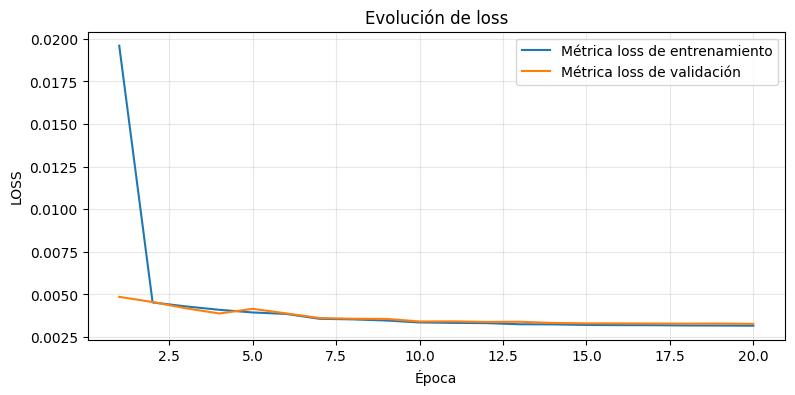

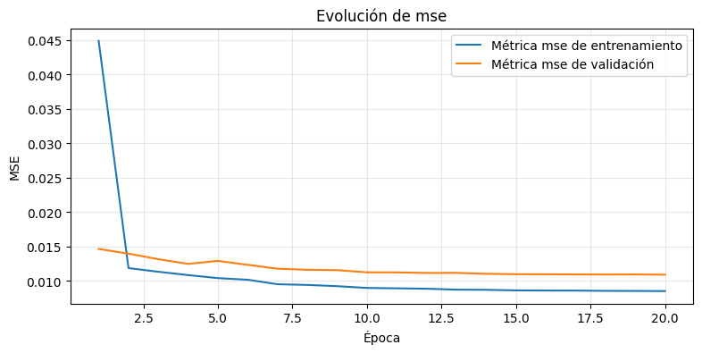

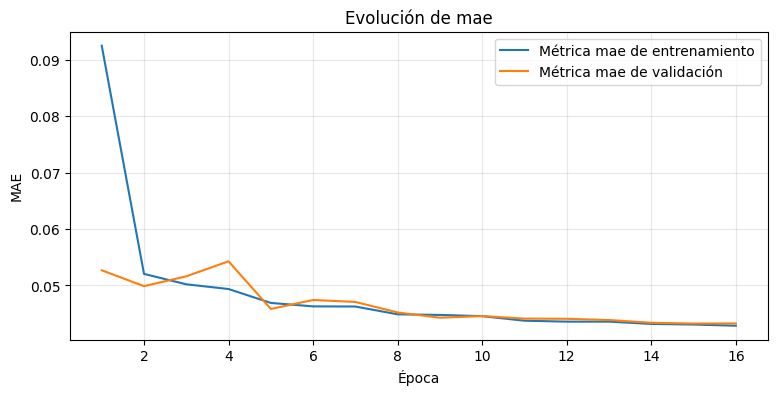

::::

*Fuente: Elaboración propia*

Gráficas de evolución de las métricas de entrenamiento en la red densa basada en una normalización con la mediana.
:::

Los espectros obtenidos sobre los mismos objetos que el modelo anterior, un par por grupo del diagrama [HR]{.acr}, fueron los observados en las @fig-dense-median-left, @fig-dense-median-central, @fig-dense-median-right y @fig-dense-median-wd:

:::{#fig-dense-median-left}

::::{layout-nrow="2"}

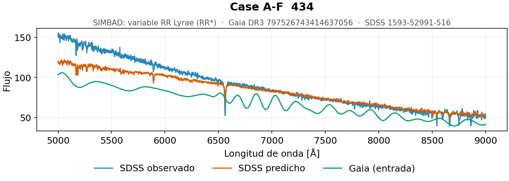

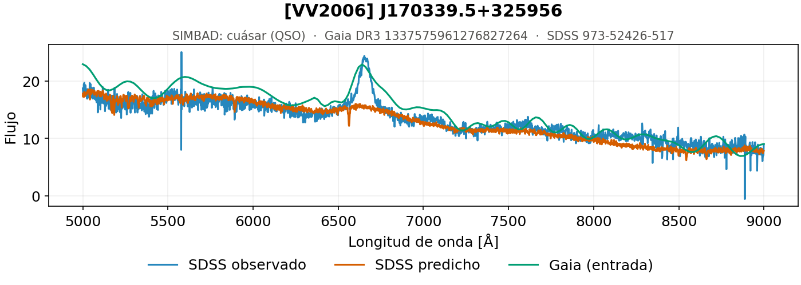

::::

*Fuente: Elaboración propia*

Secuencia central, alta luminosidad y alta temperatura. Espectros generados por el modelo de redes neuronales densas con normalización basada en la mediana de cada espectro para los objetos con paralaje no significativo, por debajo de 0,01 mas, cuya magnitud absoluta no es fiable: SIMBAD identifica la pareja como una [RR*]{.acr .short} y un [QSO]{.acr .short}, y no como estrellas de la secuencia principal.
:::

:::{#fig-dense-median-central}

::::{layout-nrow="2"}

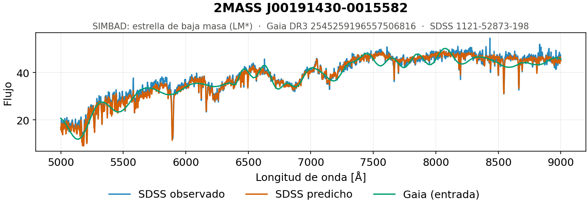

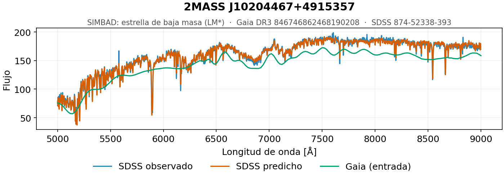

::::

*Fuente: Elaboración propia*

Secuencia central. Espectros generados por el modelo de redes neuronales densas con normalización basada en la mediana de cada espectro para el tramo central de la secuencia, el grupo más poblado de la muestra con 655 objetos, formado por estrellas de baja masa con temperaturas efectivas en torno a 4 500 K.
:::

:::{#fig-dense-median-right}

::::{layout-nrow="2"}

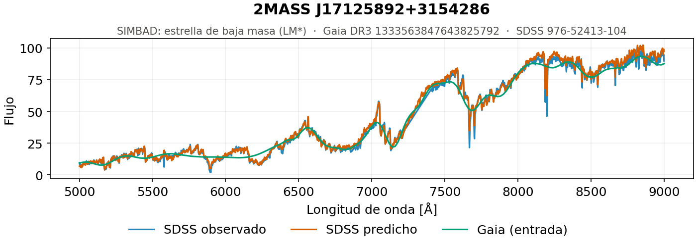

::::

*Fuente: Elaboración propia*

Secuencia central, baja luminosidad y baja temperatura. Espectros generados por el modelo de redes neuronales densas con normalización basada en la mediana de cada espectro para el extremo frío de la secuencia, con estrellas de baja masa de unos 3 100 K y paralajes de entre 8 y 27 mas, es decir, objetos cercanos y poco luminosos.
:::

:::{#fig-dense-median-wd}

::::{layout-nrow="2"}

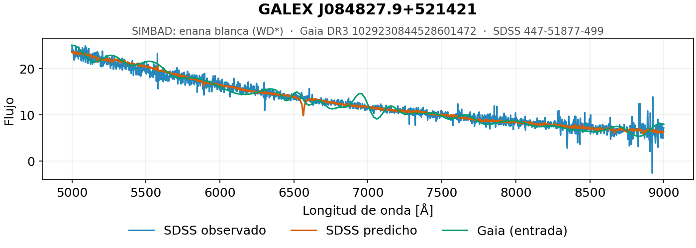

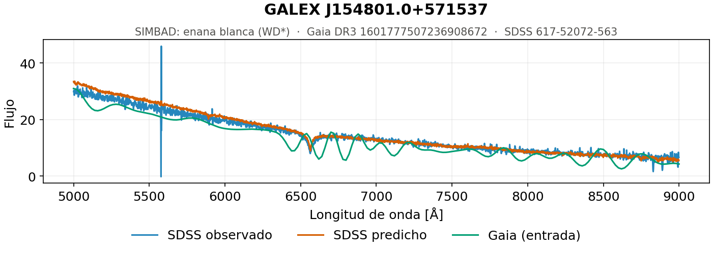

::::

*Fuente: Elaboración propia*

Enanas blancas. Espectros generados por el modelo de redes neuronales densas con normalización basada en la mediana de cada espectro para las enanas blancas, objetos calientes y poco luminosos cuyo espectro es un continuo decreciente con muy pocos rasgos.
:::

Comparándolas con las gráficas obtenidas con la primera normalización mencionada, pudimos destacar una diferencia visual pequeña, pero positiva hacia este segundo tipo de normalización. Esta mejora destaca sobre todo en los dos primeros gráficos representados en la @fig-dense-median-left, donde a pesar de no captar las las líneas de emisión u absorción, la predicción se ajustó más a la forma general del espectro real de [SDSS]{.acr}.

Por último, si nos fijamos en las @fig-dense-max-left, @fig-dense-max-central, @fig-dense-max-right y @fig-dense-max-wd, observamos los resultados obtenidos sobre los mismos objetos con una normalización espectro a espectro basada en el máximo valor del flujo. En estas, la fórmula utilizada para normalizar los espectros fue:
$$ F_{\mathrm{norm},i} = \frac{F_i}{\mathrm{max}(|F_i|)} $$

Y para desnormalizarlos:

$$ F_i = F_{\mathrm{norm},i} \cdot \mathrm{max}(|F_i|) $$

En la @tbl-met-dense-max se encuentran las métricas obtenidas con esta arquitectura y normalización sobre los diferentes conjuntos de datos.

::: {#tbl-met-dense-max}

| Conjunto de datos | Pérdida | [MAE]{.acr} | [MSE]{.acr} |
|---|---:|---:|---:|
| Entrenamiento | 0.0040 | 0.0597 | 0.0081 |
| Validación | 0.0044 | 0.0628 | 0.0088 |
| Test | 0.0045 | 0.0610 | 0.0089 |

*Fuente: Elaboración propia*

Resultados obtenidos con el modelo denso con la normalización espectro a espectro basada en el máximo para los diferentes conjuntos de datos.
:::

Los valores obtenidos con esta normalización, fueron muy similares a los anteriores.

A partir de las gráficas observadas en las figuras @fig-dense-max-left, @fig-dense-max-central, @fig-dense-max-right y @fig-dense-max-wd, pareció que la opción con mejores resultados era la segunda, dado que era la que obtenía espectros más cercanos a los reales. Ahora bien, se comprobaron métricas para obtener resultados más concluyentes.

:::{#fig-dense-max-left}

::::{layout-nrow="2"}

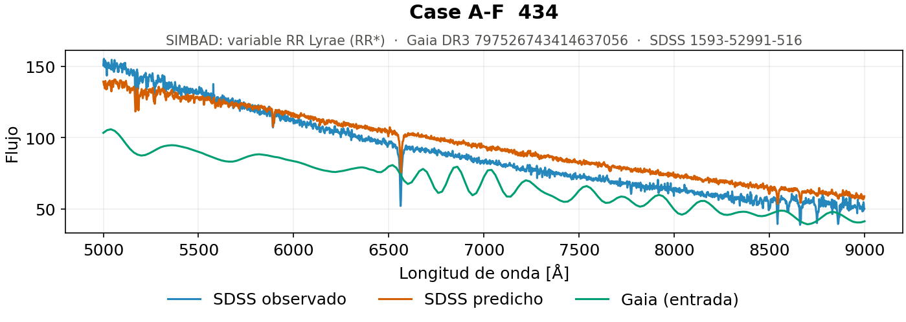

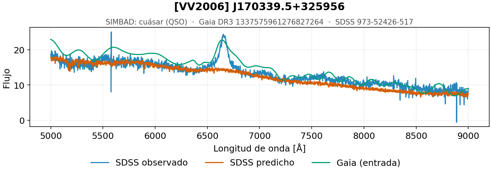

::::

*Fuente: Elaboración propia*

Secuencia central, alta luminosidad y alta temperatura. Espectros generados por el modelo de redes neuronales densas con normalización basada en el máximo de cada espectro para los objetos con paralaje no significativo, por debajo de 0,01 mas, cuya magnitud absoluta no es fiable: SIMBAD identifica la pareja como una [RR*]{.acr .short} y un [QSO]{.acr .short}, y no como estrellas de la secuencia principal.
:::

:::{#fig-dense-max-central}

::::{layout-nrow="2"}

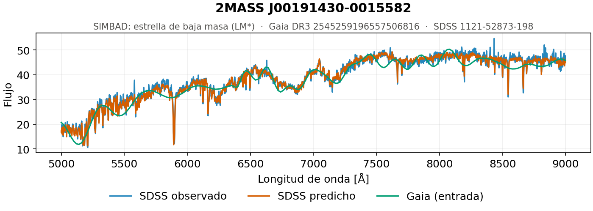

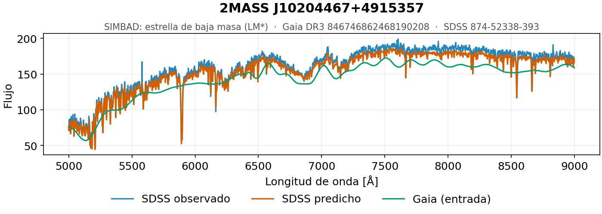

::::

*Fuente: Elaboración propia*

Secuencia central. Espectros generados por el modelo de redes neuronales densas con normalización basada en el máximo de cada espectro para el tramo central de la secuencia, el grupo más poblado de la muestra con 655 objetos, formado por estrellas de baja masa con temperaturas efectivas en torno a 4 500 K.
:::

:::{#fig-dense-max-right}

::::{layout-nrow="2"}

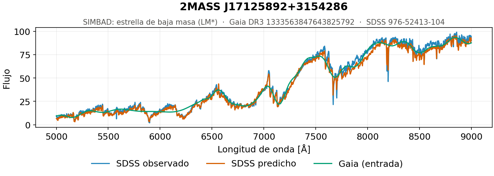

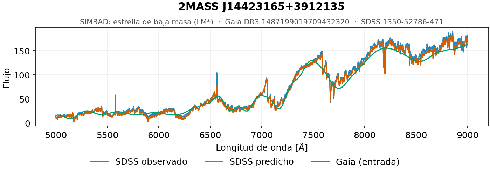

::::

*Fuente: Elaboración propia*

Secuencia central, baja luminosidad y baja temperatura. Espectros generados por el modelo de redes neuronales densas con normalización basada en el máximo de cada espectro para el extremo frío de la secuencia, con estrellas de baja masa de unos 3 100 K y paralajes de entre 8 y 27 mas, es decir, objetos cercanos y poco luminosos.
:::

:::{#fig-dense-max-wd}

::::{layout-nrow="2"}

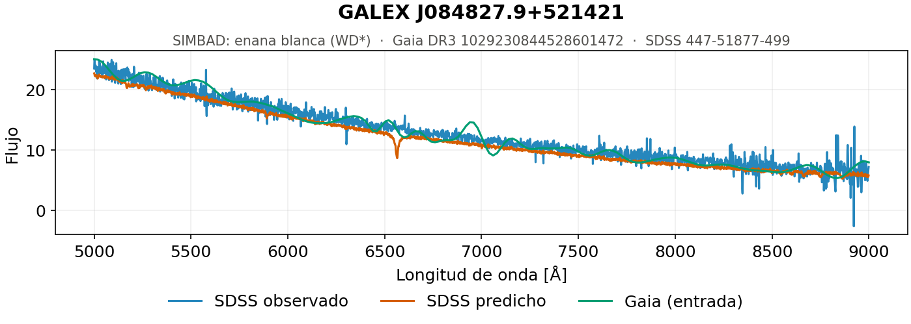

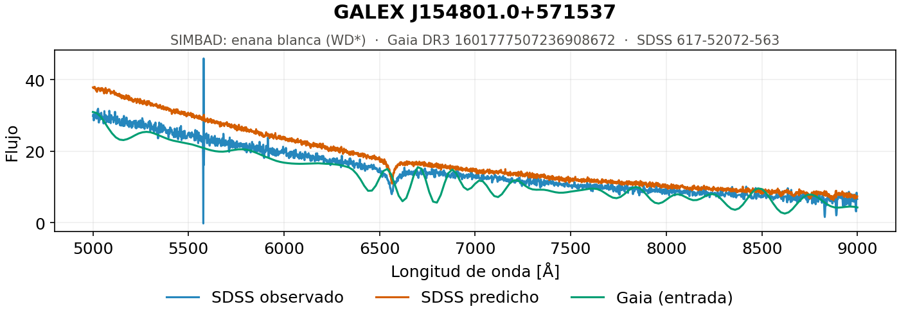

::::

*Fuente: Elaboración propia*

Enanas blancas. Espectros generados por el modelo de redes neuronales densas con normalización basada en el máximo de cada espectro para las enanas blancas, objetos calientes y poco luminosos cuyo espectro es un continuo decreciente con muy pocos rasgos.
:::

A lo largo del entrenamiento, observamos en la @fig-metricas-red-densa-max como las líneas no parecían converger de igual modo que lo habían hecho en el modelo anterior.

:::{#fig-metricas-red-densa-max}

::::{layout="[[-1,5,-1],[-1,5,-1],[-1,5,-1]]"}

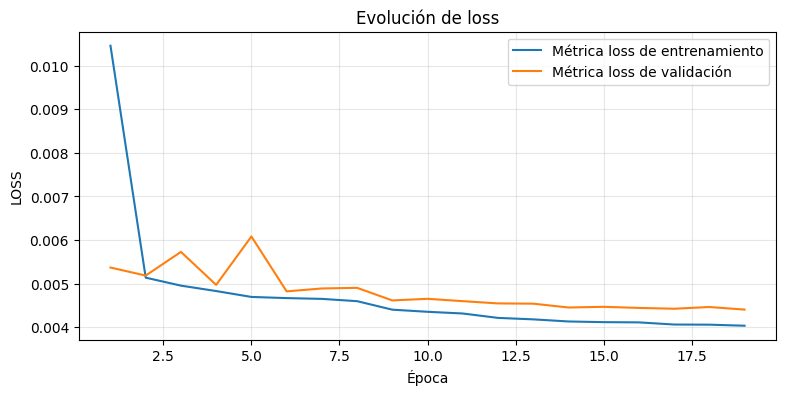

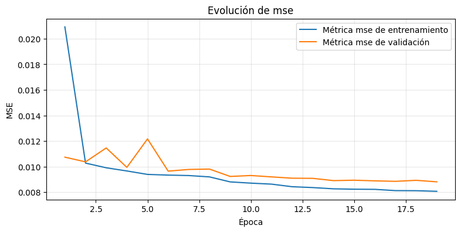

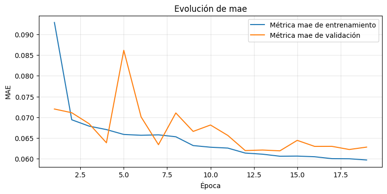

::::

*Fuente: Elaboración propia*

Gráficas de evolución de las métricas de entrenamiento en la red densa con normalización a partir del máximo de cada espectro.
:::

\

#### Modelo denso con [SNR]{.acr .short}

La @fig-arquitectura-snr muestra la arquitectura de esta variante. La red es exactamente la del modelo denso, y lo único que cambia es la entrada, que pasa de 201 a 402 valores al concatenar detrás del espectro los 201 valores de la [SNR]{.acr} de ese mismo espectro. Cada mitad se normalizó de una manera antes de entrar en la red: el espectro, dividiéndolo entre la mediana de su flujo absoluto; la [SNR]{.acr}, tipificándola punto a punto con la media y la desviación típica del conjunto de entrenamiento. Los 201 valores adicionales solo añaden parámetros a la primera capa oculta, un 1,9 % del total del modelo, y la red no sabe que la segunda mitad de su entrada es una medida de calidad y no un flujo: esa relación tenía que aprenderla de los datos.

:::{#fig-arquitectura-snr}

*Fuente: Elaboración propia*

Arquitectura del modelo denso con la [SNR]{.acr .short}
:::

Al tratar de añadir la [SNR]{.acr} de las muestras de Gaia como parte de los datos de entrada del modelo, los resultados obtenidos sobre los mismos objetos fueron los observados en las @fig-snr-left, @fig-snr-central, @fig-snr-right y @fig-snr-wd.

:::{#fig-snr-left}

::::{layout-nrow="2"}

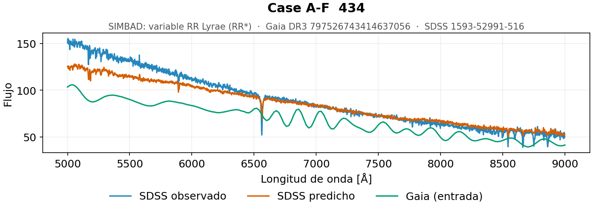

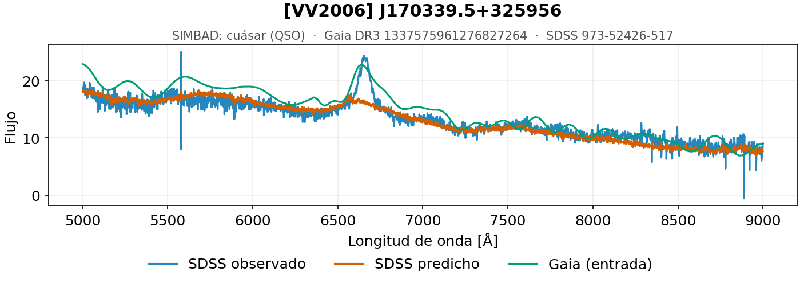

::::

*Fuente: Elaboración propia*

Secuencia central, alta luminosidad y alta temperatura. Espectros generados por el modelo de redes neuronales densas con la [SNR]{.acr .short} de Gaia como entrada para los objetos con paralaje no significativo, por debajo de 0,01 mas, cuya magnitud absoluta no es fiable: SIMBAD identifica la pareja como una [RR*]{.acr .short} y un [QSO]{.acr .short}, y no como estrellas de la secuencia principal.
:::

:::{#fig-snr-central}

::::{layout-nrow="2"}

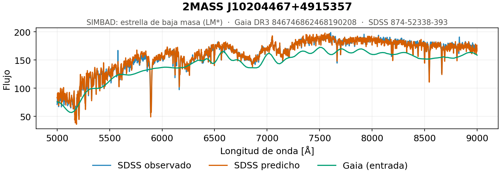

::::

*Fuente: Elaboración propia*

Secuencia central. Espectros generados por el modelo de redes neuronales densas con la [SNR]{.acr .short} de Gaia como entrada para el tramo central de la secuencia, el grupo más poblado de la muestra con 655 objetos, formado por estrellas de baja masa con temperaturas efectivas en torno a 4 500 K.
:::

:::{#fig-snr-right}

::::{layout-nrow="2"}

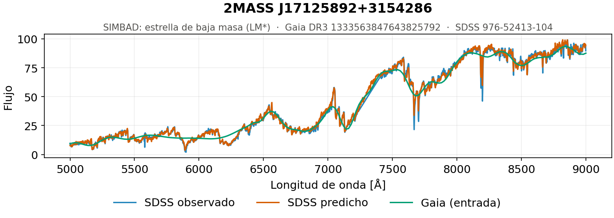

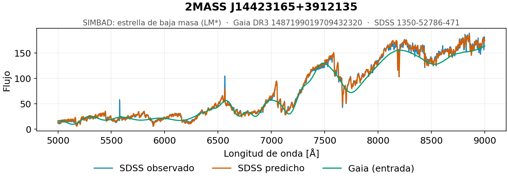

::::

*Fuente: Elaboración propia*

Secuencia central, baja luminosidad y baja temperatura. Espectros generados por el modelo de redes neuronales densas con la [SNR]{.acr .short} de Gaia como entrada para el extremo frío de la secuencia, con estrellas de baja masa de unos 3 100 K y paralajes de entre 8 y 27 mas, es decir, objetos cercanos y poco luminosos.
:::

:::{#fig-snr-wd}

::::{layout-nrow="2"}

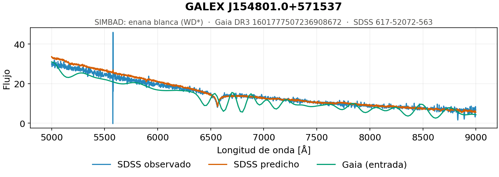

::::

*Fuente: Elaboración propia*

Enanas blancas. Espectros generados por el modelo de redes neuronales densas con la [SNR]{.acr .short} de Gaia como entrada para las enanas blancas, objetos calientes y poco luminosos cuyo espectro es un continuo decreciente con muy pocos rasgos.
:::

Por otro lado, las métricas obtenidas sobre el conjunto de test se encuentran en la @tbl-snr-gaia: 

::: {#tbl-snr-gaia}

| Pérdida | [MAE]{.acr} | [MSE]{.acr} |
|---|---:|---:|
| 0.0031 | 0.0424 | 0.0089 |

*Fuente: Elaboración propia*

Resultados obtenidos incluyendo la [SNR]{.acr .short} de la muestra de Gaia como entrada del modelo.
:::

Se puede apreciar cómo la incorporación de la [SNR]{.acr} como variable adicional de entrada no produjo una mejora significativa en el modelo. Los valores de pérdida, [MAE]{.acr} y [MSE]{.acr} fueron prácticamente los mismos que los obtenidos en pruebas anteriores y visualmente tampoco se apreció una mejora de la captación de tendencias del espectro. Por este motivo, se decidió no incluir esta variable en el modelo final.

### Resultados obtenidos con los modelos convolucionales

Se presentan por separado los resultados de las dos versiones del modelo convolucional: el modelo convolucional 1D y el modelo convolucional U-Net. Ambas compartían la misma normalización, por lo que, a diferencia de lo que ocurría con el modelo denso, sus métricas sí eran directamente comparables entre sí.

#### Modelo convolucional 1D

En el caso del modelo convolucional residual, el entrenamiento se detuvo en la época 11 por la función de parada temprana. La evolución de las métricas, representada en la @fig-training-metrics-cnn, mostró un descenso muy rápido durante las dos primeras épocas seguido de un estancamiento, a pesar de las sucesivas reducciones de la tasa de aprendizaje aplicadas durante el proceso.

Este comportamiento sugirió que la red convergía casi de inmediato hacia una solución cercana al propio espectro interpolado, aportando sobre él únicamente una corrección pequeña. Las curvas de entrenamiento y validación de la función de pérdida y [MAE]{.acr} permanecieron muy próximas entre sí durante todo el proceso, a diferencia de lo observado para el [MSE]{.acr} donde sí se apreciaron indicios de sobreajuste.

:::{#fig-training-metrics-cnn}

::::{ layout="[[-1,5,-1],[-1,5,-1],[-1,5,-1]]"}

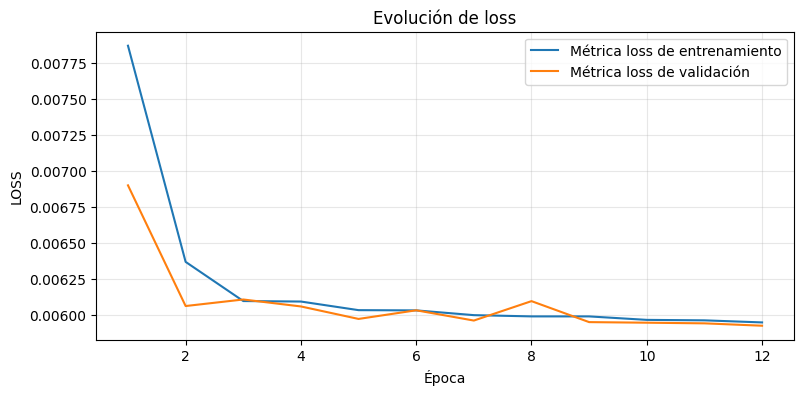

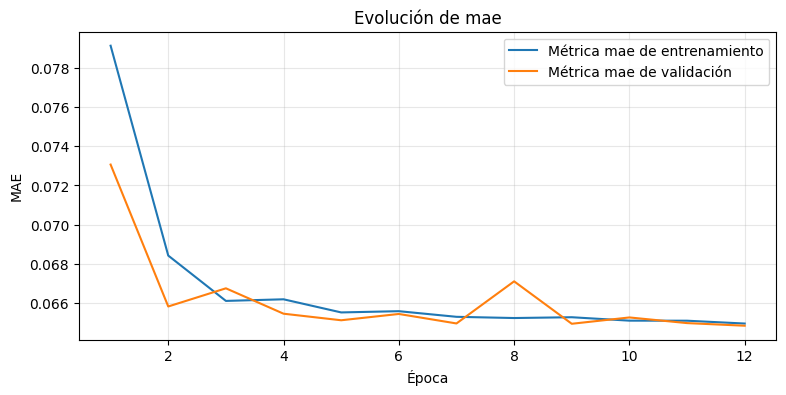

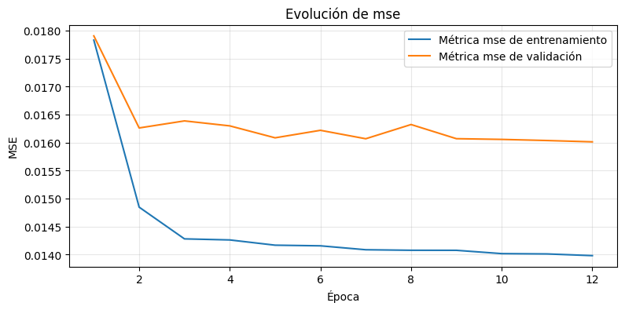
::::

*Fuente: Elaboración propia*

Gráficas de las métricas de evolución de entrenamiento en el modelo convolucional 1D
:::

Una vez finalizado el entrenamiento, se evaluó el modelo sobre el conjunto de test, obteniendo las métricas recogidas en la @tbl-test-cnn, muy similares a las de los conjuntos de entrenamiento y validación de la mejor época.

::: {#tbl-test-cnn}

| Conjunto de datos | Pérdida | [MAE]{.acr} | [MSE]{.acr} |
|---|---:|---:|---:|
| Entrenamiento | 0.0060 | 0.0650 | 0.0140 |
| Validación | 0.0059 | 0.0648 | 0.0160 |
| Test | 0.0058 | 0.0645 | 0.0130 |

*Fuente: Elaboración propia*

Resultados obtenidos con el modelo convolucional 1D para los diferentes conjuntos de datos.
:::

En las @fig-cnn-v1-left, @fig-cnn-v1-central, @fig-cnn-v1-right y @fig-cnn-v1-wd se muestran las predicciones obtenidas sobre los mismos objetos empleados en las comparativas del modelo denso, un grupo del diagrama [HR]{.acr} por gráfica y una vez deshecha la normalización. 
En todos los grupos se observó que el espectro predicho se mantenía muy próximo a la entrada de Gaia interpolada, aplicando sobre ella una corrección suave que ajusta la escala local del continuo. Sin embargo, el modelo no llegó a reconstruir las estructuras finas del espectro de [SDSS]{.acr}, en línea con el estancamiento temprano observado durante el entrenamiento.

:::{#fig-cnn-v1-left}

::::{layout-nrow="2"}

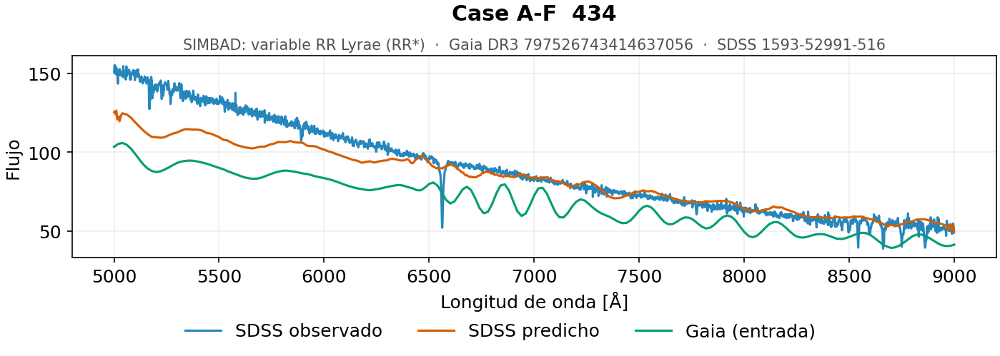

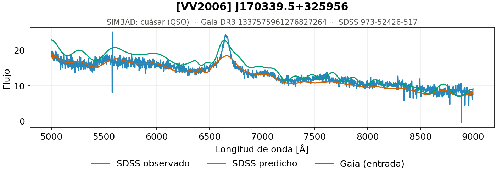

::::

*Fuente: Elaboración propia*

Secuencia central, alta luminosidad y alta temperatura. Espectros generados por el modelo convolucional 1D para los objetos con paralaje no significativo, por debajo de 0,01 mas, cuya magnitud absoluta no es fiable: SIMBAD identifica la pareja como una [RR*]{.acr .short} y un [QSO]{.acr .short}, y no como estrellas de la secuencia principal.
:::

:::{#fig-cnn-v1-central}

::::{layout-nrow="2"}

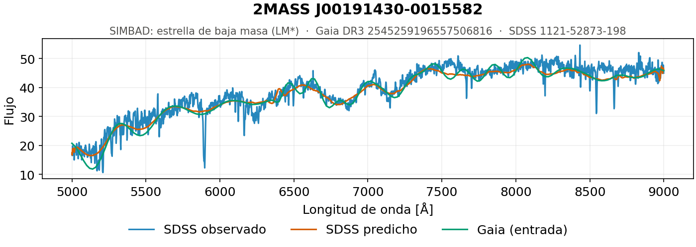

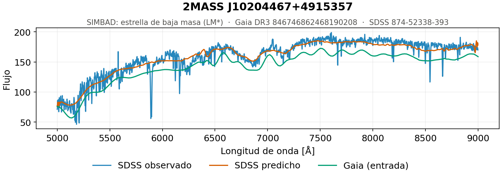

::::

*Fuente: Elaboración propia*

Secuencia central. Espectros generados por el modelo convolucional 1D para el tramo central de la secuencia, el grupo más poblado de la muestra con 655 objetos, formado por estrellas de baja masa con temperaturas efectivas en torno a 4 500 K.
:::

:::{#fig-cnn-v1-right}

::::{layout-nrow="2"}

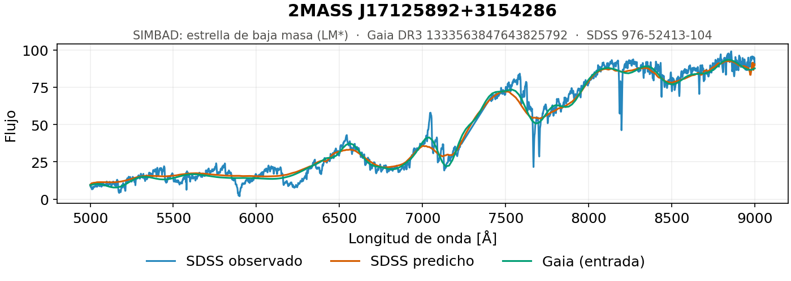

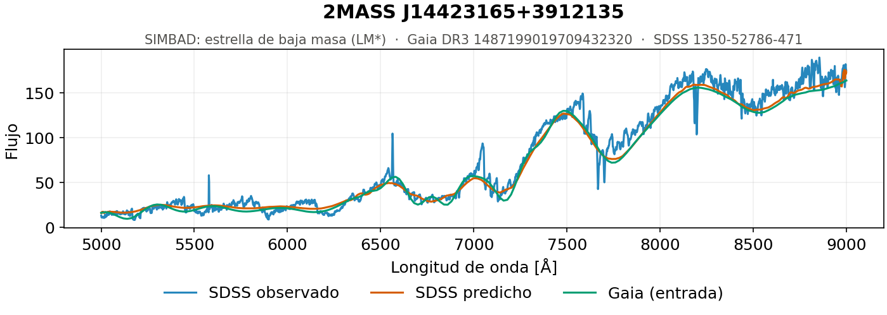

::::

*Fuente: Elaboración propia*

Secuencia central, baja luminosidad y baja temperatura. Espectros generados por el modelo convolucional 1D para el extremo frío de la secuencia, con estrellas de baja masa de unos 3 100 K y paralajes de entre 8 y 27 mas, es decir, objetos cercanos y poco luminosos.
:::

:::{#fig-cnn-v1-wd}

::::{layout-nrow="2"}

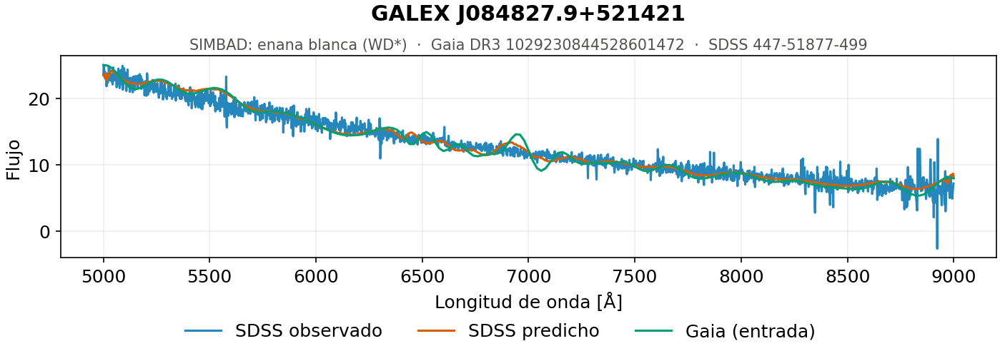

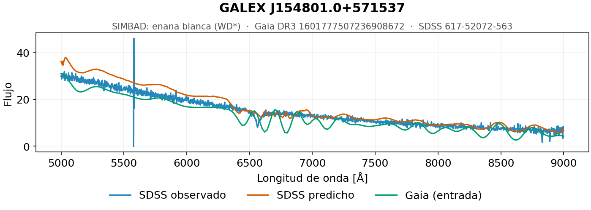

::::

*Fuente: Elaboración propia*

Enanas blancas. Espectros generados por el modelo convolucional 1D para las enanas blancas, objetos calientes y poco luminosos cuyo espectro es un continuo decreciente con muy pocos rasgos.
:::

#### Modelo convolucional U-Net

El comportamiento del modelo U-Net durante el entrenamiento fue muy distinto al del modelo convolucional 1D. Lejos de estancarse en las primeras épocas, la pérdida de validación siguió mejorando de forma sostenida: la función de reducción de la tasa de aprendizaje llegó a actuar tres veces (de 0.0003 hasta 0.000037) y cada reducción desbloqueó una nueva fase de mejora. El entrenamiento se interrumpió en la época 48, cuando la pérdida de validación llevaba varias épocas prácticamente estabilizada; gracias al guardado del mejor modelo en cada época, se conservaron los pesos de la época 47, la de mejor validación. La evolución de las métricas se muestra en la @fig-loss-evolution-cnn-v2 donde de nuevo las curvas de entrenamiento y validación permanecieron próximas entre sí, sin indicios de sobreajuste.

:::{#fig-loss-evolution-cnn-v2}

::::{ layout="[[-1,5,-1],[-1,5,-1],[-1,5,-1]]"}

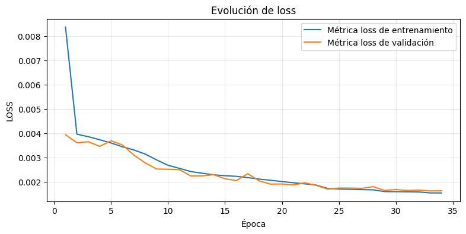

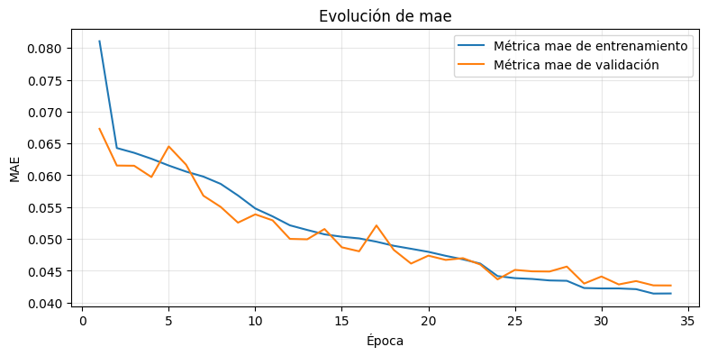

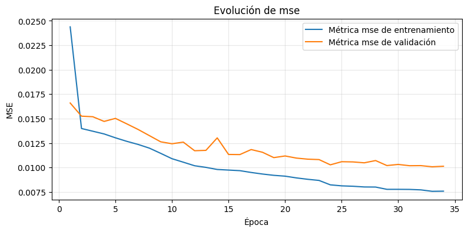

::::

*Fuente: Elaboración propia*

Gráficas de la evolución de las métricas de entrenamiento del modelo convolucional U-Net
:::

Las métricas de entrenamiento, validación y test de la mejor época se recogen en la @tbl-test-cnn-v2. Junto a las métricas sin ponderar, comparables con las del resto de modelos, se incluyen sus variantes ponderadas por la varianza inversa de [SDSS]{.acr}, que reflejan el objetivo que la red optimizó. La pérdida, al estar ponderada, no es comparable con la de las arquitecturas anteriores.

::: {#tbl-test-cnn-v2 tbl-colwidths="false"}

| Conjunto de datos | Pérdida | [MAE]{.acr} | [MSE]{.acr} | [MAE]{.acr} ponderado | [MSE]{.acr} ponderado |
|---|---:|---:|---:|---:|---:|
| Entrenamiento | 0.0015 | 0.0414 | 0.0076 | 0.0341 | 0.0032 |
| Validación | 0.0016 | 0.0427 | 0.0101 | 0.0352 | 0.0034 |
| Test | 0.0017 | 0.0433 | 0.0071 | 0.0362 | 0.0034 |

*Fuente: Elaboración propia*

Resultados obtenidos con el modelo convolucional U-Net para los diferentes conjuntos de datos.
:::

La comparación con la @tbl-test-cnn fue directa por compartir normalización: el [MAE]{.acr} sobre test bajó de 0.0645 a 0.0433 y el [MSE]{.acr} de 0.0130 a 0.0071. Asimismo, al comparar con el modelo denso normalizado con la mediana, se observó que los resultados obtenidos por este modelo convolucional eran generalmente mejores.
En las @fig-cnn-v2-left, @fig-cnn-v2-central, @fig-cnn-v2-right y @fig-cnn-v2-wd  se muestran las predicciones sobre los mismos objetos de las comparativas anteriores.

:::{#fig-cnn-v2-left}

::::{layout-nrow="2"}

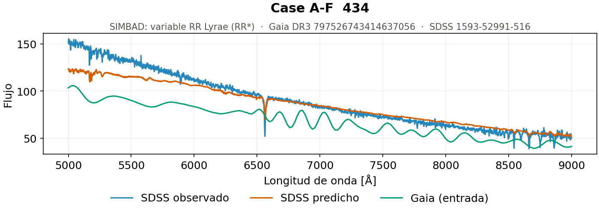

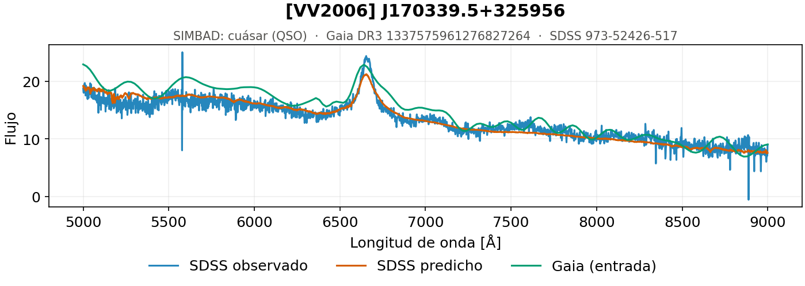

::::

*Fuente: Elaboración propia*

Secuencia central, alta luminosidad y alta temperatura. Espectros generados por el modelo convolucional U-Net para los objetos con paralaje no significativo, por debajo de 0,01 mas, cuya magnitud absoluta no es fiable: SIMBAD identifica la pareja como una [RR*]{.acr .short} y un [QSO]{.acr .short}, y no como estrellas de la secuencia principal.
:::

:::{#fig-cnn-v2-central}

::::{layout-nrow="2"}

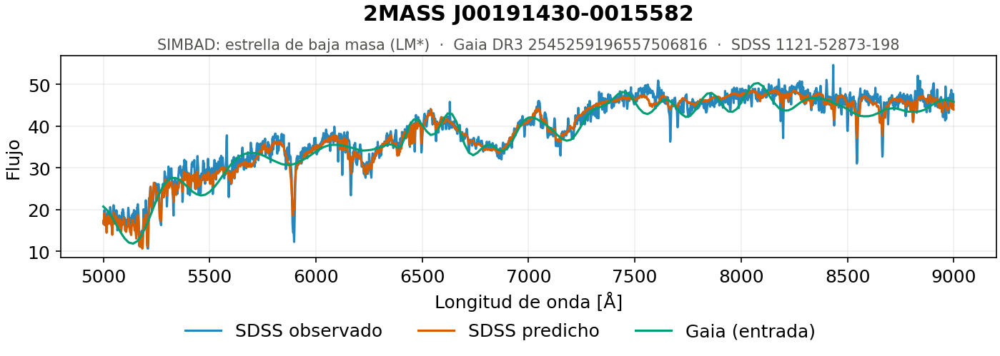

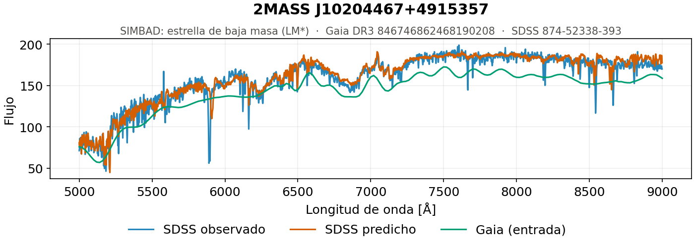

::::

*Fuente: Elaboración propia*

Secuencia central. Espectros generados por el modelo convolucional U-Net para el tramo central de la secuencia, el grupo más poblado de la muestra con 655 objetos, formado por estrellas de baja masa con temperaturas efectivas en torno a 4 500 K.
:::

:::{#fig-cnn-v2-right}

::::{layout-nrow="2"}

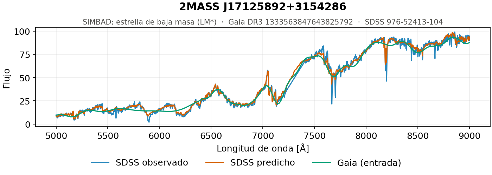

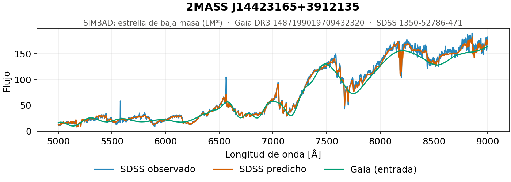

::::

*Fuente: Elaboración propia*

Secuencia central, baja luminosidad y baja temperatura. Espectros generados por el modelo convolucional U-Net para el extremo frío de la secuencia, con estrellas de baja masa de unos 3 100 K y paralajes de entre 8 y 27 mas, es decir, objetos cercanos y poco luminosos.
:::

:::{#fig-cnn-v2-wd}

::::{layout-nrow="2"}

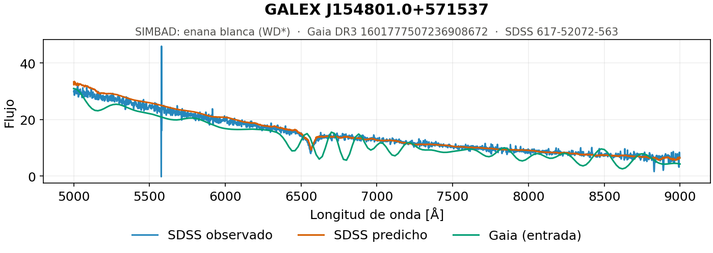

::::

*Fuente: Elaboración propia*

Enanas blancas. Espectros generados por el modelo convolucional U-Net para las enanas blancas, objetos calientes y poco luminosos cuyo espectro es un continuo decreciente con muy pocos rasgos.
:::

A diferencia del modelo convolucional 1D, la U-Net no se limitó a una corrección suave del continuo: la predicción reconstruyó parte de la estructura espectral fina del espectro de [SDSS]{.acr}, incluidas líneas de absorción y emisión que no eran visibles en la entrada de Gaia interpolada. Este salto cualitativo fue coherente con las mejoras introducidas: el campo receptivo global permitió corregir el continuo a todas las escalas, y la pérdida ponderada concentró la capacidad del modelo en los píxeles fiables del objetivo en lugar de en reproducir su ruido.

### Resultados obtenidos con el modelo recurrente

Después de entrenar diversas combinaciones de las características descritas para los modelos en el apartado de redes recurrentes, se pudieron destacar tres modelos que obtuvieron los mejores resultados entre los estudiados. 

#### Modelo basado en una capa [GRU]{.acr .short}
La primera arquitectura destacable, estaba formada por una capa de [GRU]{.acr} y dos densas con función de activación ReLU, junto a las mismas funciones de disminución de la tasa de aprendizaje y parada temprana que los modelos basados únicamente en redes neuronales densas. Después de 19 épocas se obtuvieron las métricas de entrenamiento, validación y test descritas en la @tbl-GRU-metrics:

::: {#tbl-GRU-metrics}

| Conjunto de datos | Pérdida | [MAE]{.acr} | [MSE]{.acr} |
|---|---:|---:|---:|
| Entrenamiento | 0.0045 | 0.0484 | 0.0118 |
| Validación | 0.0045 | 0.0482 | 0.0139 |
| Test | 0.0044 | 0.0480 | 0.0110 |

*Fuente: Elaboración propia*

Resultados obtenidos con el primer modelo basado en [GRU]{.acr .short} para los diferentes conjuntos de datos.
:::

Se puede observar que no se apreciaban diferencias significativas entre los grupos, pudiendo confirmar la inexistencia de sobreajuste al conjunto de entrenamiento. 

Respecto a las predicciones realizadas sobre las mismas observaciones que en los casos anteriores, se obtuvieron las gráficas de las @fig-gru-left, @fig-gru-central, @fig-gru-right y @fig-gru-wd, un par de espectros por cada grupo del diagrama [HR]{.acr}:

:::{#fig-gru-left}

::::{layout-nrow="2"}

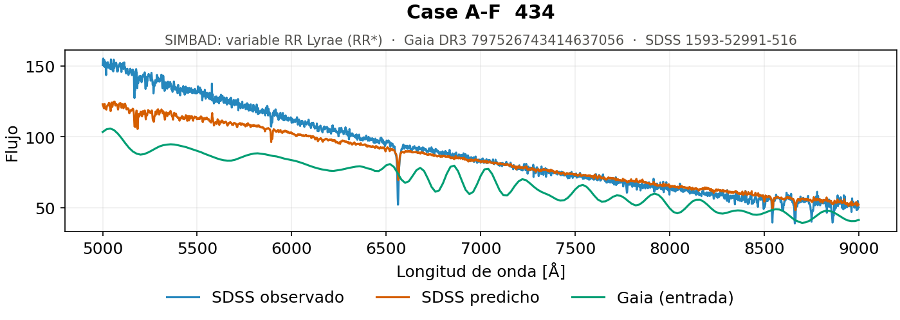

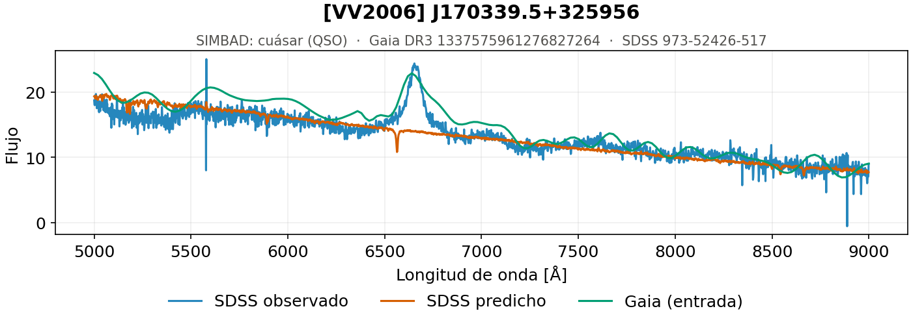

::::

*Fuente: Elaboración propia*

Secuencia central, alta luminosidad y alta temperatura. Espectros generados por el modelo de redes neuronales recurrentes con una capa de [GRU]{.acr .short} para los objetos con paralaje no significativo, por debajo de 0,01 mas, cuya magnitud absoluta no es fiable: SIMBAD identifica la pareja como una [RR*]{.acr .short} y un [QSO]{.acr .short}, y no como estrellas de la secuencia principal.
:::

:::{#fig-gru-central}

::::{layout-nrow="2"}

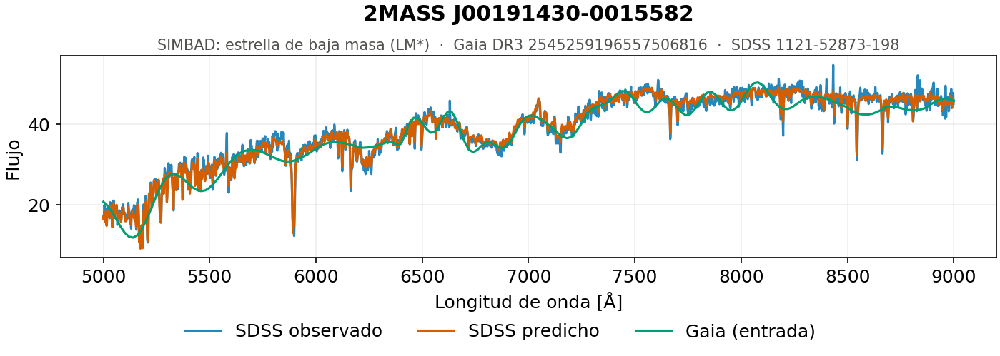

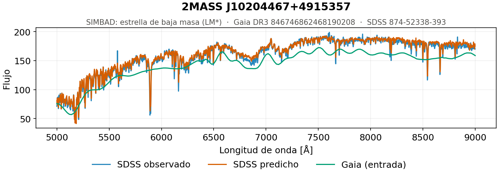

::::

*Fuente: Elaboración propia*

Secuencia central. Espectros generados por el modelo de redes neuronales recurrentes con una capa de [GRU]{.acr .short} para el tramo central de la secuencia, el grupo más poblado de la muestra con 655 objetos, formado por estrellas de baja masa con temperaturas efectivas en torno a 4 500 K.
:::

:::{#fig-gru-right}

::::{layout-nrow="2"}

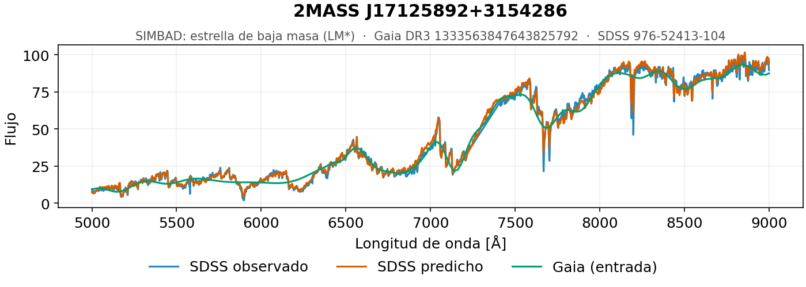

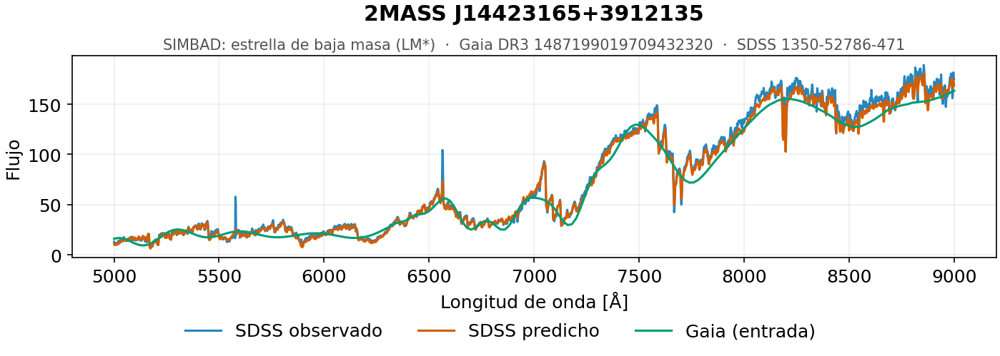

::::

*Fuente: Elaboración propia*

Secuencia central, baja luminosidad y baja temperatura. Espectros generados por el modelo de redes neuronales recurrentes con una capa de [GRU]{.acr .short} para el extremo frío de la secuencia, con estrellas de baja masa de unos 3 100 K y paralajes de entre 8 y 27 mas, es decir, objetos cercanos y poco luminosos.
:::

:::{#fig-gru-wd}

::::{layout-nrow="2"}

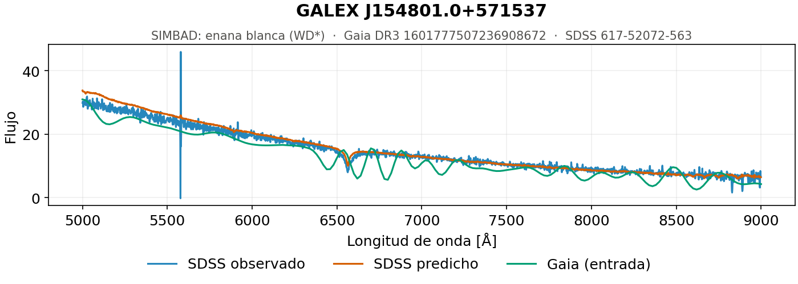

::::

*Fuente: Elaboración propia*

Enanas blancas. Espectros generados por el modelo de redes neuronales recurrentes con una capa de [GRU]{.acr .short} para las enanas blancas, objetos calientes y poco luminosos cuyo espectro es un continuo decreciente con muy pocos rasgos.
:::

Igual que sucedía en alguno de los modelos densos estudiados, las emisiones y absorciones de los dos primeros espectros no fueron captados por el modelo. Sin embargo, los siguientes obtuvieron buenos resultados.

La evolución de las métricas de entrenamiento puede observarse en la @fig-evolution-gru:

:::{#fig-evolution-gru}

::::{ layout="[[-1,5,-1],[-1,5,-1],[-1,5,-1]]"}

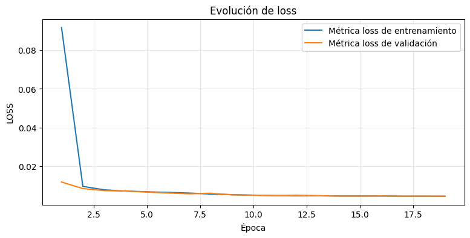

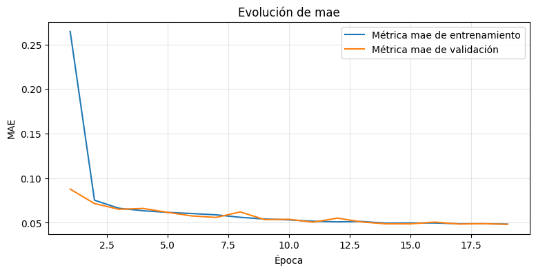

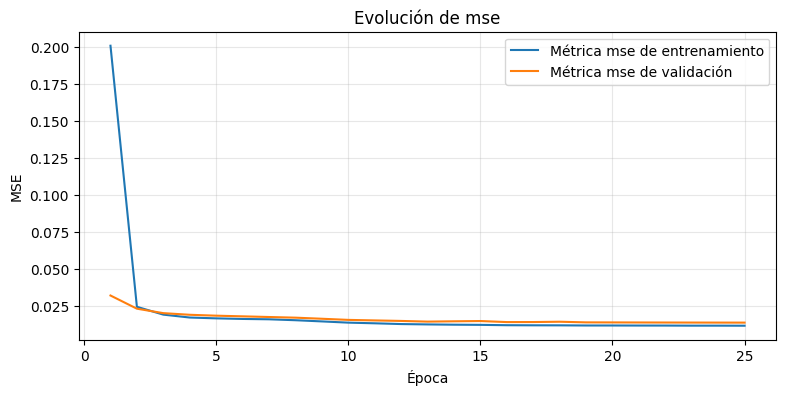

::::

*Fuente: Elaboración propia*

Gráficas de la evolución de las métricas de entrenamiento del modelo basado en una capa [GRU]{.acr .short}
:::

En estos gráficos se aprecia como el modelo convergió con pocas iteraciones, pero mantuvo una mejora constante que continuó alrededor de un total de 19 épocas.

#### Modelo basado en una capa Bidireccional
Los siguientes modelos a mencionar, usaron funciones de parada temprana con espera de 2 épocas y reducción de la tasa de aprendizaje con 1 época. 

La siguiente arquitectura usó una capa Bidireccional después de la de entrada, y a continuación, 4 capas densas con capas con funciones de activación LeakyReLU. 

Las métricas obtenidas tras las seis épocas de entrenamiento del modelo fueron las incluidas en la @tbl-BIRNN-metrics :

::: {#tbl-BIRNN-metrics}

| Conjunto de datos | Pérdida | [MAE]{.acr} | [MSE]{.acr} |
|---|---:|---:|---:|
| Entrenamiento | 0.0045 | 0.0496 | 0.0120 |
| Validación | 0.0045 | 0.0492 | 0.0140 |
| Test | 0.0044 | 0.0500 | 0.0110 |

*Fuente: Elaboración propia*

Resultados obtenidos con el modelo basado en [RNN]{.acr .short} bidireccionales para los diferentes conjuntos de datos.
:::

Estos valores fueron muy similares a los obtenidos en el modelo anterior, siendo entre un 0.001 y 0.01 más altos según la métrica. Siguieron siendo buenas aproximaciones e indicaron un buen comportamiento del modelo, pero no presentaron una mejora significativa comparado con el anterior. Contrariamente a lo que podría suponerse, el procesamiento de la secuencia en ambas direcciones no aportó una clara ventaja estadística en este conjunto de datos.

Los ejemplos usados para la representación visual de las aproximaciones tampoco presentaron grandes diferencias, tal y como observamos en las @fig-birnn-left, @fig-birnn-central, @fig-birnn-right y @fig-birnn-wd

:::{#fig-birnn-left}

::::{layout-nrow="2"}

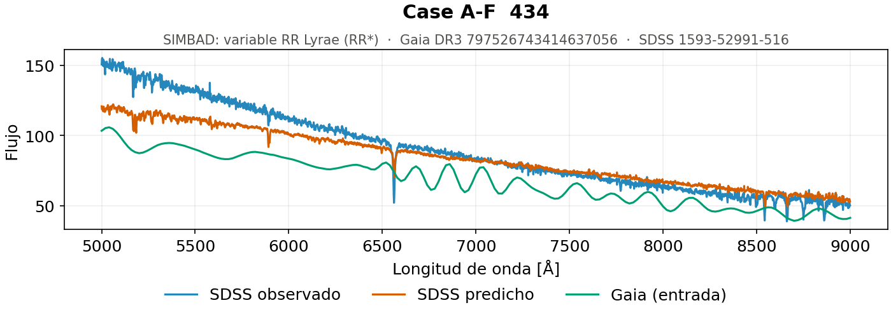

::::

*Fuente: Elaboración propia*

Secuencia central, alta luminosidad y alta temperatura. Espectros generados por el modelo de redes neuronales recurrentes con una capa bidireccional para los objetos con paralaje no significativo, por debajo de 0,01 mas, cuya magnitud absoluta no es fiable: SIMBAD identifica la pareja como una [RR*]{.acr .short} y un [QSO]{.acr .short}, y no como estrellas de la secuencia principal.
:::

:::{#fig-birnn-central}

::::{layout-nrow="2"}

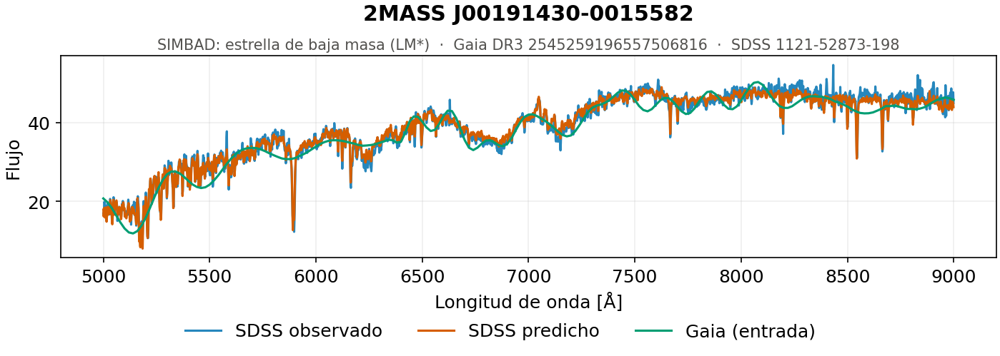

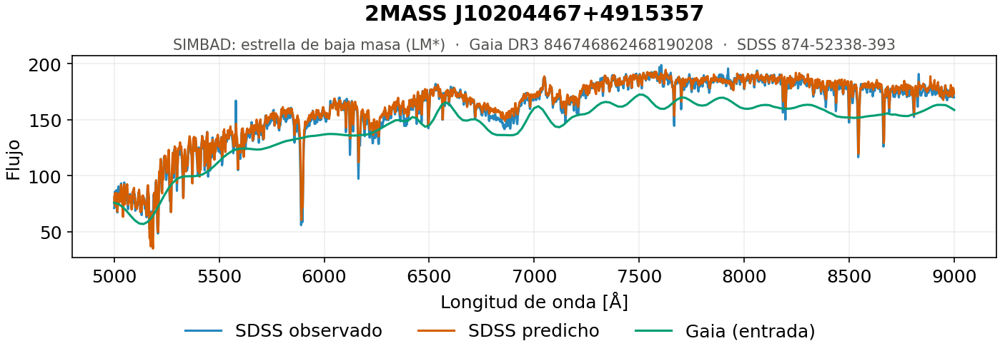

::::

*Fuente: Elaboración propia*

Secuencia central. Espectros generados por el modelo de redes neuronales recurrentes con una capa bidireccional para el tramo central de la secuencia, el grupo más poblado de la muestra con 655 objetos, formado por estrellas de baja masa con temperaturas efectivas en torno a 4 500 K.
:::

:::{#fig-birnn-right}

::::{layout-nrow="2"}

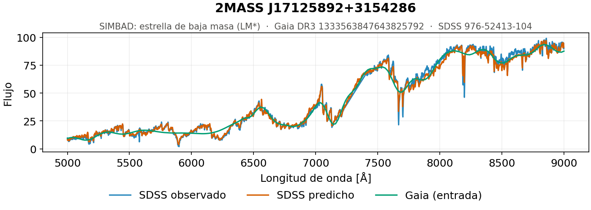

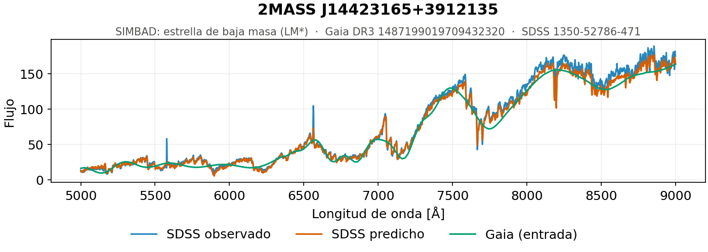

::::

*Fuente: Elaboración propia*

Secuencia central, baja luminosidad y baja temperatura. Espectros generados por el modelo de redes neuronales recurrentes con una capa bidireccional para el extremo frío de la secuencia, con estrellas de baja masa de unos 3 100 K y paralajes de entre 8 y 27 mas, es decir, objetos cercanos y poco luminosos.
:::

:::{#fig-birnn-wd}

::::{layout-nrow="2"}

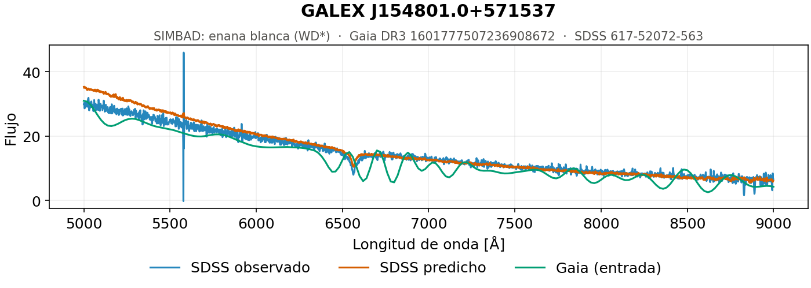

::::

*Fuente: Elaboración propia*

Enanas blancas. Espectros generados por el modelo de redes neuronales recurrentes con una capa bidireccional para las enanas blancas, objetos calientes y poco luminosos cuyo espectro es un continuo decreciente con muy pocos rasgos.
:::

Las predicciones mantuvieron el comportamiento del modelo anterior, sin grandes diferencias observables.

En cuanto a la evolución de las métricas, los resultados se ven representados en la @fig-evolution-birnn. Como en el caso anterior, los valores de entrenamiento y validación convergieron rápido, en este caso en la segunda época. A partir de aquí el modelo se mantuvo constante hasta que terminó su entrenamiento en la octava iteración

:::{#fig-evolution-birnn}

::::{ layout="[[-1,10,-1],[-1,10,-1],[-1,10,-1]]"}

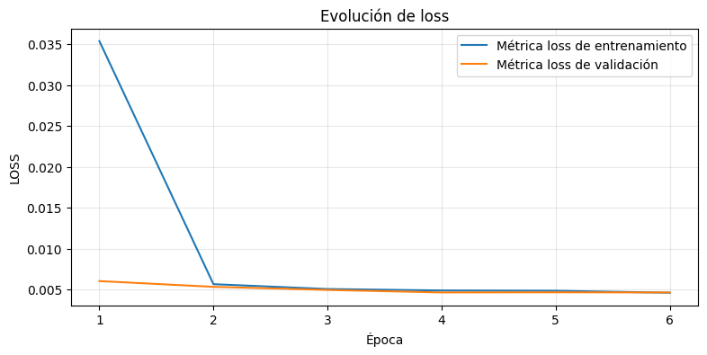

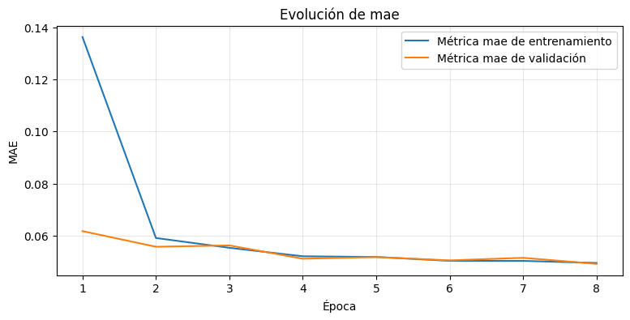

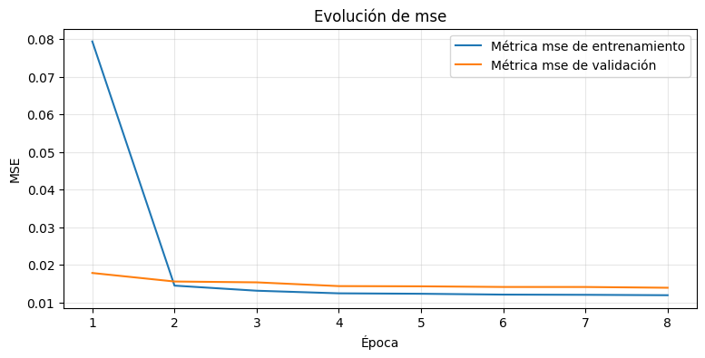

::::

*Fuente: Elaboración propia*

Gráficas de la evolución de las métricas de entrenamiento del modelo basado en una capa Bidireccional
:::

#### Modelo basado en capas Bidireccionales y función de Atención

El último modelo destacable de los estudiados en este apartado se basó en dos capas bidireccionales y la aplicación de la función de atención sobre todos los puntos del espectro junto a las capas densas anteriormente mencionadas. 
Esta adición tampoco representó grandes mejoras en las métricas del modelo, como puede observarse en la @tbl-ATT-metrics.

::: {#tbl-ATT-metrics}

| Conjunto de datos | Pérdida | [MAE]{.acr} | [MSE]{.acr} |
|---|---:|---:|---:|
| Entrenamiento | 0.0046 | 0.0505 | 0.0122 |
| Validación | 0.0047 | 0.0506 | 0.0143 |
| Test | 0.0045 | 0.0503 | 0.0113 |

*Fuente: Elaboración propia*

Resultados obtenidos con el modelo basado en [RNN]{.acr .short} bidireccionales y la función de Atención para los diferentes conjuntos de datos.
:::

A pesar de las ventajas del mecanismo de atención las métricas obtenidas siguieron estando muy cercanas a las de los demás modelos estudiados.

Igual que en las métricas comentadas, en los espectros usados como punto de control tampoco se apreciaron grandes diferencias como se puede observar en las imágenes de las @fig-att-left, @fig-att-central, @fig-att-right y @fig-att-wd. 

:::{#fig-att-left}

::::{layout-nrow="2"}

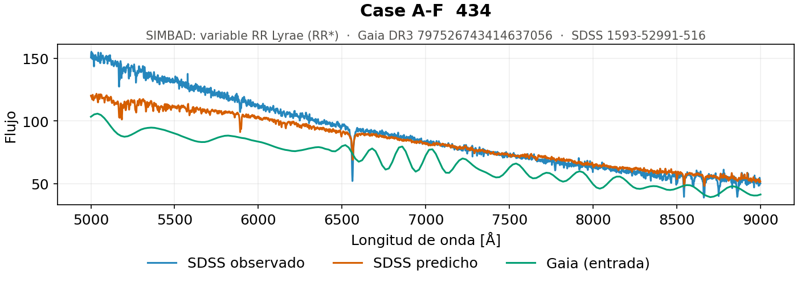

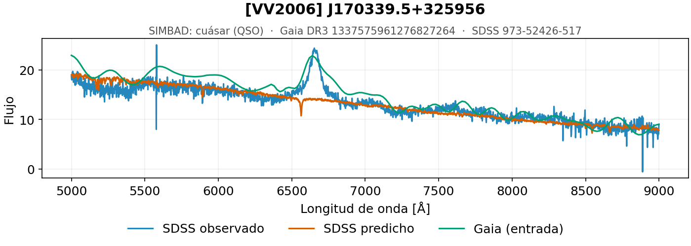

::::

*Fuente: Elaboración propia*

Secuencia central, alta luminosidad y alta temperatura. Espectros generados por el modelo de redes neuronales recurrentes con una función de Atención para los objetos con paralaje no significativo, por debajo de 0,01 mas, cuya magnitud absoluta no es fiable: SIMBAD identifica la pareja como una [RR*]{.acr .short} y un [QSO]{.acr .short}, y no como estrellas de la secuencia principal.
:::

:::{#fig-att-central}

::::{layout-nrow="2"}

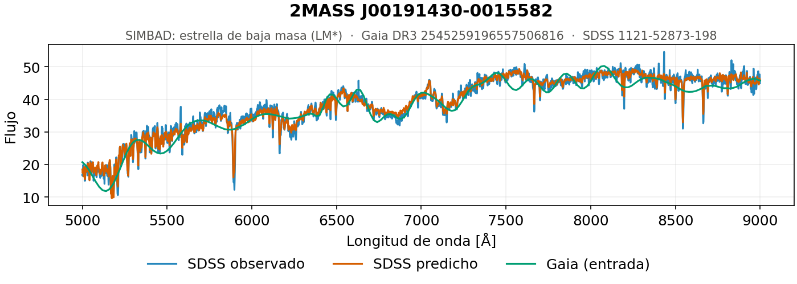

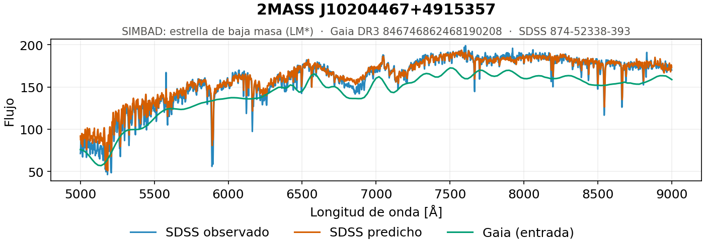

::::

*Fuente: Elaboración propia*

Secuencia central. Espectros generados por el modelo de redes neuronales recurrentes con una función de Atención para el tramo central de la secuencia, el grupo más poblado de la muestra con 655 objetos, formado por estrellas de baja masa con temperaturas efectivas en torno a 4 500 K.
:::

:::{#fig-att-right}

::::{layout-nrow="2"}

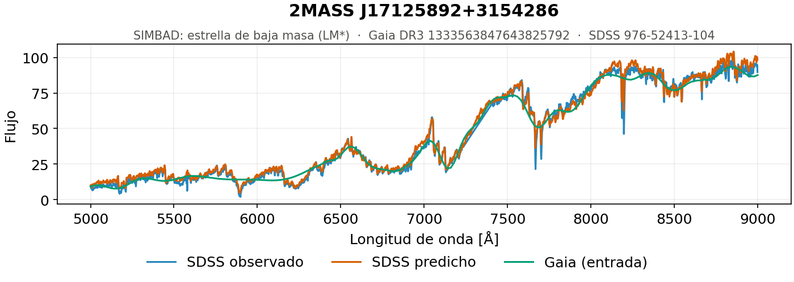

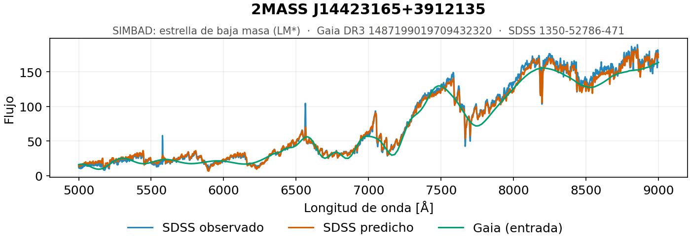

::::

*Fuente: Elaboración propia*

Secuencia central, baja luminosidad y baja temperatura. Espectros generados por el modelo de redes neuronales recurrentes con una función de Atención para el extremo frío de la secuencia, con estrellas de baja masa de unos 3 100 K y paralajes de entre 8 y 27 mas, es decir, objetos cercanos y poco luminosos.
:::

:::{#fig-att-wd}

::::{layout-nrow="2"}

::::

*Fuente: Elaboración propia*

Enanas blancas. Espectros generados por el modelo de redes neuronales recurrentes con una función de Atención para las enanas blancas, objetos calientes y poco luminosos cuyo espectro es un continuo decreciente con muy pocos rasgos.
:::

Visualmente los espectros no destacaron como para justificar la complejidad introducida en la arquitectura.

Finalmente, en la @fig-evolution-att se observa el comportamiento del modelo a lo largo del entrenamiento. 

En este caso, el modelo tardó cuatro épocas en converger y su entrenamiento se basó en pocas épocas, no llegando a superar las nueve.

:::{#fig-evolution-att}

::::{ layout="[[-1,10,-1],[-1,10,-1],[-1,10,-1]]"}

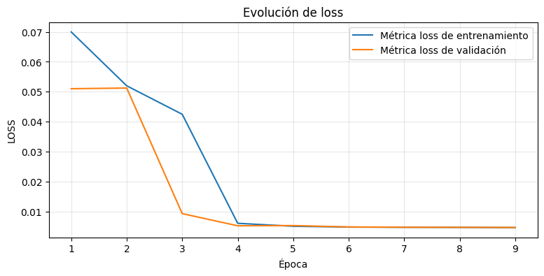

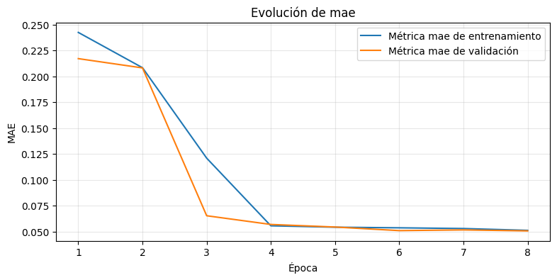

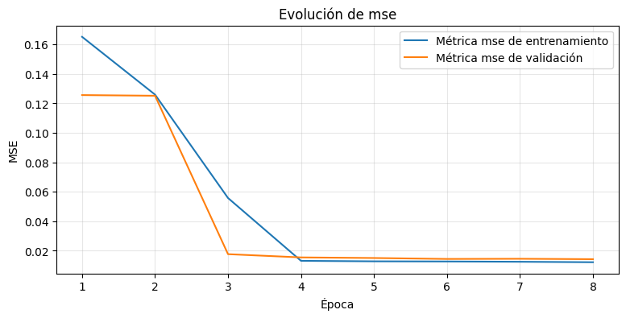

::::

*Fuente: Elaboración propia*

Gráficas de la evolución de las métricas de entrenamiento del modelo basado en el mecanismo de Atención
:::

## Discusión

Para comparar la eficacia de cada modelo estudiado con estadísticas añadidas a las ya utilizadas, se cuantificó la diferencia entre los espectros reales de [SDSS]{.acr} y los predichos por cada modelo a partir del estadístico chi-cuadrado para cada observación del conjunto de test y la librería *iSpec*.

Con *iSpec* se estimaron los parámetros astrofísicos de los cuerpos observados a partir del espectro real de [SDSS]{.acr} y los predichos. 
Para ello primero se transformó cada espectro en el formato requerido por *iSpec*, teniendo que añadir para cada punto el flujo, longitud de onda y error asociado. El análisis se realizó sin incertidumbre asignada a cada punto, con lo que se asignó un valor unitario de error a todos los puntos de modo que todos partiesen del mismo peso.
Una vez teníamos la estructura requerida, normalizamos al continuo los espectros con la función propia de *iSpec*.

Además, los puntos iniciales de comprobación de las variables $T_{\mathrm{eff}}$, $\log g$ y $[\mathrm{M}/\mathrm{H}]$ se definieron a partir de las observaciones de Gaia para facilitar el entrenamiento y no partir siempre de unos valores por defecto. 

En primer lugar, se realizó el ajuste con la malla de modelos atmosféricos *MARCS.GES* [@Gustafsson2008], pero se observaron advertencias de que los valores quedaban fuera del rango disponible, así que se usó *ATLAS9.Castelli* [@CastelliKurucz2003], que prácticamente eliminó el problema. Estas mallas atmosféricas incluyen modelos teóricos de atmósferas estelares, describiendo el comportamiento atmosférico de las estrellas bajo diferentes condiciones de temperatura, gravedad y metalicidad. Por otro lado, la lista de líneas atómicas usada fue *VALD* [@Piskunov1995], cuyo contenido identifica las líneas espectrales con los elementos a los que pertenecen e incluye parámetros necesarios para la síntesis espectral. 
Se usaron las abundancias solares de Grevesse [@Grevesse2007] como referencia de la metalicidad y la información isotópica de *SPECTRUM* [@GrayCorbally1994].

A partir de los datos iniciales, mallas e información base mencionada, se ajustó la temperatura, gravedad superficial y metalicidad de las estrellas.

Para comprobar el funcionamiento del modelo de redes neuronales, se tomaron los resultados del espectro real de [SDSS]{.acr} como los verdaderos, y se compararon los predichos con estos, calculando las diferencias entre los datos obtenidos, sus errores absolutos y relativos. 

Se analizaron muestras aleatorias de 250 espectros para cada modelo las diferencias entre los valores estimados a partir de los espectros de [SDSS]{.acr} reales y los predichos por los modelos fueron los incluidos en la @tbl-iSpec:

::: {#tbl-iSpec tbl-colwidths="false"}

| Modelo | Error relativo de Teff | Error relativo de log(g) | Error absoluto de M/H |
|---|---:|---:|---:|
| Densa global | 0.30% | 0.08% | 0.010dex |
| Densa con mediana | 0.23% | 0.09% | 0.020dex |
| Densa con máximo | 0.28% | 0.08% | 0.015dex |
| Convolucional 1D | 0.37% | 0.21% | 0.018dex |
| Convolucional U-Net | 0.35% | 0.19% | 0.022dex |
| [GRU]{.acr .short} | 0.24% | 0.11% | 0.018dex |
| Bidireccional | 0.36% | 0.12% | 0.017dex |
| Atención | 0.28% | 0.11% | 0.019dex |

*Fuente: Elaboración propia*

Resultados obtenidos con *iSpec* en los modelos comentados en apartados anteriores.
:::

Las fórmulas utilizadas para el cálculo de los errores relativos fueron las siguientes:

$$
\mathrm{Error\ relativo}\,(T_{\mathrm{eff}}) = \frac{|T_{\mathrm{eff,pred}} - T_{\mathrm{eff,real}}|} {|T_{\mathrm{eff,real}}|} \cdot 100
$$

$$
\mathrm{Error\ relativo}\,(\log(g)) =
\frac{|\log(g)_{\mathrm{pred}} - \log(g)_{\mathrm{real}}|}
{|\log(g)_{\mathrm{real}}|} \cdot 100
$$

Los resultados obtenidos a partir de los dos datos anteriores muestran cómo la elección del modelo con mejor ajuste a los objetivos dependió del tipo de estadístico comprobado.
En primer lugar, teniendo en cuenta las métricas de entrenamiento y test, la arquitectura basada en una red convolucional U-Net fue la que obtuvo mejores resultados. Al mismo tiempo, visualmente parecía captar más regiones de absorción y emisión que otros modelos no eran capaces de aproximar. Por otro lado, no consiguió ajustarse tanto a las pequeñas fluctuaciones locales como por ejemplo el modelo basado en una red neuronal densa con la normalización a través de la mediana. Este hecho podría deberse a que el modelo tenía en cuenta la incertidumbre de los puntos para aportar peso en su entrenamiento a aquellos que menos ruido presentasen.

No obstante, al evaluar mediante *iSpec* las aproximaciones de características astrofísicas, se observó que todos los modelos presentaban un comportamiento similar. A partir de esta herramienta no se pudo destacar un único modelo de forma clara con mejor rendimiento que los demás. Aún así, si se obervó que las predicciones producían parámetros astrofísicos muy próximos a los obtenidos mediante los espectros reales, indicando que las diferencias entre métricas de entrenamiento y visuales, no se reflejaban de forma llamativa en los parámetros estimados con esta librería. 
En todo caso, al comparar los datos de los modelos destacables de este estudio se observó como el modelo basado en redes neuronales densas y normalización con la mediana parecía obtener estadísticas ligeramente mejores, siendo el que menores diferencias presenta en cuanto a la temperatura y un 0.01% for detrás del mejor valor obtenido sobre la gravedad superficial. 

En general, las diferencias entre los tres modelos recurrentes fueron reducidas, por lo que todos ellos conservaron de forma similar información necesaria para estimar los parámetros astrofísicos estudiados. 
En conjunto, estos resultados reforzaron la idea de que no por aumentar la complejidad del modelo mejora el rendimiento.
El modelo con una capa [GRU]{.acr} fue destacable como el más equilibrado entre complejidad y resultados dentro de las [RNN]{.acr}, pero aun así no superó los resultados obtenidos con el modelo neuronal denso.

Aún así estos valores indicaron una relación de similitud entre las propiedades físicas de ambos espectros, por lo que se pudo afirmar que los modelos estudiados conllevaban una alta capacidad para predecir los espectros de [SDSS]{.acr} manteniendo las características astrofísicas predichas con *iSpec* en rangos de error pequeños. 

El siguiente estadístico analizado fue Chi-cuadrado. La definición utilizada se basó en la diferencia entre el flujo real y el flujo predicho ponderada con la varianza inversa. Al considerar esta definición, los puntos espectrales con una incertidumbre menor, tienen más peso en el cálculo, mientras que los puntos con mayor rango de error contribuyen en menor medida al resultado. 

La fórmula de chi-cuadrado se define como :

$$ \chi^2 = \sum_{i=1}^{N} \frac{\left(f_{\mathrm{real},i}-f_{\mathrm{pred},i}\right)^2}{\sigma_i^2} = \sum_{i=1}^{N}\left(f_{\mathrm{real},i}-f_{\mathrm{pred},i}\right)^2 \mathrm{ivar}_i $$

donde $f_{\mathrm{real},i}$ y $f_{\mathrm{pred},i}$ representan, respectivamente, el flujo real y predicho en el punto espectral $i$, respectivamente, mientras que $\mathrm{ivar}_i$ es la varianza inversa sacada de los datos de [SDSS]{.acr}. Esta ponderación permite tener en cuenta la incertidumbre de cada punto espectral en lugar de suponer que todos tienen la misma precisión.

Por otro lado, como $\chi^2$ también depende del número de puntos de cada espectro, se consideró una versión normalizada dividida por la cantidad de puntos espectrales válidos (con varianza inversa no nula). La normalización facilita la comparación entre los distintos espectros, dado que valores próximos a la unidad indican que las diferencias entre ambos espectros son comparables con la incertidumbre de la muestra, mientras que valores mayores implican discrepancias superiores a las esperadas en los puntos espectrales. 
Teniendo esto en cuenta, la fórmula final fue:

$$\chi^2_{\mathrm{norm}} = \frac{\chi^2}{N} $$

A partir de esta expresión se obtuvieron los valores de la @tbl-chi-square:

::: {#tbl-chi-square}

| Modelo | Mediana | Mínimo | Máximo |
|---|---:|---:|---:|
| Densa con mediana | 1.52 | 0.53 | 137.00 |
| [GRU]{.acr .short} | 1.69 | 0.51 | 195.58 |
| Convolucional U-Net | 1.82 | 0.51 | 111.73 |
| [RNN]{.acr .short} bidireccional | 1.94 | 0.58 | 269.77 |
| [RNN]{.acr .short} bidireccional con atención | 2.10 | 0.53 | 193.42 |
| Densa global | 3.50 | 0.48 | 432.12 |
| Convolucional 1D | 3.96 | 1.06 | 704.61 |
| Densa con máximo | 5.62 | 0.55 | 93729.96 |

*Fuente: Elaboración propia*

Chi-cuadrado normalizado aplicado sobre los conjuntos de test predichos por los diversos modelos estudiados.
:::

Igual que en el caso anterior, el modelo basado en una red neuronal densa con la normalización aplicada con la mediana por espectro fue el que mejores resultados obtuvo. Ni los modelos convolucionales ni los recurrentes mejoraron sus mediana. 
Al comparar el mínimo y máximo chi-cuadrado, destacamos que aunque la red densa obtuviese la mejor mediana, la red convolucional U-Net obtuvo el rango de valores más desplazado hacia el cero. 

Por otro lado, el modelo denso normalizado con el máximo de cada espectro fue el menos estable, tal y como se apreció en la diferencia entre el mínimo y máximo, dos órdenes de magnitud por encima de la del resto de modelos. Presentó una mediana aproximadamente 4 veces superior al modelo con mejores resultados, confirmando que era el que peor comportamiento presentaba de entre los modelos seleccionados en este estudio. Además, el valor máximo tan elevado indicó la presencia de predicciones con discrepancias mucho mayores a las del resto de arquitecturas.

Entre las arquitecturas convolucionales, la U-Net redujo prácticamente a la mitad la mediana del modelo convolucional 1D (de 3.96 a 1.82), en la misma línea que la mejora que ya mostraban el [MAE]{.acr} y el [MSE]{.acr} sobre el conjunto de test. Este resultado puede deberse a que el chi-cuadrado pondera cada punto espectral con su varianza inversa, de modo que penaliza especialmente la corrección suave que esta redes aplican sobre el espectro de Gaia interpolado, que no llegaron a reproducir las estructuras finas del espectro de [SDSS]{.acr}.

Si nos centramos en los resultados obtenidos por la red que mejores estadísticas presentó en cuanto a *iSpec* y el estadístico chi-cuadrado, la red neuronal densa con la normalización por la mediana, observamos en la @fig-HR-CHI-dense que no destaca una categoría de estrellas donde el modelo presentara un mejor o peor ajuste.

:::{#fig-HR-CHI-dense}

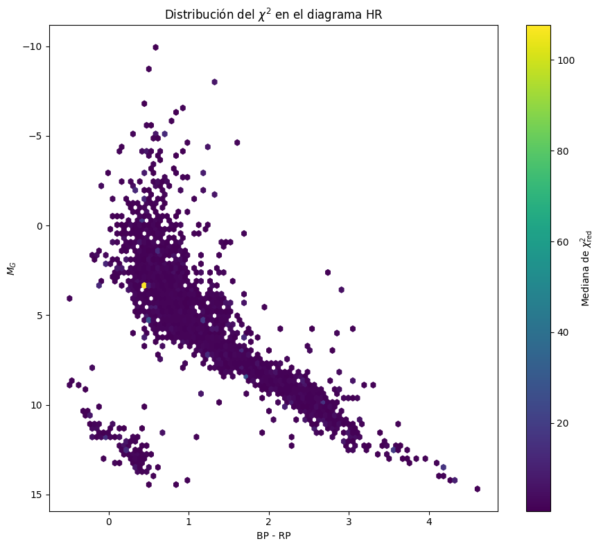

*Fuente: Elaboración propia*

Diagrama [HR]{.acr .short} del estadístico chi-cuadrado normalizado aplicado sobre la muestra de test en el modelo denso.
:::

La distribución de los valores del estadístico chi-cuadrado a lo largo del diagrama [HR]{.acr} no mostró una concentración evidente de zonas con grandes fallos, por lo que el rendimiento del modelo pareció no depender del tipo de estrella.

Cabe destacar que en el gráfico se observaron algunas estrellas puntuales con un valor de chi-cuadrado muy superior al resto. Sin embargo, estas no parecieron seguir una distribución discreta, sino que se encontraron dispersas a lo largo del diagrama.

Las mismas conclusiones se extrajeron al analizar la distribución del chi-cuadrado sobre los datos generados con el modelo convolucional U-Net de la @fig-HR-CHI-UNET.

:::{#fig-HR-CHI-UNET}

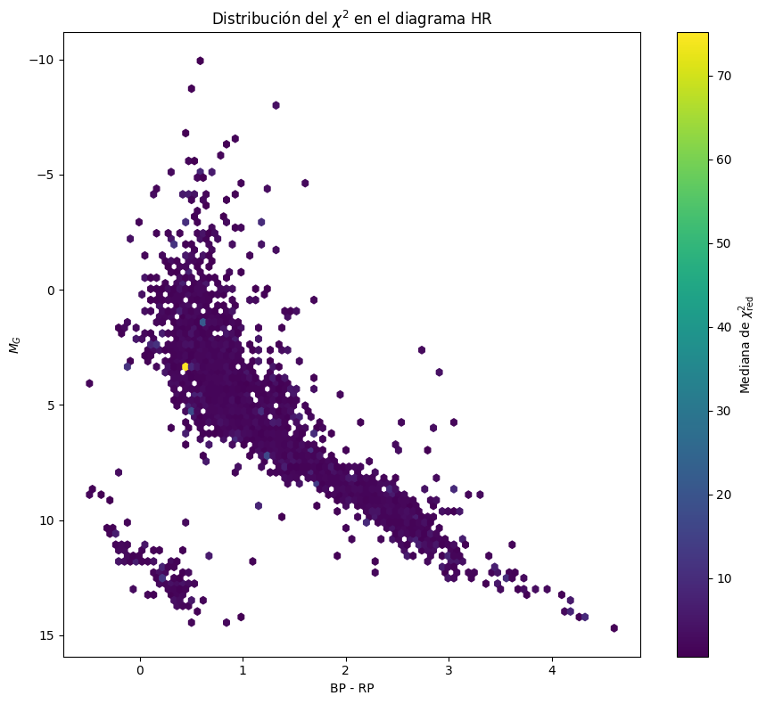

*Fuente: Elaboración propia*

Diagrama [HR]{.acr .short} del estadístico chi-cuadrado normalizado aplicado sobre la muestra de test en el modelo convolucional U-Net.
:::

## Conclusiones y trabajo futuro

En este capítulo se incluyen las conclusiones obtenidas tras el desarrollo del trabajo y comentarios acerca de posibles trabajos futuros partiendo de los resultados obtenidos.

### Conclusiones

A lo largo del trabajo se llevó a cabo todo el desarrollo necesario para poder entrenar un modelo de redes neuronales, partiendo desde la creación de la base de datos de espectros de Gaia y [SDSS]{.acr} hasta su uso para la validación del modelo generado. 

En primer lugar, la creación de la base de datos resultó no ser algo trivial. Se diseñó un proceso por etapas que nos permitió obtener, a partir de espectros y datos de [SDSS]{.acr}, la información captada por Gaia del cuerpo que categorizaba como el vecino más cercano. Se observaron diversas limitaciones en este proceso, en gran medida debido a la estructura y capacidad de los servicios de consulta de los que disponen ambos instrumentos. Por este motivo, una parte importante del trabajo se basó en conseguir un método robusto y reproducible que permitiese crear la base de datos inicial. Este proceso formó parte también de los resultados del trabajo, ya que la herramienta permitía obtener y preparar nuevas parejas de espectros de forma automatizada.
Al mismo tiempo, la calidad de los pares de espectros también influyó en el estudio. Se tuvieron que descartar algunos datos debido a escalas incompatibles, artefactos, [SNR]{.acr} de mala calidad o valores completamente anómalos, como por ejemplo espectros constantes o nulos a lo largo de la longitud de onda observada. Este filtrado permitió trabajar con una muestra más homogénea, reduciendo así los efectos negativos de observaciones que podrían haber dificultado el entrenamiento del modelo.

En cuanto al modelo neuronal, se planteó un problema de regresión multivariante, cuya red recibía como entrada un espectro de Gaia y tenía el objetivo de predecir como salida un espectro de [SDSS]{.acr}. 

Se evaluaron diferentes arquitecturas de modelo y preprocesamientos de la base de datos, considerando definitivas las versiones que se pueden encontrar detalladas en este trabajo. 
De dicho proceso de prueba y error, se obtuvieron resultados que demostraron que las diferentes arquitecturas estudiadas eran capaces de predecir la forma general de los espectros de [SDSS]{.acr} en gran parte de los casos.

Respecto a las métricas generales de entrenamiento, validación y test, el modelo que destacó por encima de los demás fue el basado en una arquitectura convolucional U-Net. Este obtuvo los mejores valores de pérdida, [MAE]{.acr} y [MSE]{.acr}. Además, visualmente esta arquitectura fue capaz de captar la morfología global de los espectros y, a diferencia de la mayoria del resto de modelos, ciertas regiones de emisión y absorción que incluso Gaia no registraba. 

En contraposición, también se observó que las redes convolucionales generaban predicciones más suavizadas que los demás modelos, sugiriendo que en comparación a otros modelos, no captaba fluctuaciones locales de [SDSS]{.acr}. Ahora bien, como trabajo futuro se debería investigar si estas oscilaciones eran principalmente ruido o señal.

Considerando el estadístico chi-cuadrado y la aproximación de parámetros con *iSpec*, el modelo neuronal denso con la normalización aplicada con la mediana por espectro obtuvo mayoritariamente las mejores métricas al comparar espectros de [SDSS]{.acr} predichos y reales. Al mismo tiempo, obtuvo las segunda posición en cuanto a mejores métricas de pérdida, [MAE]{.acr} y [MSE]{.acr}.
Incluso al usar la librería *iSpec* para estimar características astrofísicas, se obtuvieron resultados positivos, con diferencias relativas inferiores al 0.23% en la temperatura y 0.09% la gravedad superficial. Estas estadísticas indicaron que los espectros predichos no solo reproducían la forma general de los espectros reales, sino que conservaban parte de la información física necesaria para estimar parámetros astrofísicos.

Asimismo, la comparación de las métricas de entrenamiento, validación y test permitió asegurar que este modelo no se había sobreajustado a los datos usados durante el entrenamiento, sino que presentaba capacidad para generalizar su uso sobre datos no observados. 

Concluyendo todos los datos aportados, el modelo U-Net obtuvo las mejores métricas de entrenamiento y visualmente captó zonas del espectro que Gaia no observó. Por otro lado, la red neuronal denas con normalización basada en la mediana por espectro obtuvo mejores resultados en cuanto a *iSpec* y la estadística chi-cuadrado, pero sin destacar de forma evidente por encima de los demás modelos. 

En resumen, podemos concluir que este trabajo demostró la viabilidad de diseñar un modelo de redes neuronales capaz de aproximar espectros captados por Gaia a una representación similar a los observados por [SDSS]{.acr}. Además, los resultados obtenidos con *iSpec* mostraron que estas aproximaciones mantenían características espectrales que definían aspectos astrofísicos importantes. Este hecho permite dejar una puerta abierta a varias líneas de mejora, las cuales serán comentadas en el siguiente apartado. 

### Trabajo futuro

Los resultados obtenidos en este estudio constituyen un punto de partida para diversas líneas de mejora. 
Por ejemplo, una primera opción sería refinar y ampliar la base de datos de entrenamiento. En este trabajo se consiguió construir un conjunto de más de 55 000 parejas de espectros Gaia-[SDSS]{.acr}, pero como el rendimiento y la calidad del modelo dependen directamente de dicha base, cuanta mejor sea la selección e investigación de los datos usados, mejores resultados podrían obtenerse. Además de la posibilidad de aumentar el número de observaciones, se podría intentar buscar una distribución equilibrada entre los diferentes tipos de estrella.
Como se observó al analizar los datos a través de un diagrama [HR]{.acr}, las estrellas gigantes estaban escasamente representadas durante el entrenamiento del modelo, con lo que se podría extender el conjunto de datos usado. Si se aumentase este conjunto, podría comprobarse el rendimiento del modelo ante espectros con parámetros poco representados durante su entrenamiento.

Otra opción consistiría en entrenar modelos especializados para distintos tipos de objetos o rangos de parámetros físicos. En este estudio se empleó un único modelo global que debía aprender relaciones espectrales para todos los objetos incluidos en el conjunto de datos. Sin embargo, si la base de datos se separase tratando de agrupar aquellos espectros más similares en diversos subconjuntos, la calidad del modelo final podría aumentar dado que facilitaríamos su aprendizaje. Una posible partición podría basarse en datos como la temperatura, gravedad superficial o metalicidad.

Una línea de trabajo futura adicional estaría relacionada con el proceso de normalización llevado a cabo para entrenar los espectros. En este estudio, se usaron datos del espectro real de [SDSS]{.acr} para normalizar los datos de entrenamiento del modelo y para deshacer la normalización en el espectro predicho. 
En un entorno de aplicación real del modelo, el espectro de [SDSS]{.acr} no estaría disponible, ya que el espectro de mejor calidad es el objetivo a aproximar. Una posible alternativa consistiría en usar los datos del espectro de Gaia para normalizar el espectro de [SDSS]{.acr}. En ese caso, sería necesario volver a entrenar y comparar las arquitecturas y sus resultados.

Por otro lado, también existiría la opción de considerar nuevas estadísticas para valorar la calidad de los modelos. Por ejemplo, podría desarrollarse una evaluación centrada en aquellas regiones del espectro que presentan más interés astrofísico, como intervalos de absorción o emisión asociados a elementos concretos.
Además, podría añadirse una paso más a la comparación realizada con *iSpec*: se podrían usar también los espectros de Gaia para sacar estimaciones de sus parámetros astrofísicos y comparar los valores obtenidos con los datos estimados con espectros de[SDSS]{.acr} reales y los predichos. Incluyendo también más datos acerca de las diferencias relativas y absolutas de cada variable estudiada.

Durante el trabajo se consideró la posibilidad de incluir la [SNR]{.acr} como uno de los parámetros de entrada del modelo. Si bien es cierto, este hecho no produjo mejoras significativas en los resultados obtenidos, pero es una opción a tener en cuenta como posible línea de exploración. En el modelo convolucional U-Net, se tuvo en cuenta la varianza inversa como peso para ponderar la función de pérdida. Expandiendo este camino se podría valorar la fiabilidad de cada punto de los espectros observados por Gaia y [SDSS]{.acr}, aplicándolo sobre otros modelos permitiría valorar de forma más precisa el error cometido por cada uno. 

La programación de los modelos se basó en scripts y notebooks de Python, aunque en un futuro podría facilitarse el acceso a este servicio mediante el desarrollo de una aplicación que permita acceder al modelo de una forma más sencilla. Esta aplicación podría permitir introducir un espectro de Gaia, ejecutar el modelo y visualizar el espectro predicho junto a datos asociados a la calidad de la predicción.

Finalmente, la idea de este estudio podría extenderse a otros conjuntos de datos astronómicos. Este proyecto se centró en la liberación de datos número tres de Gaia y la decimotercera de [SDSS]{.acr} debido a sus plataformas y al cruce de datos previamente existente, pero la metodología desarrollada podría aplicarse de forma general a otros catálogos de datos astronómicos.
En este trabajo, el objetivo principal era conseguir mejorar la calidad de los datos captados por Gaia a partir de una herramienta que los aproximase a las observaciones de [SDSS]{.acr}. Esto podría generalizarse a otros satélites o telescopios que presenten el mismo problema que nuestro conjunto de datos de entrada: una baja resolución espectral.

Generalizando los resultados obtenidos, el modelo no solo transformaría Gaia en [SDSS]{.acr}, sino que podría servir como base para mejorar las observaciones procedentes de instrumentos astronómicos. 
