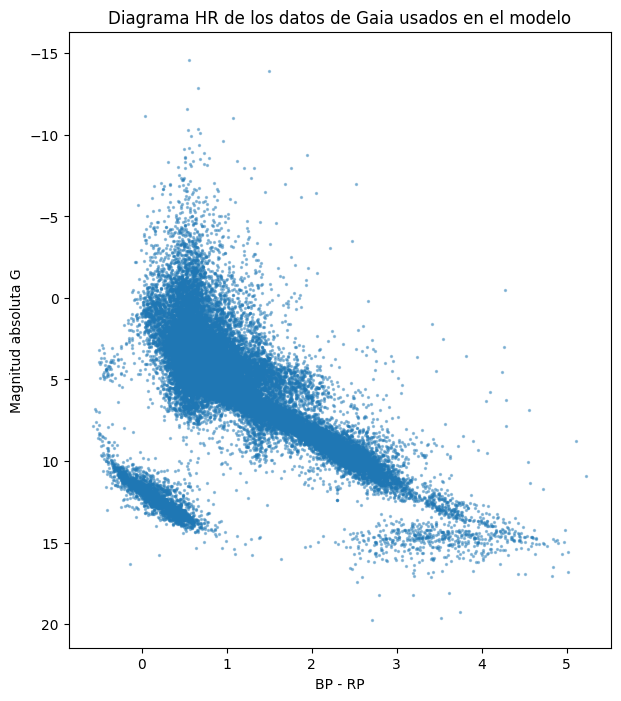
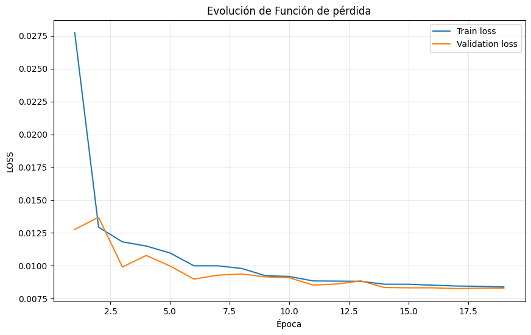
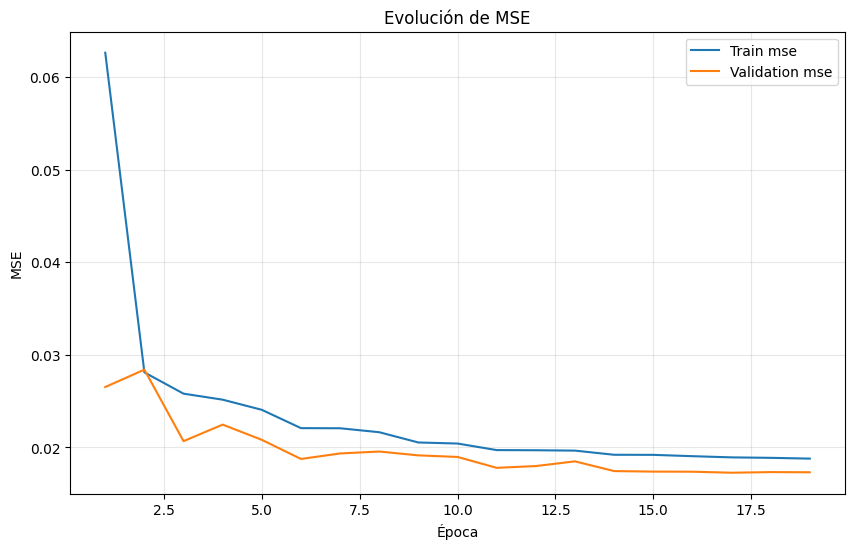
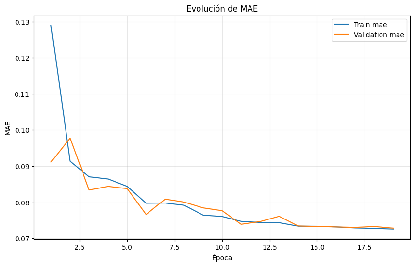
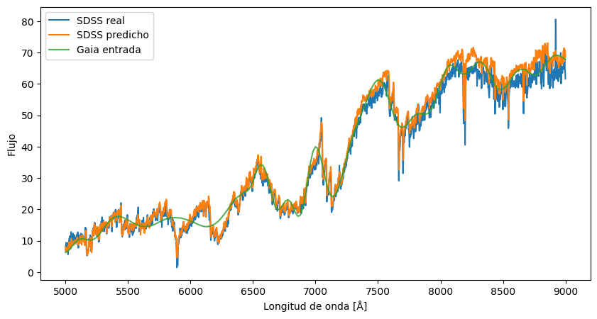
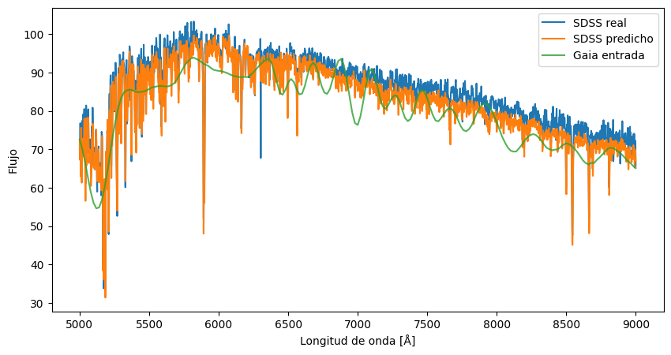
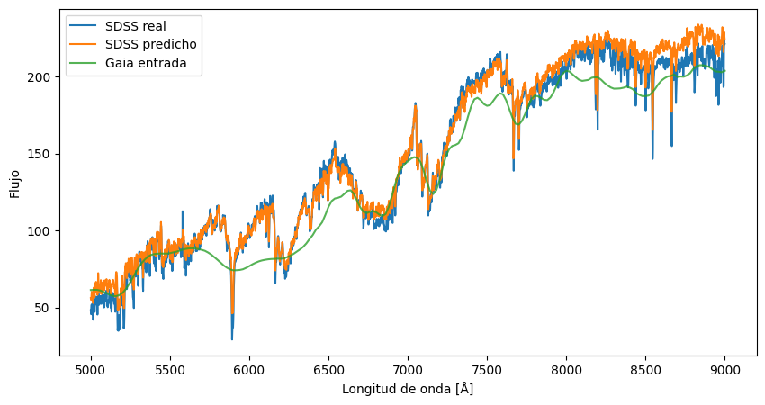
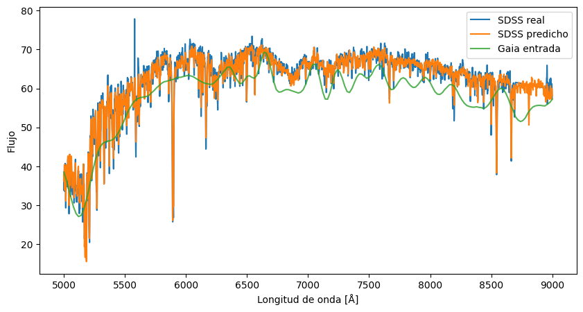
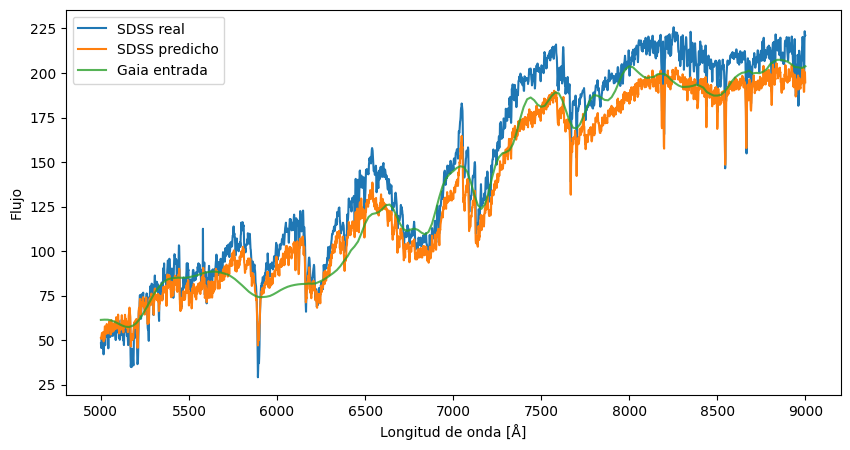

## Resumen

En este trabajo proponemos un enfoque innovador para mejorar la calidad de las señales astronómicas captadas por los fotómetros azul y rojo (BP/RP, *Blue Photometer* y *Red Photometer*) del satélite Gaia. Al entrenar un modelo a partir de la gran cantidad de datos de baja resolución recopilados por la misión Gaia y cruzarlos con las observaciones terrestres de alta resolución, se esperan encontrar patrones ocultos que puedan aplicarse a los datos de baja resolución para aproximar los de alta resolución. Para evaluar este método se usan varios subconjuntos del conjunto de datos original y se comparan con las observaciones reales de fuentes de alta resolución terrestres.

## Abstract

In this work we propose an innovative approach to improve the quality of the astronomical signals captured by the blue and red photometers (BP/RP) of the Gaia satellite. By training a model from the huge amount of low resolution data collected by the Gaia mission and the cross matched best high resolution ground based observations we expect to find hidden patterns that can be applied to allow the usage of these low resolution spectrum as proxy for high resolution ones. We evaluate our method on several benchmark subsets of the original dataset by comparing it with the real observations from high resolution sources.

<!--
El "Índice de acrónimos" se genera en las páginas preliminares (tras el Índice
de Tablas), desde `_partials/acronyms.typ`, leyendo `_acronyms.yml`.
Para referenciar un acrónimo en el texto: [ESA]{.acr}
La primera aparición se expande en formato APA 7.ª
—p. ej. «European Space Agency (ESA; Agencia Espacial Europea)»—
y las siguientes muestran solo la sigla.
-->

## Introducción
 

En diciembre de 2013 comenzó la misión Gaia [@gaiaDR1] con el objetivo de crear un mapa que permita conocer más detalles del Sistema Solar y la Vía Láctea. Esta misión es considerada la sucesora de Hipparcos dentro de [ESA]{.acr}, siendo este el primer satélite dedicado a la astrometría. Dicha misión fue puesta en marcha en el 1989 y finalizó en el 1993. Los datos que Gaia aporta son 200 veces más precisos que los obtenidos por dicho satélite, pero aun así, de menor calidad que los obtenidos por otros proyectos actuales.  

La propia agencia [ESA]{.acr} describe en el reporte publicado en 2013 donde explicaban detalles de la misión de Gaia [@ESA_Gaia_BR296_2013] que antes de estudiar un objeto celeste, es necesario poder ubicarlo en el plano, de lo contrario solo tendrían un conjunto de datos sin sentido pertenecientes a un mismo conjunto, pero sin un orden o punto de referencia, en sus propias palabras, describen lo siguiente: 

>"Antes de que los astrónomos puedan estudiar un objeto celeste, deben saber dónde encontrarlo. Sin este conocimiento, los astrónomos vagarían en vano en lo que Galileo alguna vez llamó un oscuro laberinto"
 

Por este motivo, la misión principal de Gaia se puede considerar muy útil para continuar desarrollando estudios y conocimientos acerca del universo.  

Más allá de este objetivo, Gaia ha podido aportar descubrimientos de objetos celestes que anteriormente no conocíamos.
Esta misión ha proporcionado uno de los catálogos más extensos y precisos hasta la fecha [@Gaia_DR3_Summary_2023], no solo aportando datos astrométricos, sino que también fotométricos y espectrofotométricos.

Otras misiones, como ahora la iniciada en el año 2000 con [SDSS]{.acr}, son capaces de proporcionar mediciones con mayor resolución que Gaia, pero con un número de objetos observados y una cobertura del cielo mucho menores [@SDSS_release1].
De este hecho parte la idea del trabajo que se desarrolla a continuación.

Si se pudiese definir una similitud entre los espectros obtenidos por Gaia y [SDSS]{.acr}, conseguiríamos combinar lo mejor de ambos proyectos, el rango espacial que Gaia ha sido capaz de conseguir junto al la calidad y detalle que [SDSS]{.acr} conlleva. 
En este contexto, gracias a los avances constantes de la inteligencia artificial, en este trabajo proponemos explorar técnicas que nos permitan llevar a cabo este objetivo; convertir espectros de Gaia en su equivalente [SDSS]{.acr}.

### Motivación

A lo largo de 2026 se publicarán los últimos datos recolectados por Gaia en un último DR4 y catálogo final DR5. Se calcula que a lo largo de la misión, unos 2 000 millones de estrellas y otros objetos celestes fueron captados por el satélite. 
Gracias a los datos recolectados, se dispone de una imagen reconstruida sobre cómo un observador vería nuestra galaxia desde el exterior de esta. Esta hazaña se ha conseguido a base de un conjunto de datos donde la información del cuerpo celeste parte fundamentalmente de dos espectros de baja resolución.
La espectroscopía es una de las herramientas principales de la astrofísica para extraer información acerca de los cuerpos astronómicos. Gracias a la distribución de la luz en función de la longitud de onda, se pueden conocer detalles clave acerca de los objetos estudiados, como por ejemplo su composición, la temperatura y la gravedad superficial. 
<!--
A diferencia de Gaia, otros proyectos astronómicos como [SDSS]{.acr} presentan una resolución espectral mayor en gran parte del rango de longitudes de onda que ambos comparten (en el resto del rango, simplemente no disponen de datos). Como contrapartida, al tratarse de un sondeo terrestre que depende de dos telescopios situados en el Observatorio Apache Point de Nuevo México y en el de Las Campanas de Carnegie en Chile [@DR13sdss], el número de objetos que [SDSS]{.acr} puede observar es muy inferior al de Gaia.
-->

La motivación de este trabajo parte de explorar si técnicas de aprendizaje automático pueden aprender a relacionar la gran cantidad de datos captados por Gaia y los espectros de mayor calidad de [SDSS]{.acr}. Si se modela la relación entre ambos datos, se conseguiría mejorar la información obtenida a partir de los datos recolectados por Gaia. 

<!--
Misiones anteriores a Gaia de la ESA:
- Hipparcos: lanzado en 1989, primer satélite dedicado a la astrometría. Primer release de datos en 1997 continene posiciones, distancias y movimientos de casi 120 000 estrellas, datos 200 veces mas precisos que cualquier medida anterior. Mas adelante se volvió a analizar y se obtuvo un catálogo con casi 2,5 millones de estrellas pero menos preciso. @ESA_Gaia_BR296_2013
-->

### Planteamiento del trabajo
El objetivo principal del trabajo que se desarrolla a continuación es diseñar un modelo basado en redes neuronales que consiga convertir espectros de Gaia en espectros equivalentes a los de [SDSS]{.acr}. De esta forma conseguiríamos encontrar un modelo que relacione los datos captados por ambos proyectos.

Para llevarlo a cabo, primero debemos entender las características de ambas fuentes de información, dado que los datos que usaremos deben estar correlacionados entre ambos conjuntos de datos. 
En concreto nos centraremos en la tercera liberación de datos de Gaia (Gaia DR3) [@Gaia_DR3_Summary_2023] y la decimotercera de [SDSS]{.acr} (DR13) [@DR13sdss], debido a que estos son los que en el DR3 de Gaia ya encontramos semi comparados, o por lo menos las asociaciones de vecindad hechas.
Para ser exactos, trataremos de relacionar los espectros de baja resolución [XP]{.acr} de Gaia DR3 (constituidos por los espectros azul y rojo) y los espectros ópticos de [SDSS]{.acr} DR13.

Para realizar este trabajo seleccionamos el conjunto de datos de Gaia como base de estudio por diferentes motivos, por un lado, estas observaciones son parte de un estudio actual y al mismo tiempo la forma de acceder a los datos es relativamente sencilla, pero por otro, es muy destacable la gran cantidad de información y cuerpos observados que Gaia dispone. Esto nos permite tener una buena base para tratar de sacar comparaciones con otros satélites y al mismo tiempo justifica la magnitud del efecto que tendría su mejora.

### Estructura del trabajo

El resto de este documento se organiza de la siguiente manera:

En el Capítulo 2 se explican los fundamentos teóricos necesarios para entender los espectros estelares y los conjuntos de datos empleados, y se revisa el estado del arte de los modelos generativos y del aprendizaje profundo aplicados a la astronomía.

En el Capítulo 3 se definen el objetivo general y los objetivos específicos del trabajo, así como la metodología seguida para alcanzarlos, aportando detalles acerca de los datos y librerías usadas.

En el Capítulo 4 se identifican los requisitos del sistema desarrollado.

En el Capítulo 5 se describe el proyecto piloto desarrollado: el trabajo realizado en cada etapa de la metodología y la herramienta *software* construida para la extracción de los datos, el entrenamiento del modelo y su puesta en servicio.

En el Capítulo 6 se evalúan los resultados obtenidos por el modelo frente a las observaciones reales de [SDSS]{.acr}.

Finalmente, en el Capítulo 7 se recogen las conclusiones del trabajo y se proponen posibles líneas de trabajo futuro.

<!-- Para llegar al objetivo descrito anteriormente, primero será necesario recopilar los datos de ambas fuentes, para así hacer un *Cross match* de los datos de SDSS y Gaia. De este proceso, sacaremos un data set con el catálogo de estrellas que han sido observadas por ambos instrumentos y de las cuales podemos analizar de forma paralela sus datos o espectros, para ser más precisos.
Una vez tengamos identificados los datos con los que se trabajará, analizaremos la relación señal-ruido que se obtiene en ambos sets de datos. 
A continuación, preprocesaremos los datos con el objetivo de poder tratarlos por igual y descartar todas las anomalías que puedan estropear el comportamiento de futuros modelos.

A partir de estos datos procesados, entrenaremos diversos modelos de inteligencia artificial con el objetivo de que aprendan la relación existente entre ambos tipos de espectro. Es decir, que aprendan la relación entre los datos de Gaia y los de Sloan.
A partir de aquí sacaremos conclusiones sobre la aplicabilidad y la calidad de los resultados obtenidos. -->

## Contexto y estado del arte

En esta sección se dará un contexto al problema anteriormente descrito, comenzando desde la base del conocimiento necesario para entender los datos, hasta las técnicas que se usarán para el desarrollo del modelo de aprendizaje automático. 

Por otro lado, también exploraremos trabajos ya publicados que contengan estudios de alta utilidad para el presente. 

### Contexto del problema
<!-- Para poder desarollar este trabajo, necesitamos comprender términos clave para analizar los datos. El primero es el *Paralaje*. Este término es necesario para comprender como conseguimos situar cuerpos estelares en el plano estelar. La Tierra orbita alrededor del Sol provocando que se recojan diferentes observaciones del mismo cuerpo estelar.

Buscar definición exacta de paralaje

Todos estos datos se basan en mediciones de espectros de baja resolución como lo son los BP/RP (*Blue Photometer / Red Photometer*), a los cuales denominaremos a lo largo del trabajo como BS/RS (*Blue Spectrum / Red Spectrum*).  

 A partir de aquí todo menos lo que se indique explicitamente viene de aquí Gaia_DR3_Documentation_2023 -->
A continuación nos centraremos en desarrollar términos relativos a los espectros estelares, su interpretación y cómo se obtienen y definen en las bases de datos de cada proyecto.

#### Espectros estelares
Podemos definir un espectro estelar como la función que relaciona el flujo captado de una estrella en función de la longitud de onda. Gracias a dicha función, se obtiene la distribución de la energía que emite el cuerpo celeste según el rango óptico dado, lo que permite estudiar ciertas características del cuerpo. Por ejemplo, si nos centramos en los picos del gráfico resultante de su representación, se puede analizar la composición del cuerpo o metalicidad, dado que cada elemento emite o absorbe luz en diferentes rangos. Al mismo tiempo, de este dato también se puede estudiar la temperatura en la que se encuentra dicho elemento. 
Por otro lado, si nos centramos en la anchura de las líneas, hablaríamos de datos como la gravedad superficial.
Estas relaciones han sido estudiadas por muchos científicos a lo largo de los años, como por ejemplo @carroll2017modernastrophysics, quienes recogen de forma amplia las areas principales de la astrofisica.

En la @fig-espectro-ejemplo se muestra un ejemplo de espectro estelar observado por [SDSS]{.acr}, donde se pueden apreciar las líneas de absorción mencionadas.

{#fig-espectro-ejemplo}

<!--
Hay estudios existentes que desarrollan la conexión entre los espectros y las variables anteriormente mencionadas, por ejemplo @lee2008segue trataron los datos de [SDSS]{.acr} en su sexta liberación de datos para tratar de crear herramientas automatizadas que estableciesen dicha relación.-->
Algunos estudios trataron de crear herramientas automatizadas para la obtención de los datos anteriormente mencionados. Por ejemplo @lee2008segue lo intentó con la sexta liberación datos de [SDSS]{.acr}.

Paralelamente, en la unidad de control número 8 de Gaia se trata de establecer la misma relación, como se puede observar en el trabajo llevado a cabo por @witten2023bprp, donde llegaron a identificar de manera detallada la proporción de composición metálica de las estrellas observadas.

En los siguientes apartados comentaremos los datos espectrales de Gaia y [SDSS]{.acr}.

#### Datos espectrales de Gaia

El satélite Gaia consta de 3 instrumentos para detectar la luz que recogen los telescopios del satélite [@Gaia_DR3_Summary_2023]. El primero, conocido como astrómetro, mide las posiciones estelares en el cielo, el espectómetro, [RVS]{.acr}, medirá las velocidades radiales y, por último, el instrumento fotométrico aportará dos espectros de baja resolución de dos bandas ópticas, la azul y la roja. Cabe destacar que, debido al movimiento rotativo de Gaia, se toman unas 70 mediciones fotométricas de cada cuerpo celeste. Estos espectros son preprocesados y tratados por diferentes unidades de coordinación antes de formar parte del conjunto de datos que nosotros usaremos en este trabajo, por lo que el ruido de fondo ya habrá sido reducido significativamente.

El satélite en cuestión se encuentra en una posición espacial conocida como L~2~, ubicada a 1,5 millones de kilómetros de la Tierra y donde las fuerzas gravitacionales del Sol, la Tierra y la Luna están en equilibrio. Por otro lado, el satélite, el Sol y la Tierra siempre van a permanecer alineados, impidiendo así que ninguno de los cuerpos celestes mencionados se interponga en el campo de visión de Gaia. 

La espectrofotometría en la que nos basaremos durante el desarrollo de este trabajo es la [BP/RP]{.acr}, también denominada espectro [XP]{.acr}. Como hemos comentado, estos datos proceden del fotómetro azul y del rojo, lo que permite cubrir entre los 330 y 680 nm gracias al espectro azul y de los 640 a 1050 nm gracias al rojo [@zhang2023parameters]. 
Estos datos se representan por aproximadamente 110 elementos efectivos de resolución [@deangeli2023bprp], con un poder de resolución variable según la longitud de onda de aproximadamente R $\sim$ 50 - 160. 
Este detalle conlleva que en la tercera liberación de datos de Gaia no obtengamos directamente una tabla de relación flujo - longitud de onda, sino que los espectros vienen dados por coeficientes que deben transformarse con ayuda de librerías como *GaiaXPy* o su correspondiente desarrollo con funciones lineales [@deangeli2022gaiabprp].

#### Datos espectrales de [SDSS]{.acr}
En contraposición a Gaia, este trabajo también usará y analizará datos conseguidos gracias a [SDSS]{.acr}, proyecto iniciado con el mismo objetivo que Gaia, crear un mapa tridimensional, pero, a diferencia de este, basado en observaciones terrestres. En este caso, el mapa actual creado gracias a este sondeo contiene más de 930 000 galaxias.

La primera operación bajo el nombre [SDSS]{.acr} comenzó en el año 2000, y sigue activo con su quinta fase [SDSS]{.acr}-V, que tiene planteado llegar a su fin en 2027 [@sdsscollaboration2025nineteenthdatareleasesloan].

Aunque la última publicación de datos de [SDSS]{.acr} sea la número 19, tal y como hemos comentado anteriormente, dado que el análisis de cruce de datos de Gaia DR3 se ha llevado a cabo con el DR13 de [SDSS]{.acr}, este será usado durante el estudio aunque no pertenezca a la fase más avanzada del proyecto sino a la cuarta. 

A diferencia de Gaia, [SDSS]{.acr} proporciona directamente espectros ópticos en longitud de onda y flujo, y estos datos se almacenan distribuidos a lo largo de archivos [FITS]{.acr}. En esta base se pueden encontrar variables como la longitud de onda y el flujo espectral.

Dentro del proyecto de [SDSS]{.acr}, el programa [MANGA]{.acr} se encarga de procesar los datos con tal de crear el mapa estelar, en su artículo original para [SDSS]{.acr}-IV [@manga2015] encontramos que el rango espectral aproximado de [SDSS]{.acr} se mantiene entre los 360 y 1030 nm y su resolución se encuentra en R $\sim$ 2000.

#### Comparativa de los espectros de Gaia y [SDSS]{.acr}
Gaia y [SDSS]{.acr} comparten gran parte de su rango óptico pero con datos captados con estrategias e instrumentos diferentes. Esto se enfatiza cuando comparamos los espectros observados por cada proyecto acerca del mismo cuerpo celeste. En la @fig-gaia-sdss se muestra un ejemplo aleatorio.

<!-- TODO: indicar el SNR de cada espectro en la figura o en su pie (anotación del director) -->
{#fig-gaia-sdss}

Podemos observar como claramente el intervalo que [SDSS]{.acr} cubre es muy similar a Gaia, pero existe una gran diferencia en cuanto a la suavidad de las curvas representadas. Como vemos, [SDSS]{.acr} incluye muchos más detalles que Gaia, su espectro tiene una resolución superior. 
Por otro lado, si nos fijamos en los datos captados en los extremos de visión de Gaia, notamos la posibilidad de que en rangos inferiores a 400 nm estemos observando artefactos u obteniendo mediciones muy poco precisas. Lo mismo sucede en valores superiores a 950 nm.

A lo largo del trabajo, para garantizar que los datos analizados correspondan al mismo objeto astronómico, se empleará la tabla de cruce oficial de DR3 denominada *gaiadr3.sdssdr13_best_neighbour* que se puede consultar en el archivo de Gaia [@gaiaDR3sdssBestNeighbourDataset]. Esta tabla contiene para cada cuerpo observado por Gaia, el vecino más cercano en [SDSS]{.acr} DR13, es decir, el que cuenta con una mayor probabilidad de que estén describiendo el mismo cuerpo celeste. El procedimiento con el cual se establece esta vecindad se encuentra descrito en la documentación oficial de Gaia DR3 [@Gaia_DR3_Documentation_2023], que puede consultarse en el propio archivo de Gaia. Dentro de este conjunto, definiremos un umbral de aceptación dado por la distancia angular, fijado en 2 segundos de arco.

### Estado del arte

En los últimos años, la astronomía se ha beneficiado de las técnicas de aprendizaje automático, principalmente en tareas tradicionales como clasificación y agrupamiento. Por ejemplo, @djorgovski2022applications señalan que "una amplia variedad de métodos de clasificación y agrupamiento se ha aplicado a estas tareas, y sigue siendo un área de investigación muy activa". En efecto, muchos esfuerzos han estado enfocados en reconocer tipos de estrellas o galaxias, identificar eventos transitorios, y diferenciar estrellas de galaxias, aprovechando catálogos masivos con miles de características. Estos enfoques basados en aprendizaje automático clásico han permitido lidiar con el flujo de datos de observaciones astronómicas mediante el uso de la clasificación supervisada o el agrupamiento no supervisado.

#### Modelos generativos en Astronomía

Paralelamente, ha crecido el interés en generar datos astronómicos sintéticos mediante modelos generativos. En particular, las [GAN]{.acr} se han aplicado con éxito en algunos contextos. Por ejemplo, @garcia2022improving propusieron un método de aumento de datos (*data augmentation*) basado en [GAN]{.acr} para generar curvas de luz sintéticas de estrellas variables
y mostraron cómo su modelo logra producir variaciones realistas de luminosidad, mejorando significativamente la precisión que alcanza la clasificación cuando se entrena con estos datos sintéticos adicionales. Esto ejemplifica cómo las [GAN]{.acr} pueden crear nuevos ejemplos de baja complejidad (en este caso series temporales) para compensar la escasez de datos etiquetados.

Asimismo, dada la enorme base de datos espectrales de baja resolución de la misión Gaia (más de 220 millones de espectros [BP/RP]{.acr} en Gaia DR3), se han desarrollado modelos generativos específicos para estos datos. @laroche2025closing introdujeron un *autoencoder* variacional generativo no supervisado que aprende directamente de los espectros Gaia sin necesidad de etiquetas estelares. Su arquitectura sigue el esquema *encoder-decoder* propio de los *autoencoders* variacionales: un codificador comprime los coeficientes de los espectros [BP/RP]{.acr} en un espacio latente de baja dimensión y un decodificador reconstruye el espectro a partir de dicha representación, entrenándose ambos de forma conjunta mediante la optimización de la [ELBO]{.acr}. Su modelo reproduce los espectros [BP/RP]{.acr} y detecta patrones en áreas donde el aprendizaje supervisado falla debido a la falta de referencias. De hecho, antes de este trabajo la única aproximación generativa para los espectros de Gaia era supervisada: @zhang2023parameters entrenaron un modelo capaz de generar el espectro [XP]{.acr} a partir de los parámetros estelares, apoyándose para ello en un conjunto reducido de estrellas de Gaia que cuentan con una observación equivalente en el sondeo espectroscópico terrestre LAMOST, del cual se obtuvieron dichos parámetros de referencia. Estos desarrollos recientes demuestran que los modelos generativos pueden explorar el conjunto masivo de datos Gaia para *aproximar* datos de mayor resolución. 

#### Aprendizaje profundo en Astrofísica

A pesar de estos avances, el uso de redes neuronales profundas en astronomía sigue siendo relativamente reciente y sujeto a debate. @ting2025deep destaca que, aunque estas técnicas ofrecen *perspectivas diversas* y capacidades de modelar relaciones complejas, todavía enfrentan retos importantes. Según Ting, la astronomía ha entrado en una era de datos sin precedentes, lo que ha impulsado a muchos investigadores a adoptar métodos de aprendizaje profundo para procesar observaciones modernas. Sin embargo, las reacciones varían: algunos científicos ven estas redes profundas como herramientas transformadoras, mientras que otros se muestran escépticos sobre sus verdaderas ventajas. En este contexto, se advierte que aunque las arquitecturas neuronales pueden incorporar sesgos físicos (simetrías, leyes de conservación) en su diseño para generalizar mejor, sigue siendo necesario evaluar cuidadosamente sus resultados. En resumen, el aprendizaje profundo en astrofísica está emergiendo como una vía prometedora que aún se encuentra en una fase exploratoria y que requiere una validación rigurosa antes de tener una aceptación generalizada en este dominio.

Dentro de las evoluciones recientes encontramos el trabajo @grassi2026differentiable, en el que se explora la integración de modelos físicos dentro de arquitecturas de aprendizaje automático, mediante el desarrollo de un modelo geométrico 3D completamente diferenciable para la interpretación de cubos de datos espectrales moleculares. Mediante el uso de librerías de diferenciación automática como JAX, generaron observaciones sintéticas a partir de campos de densidad y velocidad parametrizados, optimizándolos iterativamente para reproducir con precisión las observaciones astronómicas reales. Aunque este enfoque orientado a la física difiere de las redes neuronales generativas utilizadas para relacionar directamente las bandas fotométricas con espectros de alta resolución, subraya la importancia de emplear modelos computacionales avanzados y generación sintética de datos para sortear las limitaciones instrumentales y extraer propiedades subyacentes de las señales astrofísicas, especialmente para la comprensión de la composición química de los objetos celestes radiando dichas señales.

El ejemplo más cercano al enfoque propuesto en este trabajo lo encontramos en un trabajo muy reciente de @haghjoo2026learning. En esta propuesta, se usó el conjunto de datos de [JADES]{.acr} [@curtis2025jades] que proporciona imágenes y espectroscopía profunda combinando observaciones de la cámara (NIRCam) y el espectrógrafo (NIRSpec) del [JWST]{.acr}. Este sondeo es ideal para el estudio porque observa los mismos objetivos de galaxias utilizando una combinación de espectroscopía de prisma de baja resolución (R ~ 30–300) y modos de red de difracción de media resolución (R ~ 1000; mediante los instrumentos G140M, G235M y G395M). A partir de estas observaciones emparejadas, los investigadores seleccionaron una muestra inicial de 1 187 pares de espectros coincidentes, la cual fue ampliada posteriormente a 24 927 muestras mediante técnicas de mejora de datos (*data augmentation*) para el entrenamiento del modelo.

Para llevar a cabo este estudio, los investigadores desarrollaron una red neuronal profunda personalizada de tres etapas, diseñada específicamente para procesar datos unidimensionales. La primera etapa emplea una red neuronal convolucional residual (1D ResNet-CNN) que genera una reconstrucción preliminar y conservadora del espectro. La segunda etapa utiliza otra red convolucional para inferir el corrimiento al rojo (*redshift*), contextualizando así la posición física de los elementos. Finalmente, la tercera etapa de refinamiento divide el trabajo en dos ramas: un modelo basado en mecanismos de atención (*Transformer encoder*) que procesa de manera aislada las líneas de emisión, y otra red convolucional que ajusta suavemente el continuo del espectro. En total, esta arquitectura por fases cuenta con unos 2,5 millones de parámetros y está diseñada para aplicar correcciones basadas en la física, evitando que la [IA]{.acr} "alucine" datos inexistentes.  

Los resultados demostraron que este modelo es capaz de recuperar con éxito detalles de alta resolución a partir de observaciones de baja calidad. El sistema logró desmezclar y separar de manera efectiva líneas de emisión que aparecían fusionadas en los datos originales (como el doblete de [O III] y Hβ), mejorando sistemáticamente la relación señal-ruido en todas las líneas de diagnóstico clave. Además, los espectros superresueltos generados por la [IA]{.acr} alcanzaron niveles de ruido comparables a las observaciones reales de alta resolución y permitieron realizar estimaciones del corrimiento al rojo mucho más precisas, reduciendo a la mitad la dispersión de errores y disminuyendo significativamente los casos atípicos frente a los datos de entrada.

<!-- IMPORTANTE ya se han comparado datos fotométricos con los de otros sistemas 

JC: En este caso se tratan de filtros de mejora deterministas  y de calibración, no de modelos generativos. Lo dejo de momento por si puede ser útil mencionarlo, aunque quizá en otra sección.

https://gea.esac.esa.int/archive/documentation/GDR3/Data_processing/chap_cu5pho/cu5pho_sec_photSystem/cu5pho_ssec_photRelations.html

https://gea.esac.esa.int/archive/documentation/GDR3/Data_processing/chap_cu5pho/cu5pho_sec_spss/

-->
### Conclusiones

La integración y estandarización de catálogos astronómicos masivos representa un desafío técnico fundamental, especialmente al trabajar con fuentes de naturalezas distintas como Gaia y [SDSS]{.acr}. Mientras que Gaia provee un volumen de datos astrométricos, fotométricos y espectroscópicos sin precedentes, sus espectros [BP/RP]{.acr} operan en resoluciones bajas y requieren complejos procesos de calibración para mitigar el ruido espacial y las fluctuaciones. Cabe matizar que el espectrómetro [RVS]{.acr} de Gaia alcanza una resolución incluso mayor que la de [SDSS]{.acr}, pero al requerir estrellas más brillantes dispone de muchas menos fuentes observadas. En contraste, [SDSS]{.acr} aporta espectros ópticos de mayor resolución que los [BP/RP]{.acr}. La necesidad de interconectar ambas misiones define el núcleo de este estudio: establecer una relación sólida capaz de traducir y equiparar los espectros de baja resolución de Gaia con los espectros de mayor resolución de [SDSS]{.acr}.

Para abordar este asunto, el análisis del estado del arte evidencia una transición desde el uso de estas herramientas únicamente para clasificación o agrupamiento clásico hacia el uso de las [GAN]{.acr} y los *autoencoders* variacionales, que recientemente han demostrado su utilidad para la generación de datos sintéticos realistas y se establecen ya como herramientas útiles para la calibración y otras áreas relevantes en el estudio astronómico.

Avanzando aún más allá, el éxito reciente en la mejora de resolución de datos del telescopio [JWST]{.acr} mediante modelos generativos muestra que la aplicación de estas técnicas representa una solución viable que puede ser también aplicada en el contexto del catálogo astronómico que ofrece Gaia.  

El propósito de la propuesta planteada en este documento es profundizar en la aplicación de estas técnicas novedosas ofreciendo soluciones útiles que aporten mejoras tangibles en el ámbito de la astronomía, específicamente para la mejora de las señales contenidas en el amplio catálogo que Gaia nos ofrece.

## Objetivos concretos y metodología de trabajo

En este capítulo se detalla el objetivo principal de este trabajo y su desglose en objetivos más específicos para alcanzarlo.

También se expone la metodología empleada para afrontar dichos objetivos.

### Objetivo general
El objetivo general de este trabajo consiste en desarrollar un modelo basado en aprendizaje automático que permita aproximar el flujo calibrado captado por los fotómetros de baja resolución [BP/RP]{.acr} de Gaia a un espectro de resolución más alta, similar al proporcionado por las observaciones de mayor calidad de [SDSS]{.acr}.

### Objetivos específicos
Para alcanzar el objetivo propuesto, se deben alcanzar previamente los siguientes objetivos intermedios.

- Análisis estructural de la base de datos de Gaia y SDSS:

El análisis y comprensión de las observaciones y la manera en la que están organizadas en los repositorios de Gaia y [SDSS]{.acr} es fundamental para entender cuales son los datos relevantes a extraer.  

Es también necesario comprender la relación entre las mediciones de ambos sondeos astronómicos para usar observaciones coincidentes, referidas a los mismos objetos del catálogo de objetos celestes.

- Preselección de los datos:

Una vez se ha ganado cierta comprensión de los datos, se puede hacer una valoración más precisa de cuál es la calidad de los mismos, y qué valores no reúnen los requisitos para incluirse en el conjunto de datos de entrenamiento. 

Así, se deben definir unos parámetros para excluir los datos menos relevantes para el objetivo principal.

- Extracción de los datos:

Tras haber comprendido qué servicios se pueden usar para la extracción de los datos y haber reducido el conjunto de entrada atendiendo a su calidad, el siguiente paso consiste en la extracción de los mismos, usando métodos que optimicen la descarga de los datos orientados a minimizar el tiempo y los posibles errores que los servicios ofrecidos por los proyectos de Gaia y [SDSS]{.acr} ofrecen.

- Preprocesado de los datos:

Una vez extraídos los datos, es necesario realizar cierto preprocesado de los mismos para mejorar el entrenamiento.

Puesto que en la preselección de las observaciones se han tenido en cuenta criterios de calidad, y Gaia DR3 ofrece datos ya procesados y relaciones con [SDSS]{.acr}, el preprocesado en este caso consiste en la reducción del ruido, mejorando así la [SNR]{.acr}, aplicada a las observaciones de [SDSS]{.acr}, que tienen más variabilidad y pueden así aumentar la complejidad del entrenamiento.

- Preparación de los conjuntos de entrenamiento, test y validación:

Una vez los datos están listos, es necesario realizar el reparto entre los distintos conjuntos de datos. En concreto se necesitará un conjunto de entrenamiento para encontrar los mejores parámetros de los modelos propuestos, un conjunto de validación para seleccionar el modelo con mejores resultados y tener indicativos en caso de sobreajuste y, finalmente, un conjunto de test con el que estimar la calidad del modelo seleccionado a partir de datos no observados previamente.

- Selección del modelo de redes neuronales más adecuado:

Para el caso expuesto se considera que las redes neuronales pueden aportar una solución novedosa gracias a su no-linealidad.

- Entrenamiento, refinamiento y validación del modelo:

La red neuronal entrenada requerirá de un proceso de optimización y ajuste de los hiperparámetros para dar una solución satisfactoria. Asimismo, se llevará un proceso de validación de los resultados a partir del conjunto de datos creado.

- Puesta en servicio del modelo:

Una vez ajustado el modelo, el objetivo será proporcionar una manera sencilla e intuitiva de acceder a él. 

### Metodología de trabajo

De acuerdo a los objetivos expuestos, la metodología empleada para desarrollar este trabajo se estructura en las siguientes etapas. Las particularidades y la implementación concreta de cada una de ellas se recogen en el Capítulo 5.

1. Análisis exploratorio de los datos: mediante cuadernos *Jupyter* colaborativos se estudia la organización de los repositorios de Gaia y [SDSS]{.acr}, los servicios disponibles para su consulta y la manera de emparejar las observaciones de ambos proyectos referidas a un mismo objeto celeste.

2. Preselección de los datos: a partir del análisis previo se definen filtros de calidad sobre el cruce de catálogos, con el objetivo de maximizar la fiabilidad de los pares de espectros utilizados.

3. Extracción de los datos: descarga por lotes de los espectros emparejados, de manera reproducible y tolerante a las limitaciones de los servicios públicos de consulta.

4. Preprocesado de los datos: limpieza de anomalías y artefactos, y homogeneización de los espectros de ambas fuentes para que sean directamente comparables. En esta etapa resulta fundamental comparar la [SNR]{.acr} de los espectros: cada observatorio puede medir el mismo objeto un número distinto de veces y en condiciones diferentes, por lo que la [SNR]{.acr} puede variar entre observaciones de un mismo cuerpo. Por ello, los pares de espectros que se usen para entrenar y evaluar el modelo deben presentar una [SNR]{.acr} equivalente.

5. Preparación de los conjuntos de entrenamiento, validación y test: partición del conjunto de datos garantizando una distribución homogénea de las muestras, también en términos de [SNR]{.acr}, y de manera reproducible.

6. Entrenamiento, refinamiento y validación del modelo: proceso iterativo de optimización y ajuste de hiperparámetros, evaluando el modelo sobre el conjunto de validación y reservando el conjunto de test para la evaluación final.

<!--
### Organización del trabajo en grupo

Este trabajo ha sido desarrollado de manera conjunta por los dos autores. Para coordinar el desarrollo se han mantenido reuniones periódicas de seguimiento, junto con las revisiones con el director del trabajo, y se ha empleado un repositorio de control de versiones compartido tanto para el código como para la memoria, donde los avances de cada autor se han integrado mediante revisiones cruzadas.

<!-- TODO: detallar el reparto concreto de tareas entre Carla y Javier (la plantilla requiere describir el trabajo grupal)
En cuanto al reparto concreto de las tareas, el desarrollo del código usado se ha dividido principalmente en dos bloques. Por un lado, Javier se encargó de la creación de la base de datos usada para el entrenamiento del modelo, incluyendo la extracción de datos de Gaia y [SDSS]{.acr} y su descarga. 
En cambio, Carla se centró en el preprocesado de dicha base de datos y el diseño de la red neuronal, incluyendo el ajuste de los hiperparámetros y la evaluación de los resultados obtenidos. 

Por otro lado, la elaboración de la memoria también se repartió entre los dos autores. Carla desarrolló los apartados de introducción, contexto y conclusiones. Mientras que Javier trabajó en el estado del arte, metodología y objetivos. 

El capítulo 6, llamado *Proyecto piloto*, fue redactado por ambos autores teniendo en cuenta quien desarrolló principalmente el código relacionado con cada subapartado. 

Aunque las tareas se hayan repartido entre ambos autores, el desarrollo no se ha llevado a cabo de forma completamente independiente. Tanto la memoria como el código utilizado han sido revisados de manera cruzada, permitiendo a ambos autores aportar ideas y posibles mejoras sobre el trabajo. Por tanto, las divisiones descritas anteriormente indican el autor principal del apartado o código, pero no implican que dichas partes hayan sido desarrolladas únicamente por esa persona. Gracias a las revisiones se han detectado errores, mejoras y ajustes que debían incorporarse con tal de mantener un formato común y asegurar coherencia en el proyecto.
--> 

## Identificación de requisitos

Para un correcto desarrollo del proyecto, es necesario garantizar una serie de requisitos mínimos. Estos se describen a continuación según el ámbito al que hacen referencia.

### Requisitos del conjunto de datos

El conjunto de datos usado para el entrenamiento del modelo debe estar formado por pares de espectros de Gaia y [SDSS]{.acr} que correspondan al mismo objeto astronómico. Para garantizar esta correspondencia se debe usar el catálogo de cruce de datos que Gaia incluye en su tercera liberación de datos, en concreto, la tabla de mejores vecinos entre Gaia DR3 y [SDSS]{.acr} DR13. 

Cada muestra usada debe contener, como mínimo, el identificador de este objeto dentro de su base de datos, el espectro, la malla de longitud de onda correspondiente y la relación señal-ruido del espectro. En el caso de [SDSS]{.acr} el [SNR]{.acr} será obtenido a partir de la variable *ivar*.
El identificador del objeto dependerá de la base de datos, ya que en Gaia será suficiente con el *source_id*, mientras que en [SDSS]{.acr} se necesitará *specObjID*, *plate*, *mjd* y *fiberID*.

El conjunto de datos original deberá ser almacenado en un formato que sea eficiente para su uso en el modelo. En este trabajo se consideró el formato HDF5, ya que permite organizar en un solo fichero todos los datos necesarios para su entrenamiento. 

Por último, será necesaria la aplicación de criterios de calidad y el preprocesado del conjunto de datos a usar.

### Requisitos de calidad

Una vez extraído el conjunto de datos inicial, las parejas de espectros deberán pasar una serie de requisitos mínimos de calidad para ser usados en el entrenamiento del modelo.

En primer lugar, los espectros deberán contener valores numéricos válidos en todo el rango usado, con lo que se descartarán aquellos datos que contengan valores nulos o infinitos. Del mismo modo, se descartarán aquellas observaciones que contengas posibles anomalías en el flujo, como por ejemplo picos extremos o que no encajen en la tendencia general de la muestra. Al mismo tiempo, también se descartará el caso contrario, muestras donde haya una clara falta de variabilidad en el flujo, es decir, por ejemplo, que este sea un valor constante. Un claro ejemplo se puede observar en la @fig-descarte-constante, donde se aprecia como el espectro captado por SDSS es nulo:

{#fig-descarte-constante} 

Por otro lado, las parejas de espectros de Gaia y [SDSS]{.acr} deberán ser coherentes en cuanto a la escala del flujo. Aunque ambos instrumentos presentan resoluciones diferentes, al tratarse de observaciones hechas al mismo cuerpo estelar, la relación entre los flujos no debe situarse en valores extremos. 
Para descartar aquellas muestras que no sean coherentes, se comparará la media del flujo de ambos espectros y se descartarán aquellos pares cuya relación se encuentre fuera de los límites definidos con el percentil 99 del conjunto de datos. En la @fig-descarte-escala encontramos un ejemplo de lo que se evitará gracias a esta restricción.

{#fig-descarte-escala} 

En gran parte de los descartes que se realizarán, se usarán los percentiles 95 o 99 para establecer los límites tolerables. Al establecerlos de esta forma, no estableceremos un valor arbitrario fijo, sino que se tendrá en cuenta el comportamiento estadístico de la muestra, permitiendo extender su uso en casos futuros.

Asimismo, deberá tenerse en cuenta la [SNR]{.acr} de las observaciones. Este dato indica la calidad de la señal respecto al ruido, por lo que si este valor es muy bajo, la información del espectro asociado es poco fiable. Respecto a esto, se impondrán dos criterios: por un lado, se descartarán aquellos datos con los valores de [SNR]{.acr} por debajo del percentil 1. Por otro, dado que el modelo tratará de aprender la correspondencia entre las observaciones de Gaia y [SDSS]{.acr} y estos observan los objetos de formas diferentes y no bajo las mismas condiciones, lo que implica que las mediciones pueden presentar niveles de ruido diferentes aun tratándose del mismo cuerpo celeste, se descartarán aquellos pares en los que la relación entre la media de [SNR]{.acr} de ambos instrumentos sean mayores al percentil 95 o inferiores al 5.

Finalmente, los espectros se recortarán a los rangos de longitud de onda comunes entre Gaia y [SDSS]{.acr} y así evitar que la generación de datos de salida se vea afectada por la falta de datos de entrada. Al mismo tiempo, se descartarán los intervalos iniciales y finales del rango espectral, ya que en estas zonas suelen aparecer con mayor frecuencia anomalías u observaciones de artefactos. En concreto, se restringirá el intervalo de entrenamiento entre los 500 y 900 nm. 

### Requisitos del modelo

El modelo basado en redes neuronales debe resolver un problema de regresión multivariante, en el que la entrada sea un vector de flujo de Gaia y la salida se corresponda con el espectro de [SDSS]{.acr}. 

Para mejorar la estabilidad del entrenamiento, el modelo debe trabajar con datos normalizados tanto de entrada como de salida. 
La normalización será aplicada teniendo en cuenta solo los datos de entrenamiento. Los de validación y test no deben ser usados para entrenar el modelo, con la finalidad de que sean observaciones completamente nuevas para evaluarlo.

La separación de los grupos de entrenamiento, validación y test deberá llevarse a cabo de forma aleatoria para garantizar la variabilidad dentro de las muestras usadas para entrenar y evaluar el modelo.  El objetivo de esta separación aleatoria es que los conjuntos sean estadísticamente equivalentes, es decir, el conjunto de entrenamiento debe ser representativo de los conjuntos de validación y test.

La arquitectura y diseño del modelo deberá tener capacidad suficiente como para aprender las relaciones entre el espectro de entrada y salida, pero sin llegar a memorizar el conjunto de entrenamiento para así evitar el sobreajuste. 

El modelo deberá evaluarse con métricas cuantitativas apropiadas al tipo de dato y al mismo tiempo con un análisis visual de los resultados. 

## Proyecto piloto

En este capítulo se describe el trabajo realizado en cada una de las etapas definidas en la metodología, junto con la herramienta *software* desarrollada.

### Preparación del conjunto de datos

La construcción del conjunto de datos de entrenamiento se ha automatizado mediante un flujo reproducible y tolerante a fallos, organizado en seis etapas encadenadas. Cada etapa consume el resultado de la anterior y guarda su salida en disco de inmediato, de manera que una ejecución interrumpida puede reanudarse desde la primera etapa incompleta sin repetir el trabajo ya realizado. A grandes rasgos dicho flujo obtiene la referencia de los objetos con espectro en [SDSS]{.acr}, localiza la contrapartida de cada uno en Gaia, descarga los espectros para los objetos referenciados de [SDSS]{.acr}, depura el listado conservando solo los pares completos, obtiene los espectros calibrados de Gaia y combina ambas fuentes en un único conjunto de datos listo para su uso en el ajuste de la red neuronal.

#### Obtención de los objectos con espectro de [SDSS]{.acr}

La primera etapa parte del catálogo espectroscópico de [SDSS]{.acr} y recopila los metadatos de todos sus espectros primarios. Comenzar por este catálogo garantiza que cada objeto considerado dispone realmente de una observación espectral de [SDSS]{.acr}, lo que evita la enorme pérdida de muestras que se produciría al partir del cruce fotométrico en sentido contrario. El resultado es la lista de candidatos con espectro de [SDSS]{.acr} confirmado.

#### Cruce inverso con Gaia

A partir de esa lista, la segunda etapa consulta el archivo de Gaia en sentido inverso: para cada objeto de [SDSS]{.acr} busca la fuente equivalente en Gaia que además disponga de espectro BP/RP. Así se conserva únicamente la intersección de cuerpos observados por ambos proyectos, que constituye el cruce sobre el que se trabajará.

#### Descarga de los espectros de [SDSS]{.acr}.

La tercera etapa descarga el espectro de [SDSS]{.acr} para cada objeto emparejado. Las descargas se realizan en paralelo y cada espectro se almacena en cuanto se obtiene, de modo que el proceso es robusto frente a las interrupciones y a las limitaciones de los servicios públicos de consulta.

#### Depuración de referencias

Como no todas las descargas culminan con éxito, la cuarta etapa depura el listado de pares y conserva exclusivamente aquellos cuyo espectro de [SDSS]{.acr} se ha obtenido correctamente. El resultado es la tabla de referencia definitiva que vincula cada objeto entre ambos sistemas.

#### Espectros calibrados de Gaia

La quinta etapa recupera los espectros de Gaia de los objetos ya depurados. Dado que Gaia no proporciona directamente la relación entre flujo y longitud de onda, sino una representación mediante coeficientes, en esta etapa dichos espectros se calibran para obtener el flujo continuo equivalente y poder usarlo en el modelo.

#### Transformación a datos de entrenamiento

Finalmente, la sexta etapa homogeneiza y combina ambas fuentes: los espectros de [SDSS]{.acr} se remuestrean a una rejilla común de longitudes de onda y se guardan junto a los de Gaia correspondientes en un único fichero con un formato optimizado HDF5. Este fichero es además acumulativo, de forma que sucesivas ejecuciones incorporan los pares nuevos sin descartar los ya almacenados.

Este proceso de extracción ha permitido reunir hasta el momento un conjunto de datos real con más de 55 000 pares de espectros emparejados de Gaia y [SDSS]{.acr}.

#### Análisis visual de los datos obtenidos

Para analizar la distribución física de los datos usados en el entrenamiento del modelo, se usa una representación del diagrama [HR]{.acr} (Hertzsprung-Russell, @hertzsprung1911wellenlaengen y @russell1914spectra). Este diagrama representa la relación entre la luminosidad de las estrellas (eje Y) y su temperatura o color (eje X).

En concreto, para estudiar los cuerpos celestes usados en este trabajo, se considera la fuente de datos de Gaia. En el eje horizontal se considera la variable *bp_rp*, que corresponde al índice de color obtenido a partir de la diferencia entre las medias de las magnitudes de BP y RP. Cuanto menor sea este valor, más azul y caliente será la estrella, mientras que los valores mayores representan estrellas rojas y frías.

En el eje vertical encontramos la variable *phot_g_mean_mag*, la magnitud aparente media en la banda G, que nos indica lo brillante que se aprecia la estrella a partir en las observaciones realizadas. Este valor depende de variables como por ejemplo la distancia, por lo que para convertir todos los valores a la misma escala y obtener la magnitud absoluta de cada observación, se usó el paralaje de cada una. 
Tras esta modificación, aquellas estrellas más luminosas, presentan valores negativos, mientras que las más luminosas se mantienen en valores positivos. 

El diagrama de los datos usados en este estudio es el que se observa en la @fig-HR-diagram:

{#fig-HR-diagram}

En este apreciamos como el conjunto de datos no está formado por un único tipo de estrella, sino que encontramos objetos con propiedades físicas diferentes. Si bien es cierto, encontramos un grupo mayoritario de observaciones tal y como se aprecia en la parte media izquierda del gráfico. 
Debido a esta diversidad, el modelo debe adaptarse a fuentes de distintas características, con lo que no es un entrenamiento especializado en un solo tipo de estrella. 
Al mismo tiempo, se observan algunos datos dispersos y distantes de las regiones más ocupadas, los cuales podrían considerarse anomalías para el modelo a entrenar.

### Entrenamiento del modelo

Una vez se dispone de la base de datos con los pares de espectros de Gaia y [SDSS]{.acr}, se procedió con el preprocesamiento de los datos, diseño y entrenamiento del modelo de redes neuronales. 
El objetivo es conseguir un modelo que aprenda una transformación entre los datos de entrada de Gaia y el espectro de [SDSS]{.acr} asociado. Así pues, el modelo planteado recibe como entrada un vector con el flujo de Gaia y obtiene como salida un vector con una aproximación del flujo correspondiente al espectro de [SDSS]{.acr}.

De cara a la preparación de la base para el entrenamiento del modelo, se definieron 3 subconjuntos: entrenamiento, test y validación. 
Los datos de test se formaron con un 20% del conjunto global y fueron empleados para evaluar el modelo, por lo que no fueron usados durante su entrenamiento. El 80% restante se separó de forma aleatoria entre las parejas que forman la base de entrenamiento del modelo, un 80% de lo restante, y la de validación, el 20% final.  

#### Planteamiento general del entrenamiento
Una vez definida la partición de los datos, se realizaron diversas pruebas con tal de analizar como afectaban al rendimiento del modelo. 
En primer lugar, se probaron diferentes funciones de normalización, dado que este paso facilitaba el entrenamiento de la red neuronal, ya que las variables de entrada y salida se situaban en escalas similares y las funciones de pérdida se ubicaban en valores significativos de cara a su futura interpretación.
Como punto de partida, se aplicó una normalización a través de la media y desviación típica de los datos del conjunto de entrenamiento. Esta opción no proporcionó malos resultados (tal y como podremos observar en los próximos apartados) y tenía la ventaja de que se podía deshacer la normalización sin necesidad de conocer los valores del conjunto de test, pero al tratarse de un proceso demasiado generalizado para la variabilidad de valores de los espectros, se probaron otros enfoques. Por ejemplo, se consideró la normalización espectro a espectro, en el que cada flujo se normaliza en su propia escala con la mediana de sus datos. 

Probamos también la adición de los datos de la relación señal-ruido que Gaia contiene en su catálogo como parte del conjunto de entrada. En este caso, los resultados obtenidos no mejoraron significativamente, por lo que se descartó y continuó el estudio sin este dato de entrada.

#### Modelo base: red neuronal densa
Después de un procedimiento de prueba y error, el modelo que mejores resultados obtuvo dentro de la categoría de red neuronal densa, estuvo formado por una capa de entrada del tamaño de los datos de Gaia, varias capas intermedias (una con 512 neuronas y tres más con 1024) y finalmente una capa de salida con tantos puntos como el espectro de [SDSS]{.acr} a predecir.
Además, probamos diferentes funciones de activación, siendo ELU y LeakyReLU las que obtuvieron mejores resultados debido a que no anulan completamente las neuronas con valores negativos. En el problema de regresión al que nos enfrentamos, las desviaciones pueden ser positivas y negativas respecto a la media, así que el uso de los métodos mencionados anteriormente favorecía el aprendizaje.

La función de pérdida definida fue Huber [@huber1964robust], que combina el error cuadrático medio para errores pequeños, y el error absoluto medio para errores más grandes. La función matemática que la define es la siguiente:
$$L_{\delta}(a)=
\begin{cases}
\frac{1}{2}a^2, & \text{si } |a| \leq \delta \\
\delta \left(|a|-\frac{1}{2}\delta\right), & \text{si } |a| > \delta
\end{cases}$$

En esta, *a* representa el error entre el valor real y predicho, y $\delta$ define el valor frontera en el que la función deja de estar definida como [MSE]{.acr} y pasa a ser más similar a [MAE]{.acr}. En este caso, se definió $\delta$ como 1.

Este comportamiento permite rebajar la penalización en aquellos casos en los que los espectros tengan desviaciones anómalas que no deban definir el comportamiento del modelo. 
Se consideró el optimizador Adam [@kingma2014adam] con una tasa de aprendizaje de 0.0001 y una limitación a 1 en la norma de los gradientes con el objetivo de evitar las actualizaciones excesivas.

El entrenamiento se realizó con lotes de 64 muestras y un máximo de 50 épocas. Para evitar un sobreentrenamiento del modelo, definimos una función de parada temprana <!--EarlyStopping--> que monitorea la pérdida del set de validación y detiene el entrenamiento si después de 5 épocas no ha mejorado como mínimo un 0.0001. De la misma forma, añadimos una función de disminución de la tasa de aprendizaje cuando la variable controlada durante el entrenamiento se estanca. 

#### Modelo convolucional 1D

#### Modelo recurrente

<!--
### Validación del modelo
-->

<!-- TO DO
Falta añadir otros modelos, incluidos los de convolucionales y los que consideran el ruido-->

## Evaluación

Una vez entrenadas las distintas opciones de red neuronal, es necesario evaluar el rendimiento para determinar que aproximación es la más adecuada al problema que se ha planteado. 

Para hacerlo, se considerarán diversos caminos. Por un lado, se analizarán las métricas obtenidas durante el entrenamiento, como por ejemplo los valores de la función de pérdida, el [MAE]{.acr} o [MSE]{.acr}. No obstante, debe tenerse en cuenta que se han usado diferentes funciones de normalización, por lo que no en todos los casos estas métricas se podrán comparar directamente. 

Para evitar este problema, la evaluación se basará también en otras técnicas. La primera será una comparativa visual de los espectros respecto al real de [SDSS]{.acr} tras deshacer la normalización, esto permitirá comprobar si el modelo se ajusta correctamente a la forma global del espectro y a sus zonas de emisión y absorción. 

Por último, se empleará la librería *ISpec* [@blancocuaresma2014ispec] para estimar parámetros físicos de los objetos observados, como por ejemplo la temperatura efectiva o la gravedad superficial, con el objetivo de comparar los obtenidos con las predicciones y el espectro real. De esta forma no se comparará solo la similitud de los espectros de forma numérica, sino que también se tendrá en cuenta si las predicciones se aproximan a la información astrofísica que se obtiene del espectro de [SDSS]{.acr} original.

### Resultados obtenidos con el modelo base

Durante el entrenamiento del modelo basado en capas densas con normalización a partir de la mediana global de los datos, se pudo observar una evolución estable de las métricas controladas, tanto en el conjunto de entrenamiento como el de validación. Vemos esta disminución constante representada en la @fig-loss-evolution, @fig-mse-evolution y @fig-mae-evolution .

{#fig-loss-evolution}

{#fig-mse-evolution}

{#fig-mae-evolution}

En la última época llevada a cabo, se obtuvo una pérdida del conjunto de entrenamiento muy similar a la del conjunto de validación.
Una vez finalizado el entrenamiento del modelo, se evaluó su eficacia sobre el conjunto de test. Los valores obtenidos fueron muy cercanos a los de la muestra de validación y entrenamiento, reforzando la idea de que el modelo tiene un comportamiento estable ante los datos que no han sido vistos anteriormente. 

Cabe destacar que las métricas calculadas anteriormente se definen sobre espectros normalizados, por lo que no mantienen la escala de las unidades de flujo originales. Sin embargo, su uso ha sido necesario para poder valorar de forma comprensible la eficacia de los diferentes modelos estudiados.

En las gráficas detalladas de la @fig-generado_global_123 y la @fig-generado_global_191, se muestran dos ejemplos distintos donde se observan superpuestos los datos de entrada del modelo, es decir el espectro captado por Gaia, el espectro de SDSS real y el generado a partir del modelo entrenado. 

{#fig-generado_global_123}

{#fig-generado_global_191}

Por un lado, en azul encontramos el espectro que el modelo pretende predecir, los puntos de [SDSS]{.acr} una vez han sido recortados y agrupados. Por otro, en verde podemos ver la entrada que recibe el modelo, siendo esta el espectro calibrado de Gaia. Los puntos de Gaia han sido convertidos a la misma unidad de medida de flujo que [SDSS]{.acr} para poder representar ambos espectros en la misma gráfica, pero en los datos originales, se usan escalas diferentes. 
Finalmente, en naranja encontramos el espectro predicho por el modelo. 

En gran parte de los gráficos observados, el modelo reproduce la morfología general del espectro, incluso modela gran parte de los picos más acentuados. 
Si bien es cierto, hay puntos que el modelo no puede inferir debido a las estructuras detalladas de [SDSS]{.acr} y la baja resolución inicial de Gaia. 

Por otro lado, al usar una normalización basada en la mediana por espectro, los resultados obtenidos fueron similares. 
Tampoco se apreciaron rasgos de sobreajuste en el modelo, y los espectros obtenidos sobre las mismas observaciones que el modelo anterior fueron las observadas en la @fig-generado_mediana_espectro_123 y @fig-generado_mediana_espectro_191:

{#fig-generado_mediana_espectro_123}

{#fig-generado_mediana_espectro_191}

Comparándolas con las gráficas obtenidas con la primera normalización mencionada, podemos destacar una diferencia visual ínfima, pero positiva hacia este segundo tipo de normalización. 

Por último, si nos fijamos en las figuras @fig-generado_maximo_espectro_123 y @fig-generado_maximo_espectro_191 , observamos los resultados obtenidos sobre el mismo objeto con una normalización espectro a espectro basada en el máximo valor del flujo:

{#fig-generado_maximo_espectro_123}

{#fig-generado_maximo_espectro_191}

A partir de las gráficas observadas, parece que la opción con mejores resultados es la segunda, dado que es la que obtiene espectros más cercanos a los reales. Ahora bien, comprobemos las siguientes métricas para obtener resultados más concluyentes.

En la @tbl-normalizaciones-densa se encuentran las métricas obtenidas con esta arquitectura según el tipo de normalización aplicado. 

| Normalización | Pérdida | [MAE]{.acr} | [MSE]{.acr} |
|---|---:|---:|---:|
| Media del conjunto de entrenamiento | 0.0086 | 0.0735 | 0.0181 |
| Por mediana de cada espectro | 0.0046 | 0.0496 | 0.0129 |
| Por máximo de cada espectro | 0.0050 | 0.0666 | 0.0100 |

: Resultados obtenidos con distintas estrategias de normalización. {#tbl-normalizaciones-densa}

Igual que en la conclusión anterior, parece que al aplicar una normalización por espectro basada en la mediana, obtenemos ligeramente mejores resultados. 

La última comparación vendrá dada por la librería *ISpec*. 

### Resultados obtenidos con el modelo convolucional 1D

### Resultados obtenidos con el modelo recurrente

### Comparación entre modelos 

## Conclusiones y trabajo futuro

En este capítulo se incluyen las conclusiones obtenidas tras el desarrollo del trabajo y comentarios acerca de posibles trabajos futuros partiendo de los resultados obtenidos.

### Conclusiones

A lo largo del trabajo hemos llevado a cabo todo el desarrollo necesario para poder entrenar un modelo de redes neuronales, partiendo desde la creación de la base de datos de espectros de Gaia y [SDSS]{.acr} hasta su uso para la validación del modelo generado. 

En primer lugar, la creación de la base de datos resultó no ser algo trivial. Diseñamos un proceso por etapas que nos permitió obtener a partir de espectros y datos de [SDSS]{.acr}, la información captada por Gaia del cuerpo que categorizaba como el vecino más cercano. Se observaron diversas limitaciones en este proceso, en gran medida debido a la estructura y capacidad de los servicios de consulta que disponen ambos instrumentos. Por este motivo, una parte importante del trabajo se basó en conseguir un método robusto y reproducible que nos permitiese crear la base de datos inicial. 
Al mismo tiempo, la calidad de los pares de espectros también influyó en el estudio, se tuvieron que descartar algunos datos debido a escalas incompatibles, artefactos, relaciones señal-ruido de mala calidad o valores completamente anómalos, como por ejemplo con espectros constantes o nulos a lo largo de la longitud de onda observada.

En cuanto al modelo neuronal, planteamos un problema de regresión multivariante, cuya red recibe como entrada un espectro de Gaia y tiene el objetivo de predecir como salida un espectro de [SDSS]{.acr}. 
<!--
Cabe destacar que la gran diferencia de resolución entre Gaia y [SDSS]{.acr} implica que el modelo no sea capaz de aprender información espectral muy detallada de [SDSS]{.acr}, es decir, no puede reconstruir de forma eficaz las estructuras finas que [SDSS]{.acr} produce. Por este motivo, la dimensión de salida de [SDSS]{.acr} se redujo mediante una agrupación de bines, permitiéndonos mejorar la calidad de los resultados sin perder la información básica del espectro de mayor calidad. -->

Se evaluaron diferentes arquitecturas de modelo y preprocesamientos de la base de datos, considerando definitivas las versiones que se pueden encontrar detalladas en este trabajo. 
De dicho proceso de prueba y error, obtuvimos resultados que demuestran que el modelo es capaz de predecir la forma general de los espectros de [SDSS]{.acr} en gran parte de los casos. Asimismo, la comparación de las métricas de entrenamiento, validación y test permiten asegurar que el modelo no se ha sobreajustado a los datos usados durante el entrenamiento, sino que presenta capacidad para generalizar su uso sobre datos no observados. 

En resumen, podemos concluir que este trabajo demuestra la viabilidad de diseñar un modelo de redes neuronales capaz de aproximar espectros captados por Gaia a una representación similar a los observados por [SDSS]{.acr}. Este hecho permite dejar una puerta abierta a varias líneas de mejora, las cuales serán comentadas en el siguiente apartado. 

### Trabajo futuro

Los resultados obtenidos en este estudio constituyen un punto de partida para diversas líneas de mejora. 
Por ejemplo, una primera opción sería refinar y ampliar la base de datos de entrenamiento. En este trabajo hemos conseguido construir un conjunto de 50 000 parejas de espectros Gaia-[SDSS]{.acr}, pero como el rendimiento y la calidad del modelo dependen directamente de dicha base, cuanta mejor selección e investigación de los datos usados, mejores resultados se obtendrían.

Otra opción consistiría en entrenar modelos especializados para distintos tipos de objetos o rangos de parámetros físicos. En este estudio se ha empleado un único modelo global que debía aprender relaciones espectrales para todos los objetos incluidos en el conjunto de datos. Sin embargo, si la base de datos se separase tratando de agrupar aquellos espectros más similares en diversos subconjuntos, la calidad del modelo final podría aumentar dado que facilitaríamos su aprendizaje. 

Durante el trabajo se consideró la posibilidad de incluir la relación señal ruido como uno de los parámetros de entrada del modelo. Si bien es cierto, este hecho no produjo mejoras significativas a los resultados obtenidos, pero es una opción a tener en cuenta como posible línea de exploración. Añadiendo esta información se podría valorar la exactitud de cada punto de los espectros observados por Gaia y [SDSS]{.acr}, lo que permitiría valorar de forma más precisa el error cometido por el modelo. 
<!--
Asimismo, también cabe la opción de estudiar el uso de redes convolucionales de una dimensión. Los resultados obtenidos con su aplicación durante este trabajo no representaban una mejora significativa del modelo, por lo que fueron descartadas, pero su efectividad podría explorarse a partir de una estructura de modelo nueva.-->

Finalmente, la idea de este estudio podría extenderse a otros conjuntos de datos astronómicos. Este proyecto se centró en la liberación de datos número tres de Gaia y la treceava de [SDSS]{.acr} debido a sus plataformas y el cruce de datos previamente existente, pero la metodología desarrollada podría aplicarse de forma general a otros catálogos de datos astronómicos. 
En este trabajo, el objetivo principal era conseguir mejorar la calidad de los datos captados por Gaia, a partir de una herramienta que los aproximase a las observaciones de [SDSS]{.acr}. Esto podría generalizarse a otros satélites o telescopios que presenten el mismo problema que nuestro conjunto de datos de entrada, una baja resolución. 
Generalizando los resultados obtenidos, el modelo no solo transformaría Gaia en [SDSS]{.acr}, sino que podría servir como base para mejorar las observaciones precedentes instrumentos astronómicos. 

