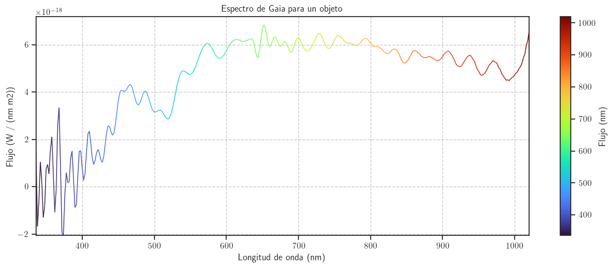

## Resumen

En este trabajo proponemos un enfoque innovador para mejorar la calidad de las señales astronómicas en las longitudes de onda del Espectro Azul y Rojo (BS/RS) del satélite Gaia. Al entrenar un modelo a partir de la gran cantidad de datos de baja resolución recopilados por la misión Gaia y cruzarlas con las observaciones terrestres de alta resolución, se esperan encontrar patrones ocultos que puedan aplicarse a los datos de baja resolución para aproximar los de alta resolución. Para evaluar este método se usan varios subconjuntos del conjunto de datos original y se comparan con las observaciones reales de fuentes de alta resolución terrestres.

## Abstract

In this paper we propose an innovative approach to improve the quality of astronomical signals in the Blue and Red Spectrum wavelengths (BS/RS) provided by Gaia satelite. By training a model from the huge amount of low resolution data collected by the Gaia mission and the cross matched best high resolution ground based observations we expect to find hidden patterns that can be applied to allow the usage of these low resolution spectrum as proxy for high resolution ones. We evaluate our method on several benchmark subsets of the original dataset by comparing it with the real observations from high resolution sources.

## Introducción
 
 <!--
Ver figura @fig-ejemplo.

{#fig-ejemplo}
-->
En diciembre de 2013 comenzó la misión GAIA [@Gaia_DR3_Documentation_2023] con el objetivo de crear un mapa que permita conocer más detalles del Sistema Solar y la Vía Láctea. Esta misión es considerada la sucesora de Hipparcos dentro de ESA, siendo este el primer satélite dedicado a la astrometría. Dicha misión fue puesta en marcha en el 1989 y finalizó en el 1993. Los datos que Gaia aporta son 200 veces más precisos que los obtenidos por dicho satélite, pero aun así, de menor calidad que los obtenidos por otros proyectos actuales [@ESA_Gaia_Overview].  

La propia agencia ESA describe en el reporte publicado en 2013 donde explicaban detalles de la misión de Gaia [@ESA_Gaia_BR296_2013] que antes de estudiar un objeto celeste, es necesario poder ubicarlo en el plano, de lo contrario solo tendrían un conjunto de datos sin sentido pertenecientes a un mismo conjunto, pero sin un orden o punto de referencia, en sus propias palabras, describen lo siguiente: 

>"Antes de que los astrónomos puedan estudiar un objeto celeste, deben saber dónde encontrarlo. Sin este conocimiento, los astrónomos vagarían en vano en lo que Galileo alguna vez llamó un oscuro laberinto"
 

Por este motivo, la misión principal de Gaia se puede considerar muy útil para continuar desarrollando estudios y conocimientos acerca del universo.  

Más allá de este objetivo, Gaia ha podido aportar descubrimientos de objetos celestes que anteriormente no conocíamos.
Esta misión ha proporcionado uno de los catálogos más extensos y precisos hasta la fecha [[@Gaia_DR3_Summary_2023]], no solo aportando datos astrométricos, sino que también fotométricos y espectrofotométricos. 

Otras misiones, como ahora la iniciada en el año 2000 con *Sloan Digital Sky Survey* (*SDSS*), son capaces de proporcionar mediciones con mayor resolución que Gaia, pero con un alcance menor [@DR13sdss].
De este hecho parte la idea del trabajo que se desarrolla a continuación.

Si se pudiese definir una similitud entre los espectros obtenidos por Gaia y SDSS, conseguiríamos combinar lo mejor de ambos proyectos, el rango espacial que Gaia ha sido capaz de conseguir junto al la calidad y detalle que SDSS conlleva. 
En este contexto, gracias a los avances constantes de la inteligencia artificial, en este trabajo proponemos explorar técnicas que nos permitan llevar a cabo este objetivo; convertir espectros de Gaia en su equivalente SDSS y viceversa.

### Motivación

A lo largo de 2026 se publicarán los últimos datos recolectados por Gaia en un último DR4 y catálogo final DR5. Se calcula que a lo largo de la misión, unos 2 billiones de estrellas y otros objetos celestes fueron captados por el satélite. 
Gracias a los datos recolectados, ha permitido disponer de una imagen reconstruida sobre cómo un observador vería nuestra galaxia desde el exterior de esta[@Gaia_DR3_Summary_2023]. Esta hazaña se ha conseguido a base de un set de datos, donde la información del cuerpo celeste parte fundamentalmente de dos espectros de baja resolución. 
La espectroscopía es una de las herramientas principales de la astrofísica para extraer información acerca de los cuerpos astronómicos. Gracias a la distribución de la luz en función de la longitud de onda, se pueden conocer detalles clave acerca de los elementos estudiados, como por ejemplo su composición, la temperatura y la gravedad superficial. 

A diferencia de Gaia, otros proyectos astronómicos como SDSS presentan una resolución mayor en sus espectrometrías, pero se han visto limitados por su ubicación, dado que SDSS depende de dos telescopios situados en el Observatorio Apache Point de Nuevo México y en el de Las Campanas de Carnegie en Chile [@DR13sdss].

La motivación de este trabajo parte de explorar si técnicas de aprendizaje automático pueden aprender a relacionar la gran cantidad de datos captados por Gaia y los espectros de mayor calidad de SDSS. Si se modela la relación entre ambos datos, se conseguiría mejorar la información obtenida a partir de los datos recolectados por Gaia. 

<!--
Misiones anteriores a Gaia de la ESA:
- Hipparcos: lanzado en 1989, primer satélite dedicado a la astrometría. Primer release de datos en 1997 continene posiciones, distancias y movimientos de casi 120 000 estrellas, datos 200 veces mas precisos que cualquier medida anterior. Mas adelante se volvió a analizar y se obtuvo un catálogo con casi 2,5 millones de estrellas pero menos preciso. @ESA_Gaia_BR296_2013
-->

### Planteamiento del trabajo
El objetivo principal del trabajo que se desarrolla a continuación es diseñar un modelo basado en redes neuronales que consiga convertir espectros Gaia en SDSS y/o viceversa. De esta forma conseguiríamos encontrar un modelo que relacione los datos captados por ambos proyectos.

Para llevarlo a cabo, primero debemos entender las características de ambas fuentes de información, dado que los datos que usaremos deben estar correlacionados entre ambos conjuntos de datos. 
En concreto nos centraremos en la publicación de datos número 3 de Gaia [@Gaia_DR3_Summary_2023] y la treceaba de Sloan [@DR13sdss], debido a que estos son los que en el DR3 de Gaia ya encontramos semi comparados, o por lo menos las asociaciones de vecindad hechas.
Para ser exactos, trataremos de relacionar los espectros de baja resolución XP de Gaia DR3 (constituidos por los espectros azul y rojo) y los espectros ópticos de SDSS DR13.

Para realizar este trabajo seleccionamos el conjunto de datos de Gaia como base de estudio por diferentes motivos, por un lado, estas observaciones son parte de un estudio actual y al mismo tiempo la forma de acceder a los datos es relativamente sencilla, pero por otro, es muy destacable la gran cantidad de información y cuerpos observados de Gaia dispone. Esto nos permite tener una buena base para tratar de sacar comparaciones con otros satélites.

### Estructura del trabajo

La estructura propuesta para este trabajo es la siguiente:
- Sección 1: Introducción.

- Sección 2: 

- Sección 3:

<!-- Para llegar al objetivo descrito anteriormente, primero será necesario recopilar los datos de ambas fuentes, para así hacer un *Cross match* de los datos de SDSS y Gaia. De este proceso, sacaremos un data set con el catálogo de estrellas que han sido observadas por ambos instrumentos y de las cuales podemos analizar de forma paralela sus datos o espectros, para ser más precisos.
Una vez tengamos identificados los datos con los que se trabajará, analizaremos la relación señal-ruido que se obtiene en ambos sets de datos. 
A continuación, preprocesaremos los datos con el objetivo de poder tratarlos por igual y descartar todas las anomalías que puedan estropear el comportamiento de futuros modelos.

A partir de estos datos procesados, entrenaremos diversos modelos de inteligencia artificial con el objetivo de que aprendan la relación existente entre ambos tipos de espectro. Es decir, que aprendan la relación entre los datos de Gaia y los de Sloan.
A partir de aquí sacaremos conclusiones sobre la aplicabilidad y la calidad de los resultados obtenidos. -->

## Contexto y estado del arte

En esta sección se dará un contexto al problema anteriormente descrito, comenzando desde la base del conocimiento necesario para entender los datos, hasta las técnicas que se usarán para el desarrollo del modelo de aprendizaje automático. 

Por otro lado, también exploraremos trabajos ya publicados que contengan estudios de alta utilidad para el presente. 

### Contexto del problema
<!-- Para poder desarollar este trabajo, necesitamos comprender términos clave para analizar los datos. El primero es el *Paralaje*. Este término es necesario para comprender como conseguimos situar cuerpos estelares en el plano estelar. La Tierra orbita alrededor del Sol provocando que se recojan diferentes observaciones del mismo cuerpo estelar.

Buscar definición exacta de paralaje

Todos estos datos se basan en mediciones de espectros de baja resolución como lo son los BP/RP (*Blue Photometer / Red Photometer*), a los cuales denominaremos a lo largo del trabajo como BS/RS (*Blue Spectrum / Red Spectrum*).  

 A partir de aquí todo menos lo que se indique explicitamente viene de aquí Gaia_DR3_Documentation_2023 -->
Para el desarrollo de este trabajo, necesitamos comprender términos clave para analizar los datos. A continuación nos centraremos en los espectros estelares, su interpretación y como se obtienen de las bases de datos de cada satélite. 

#### Espectros estelares
Podemos definir un espectro estelar como la función que relaciona el flujo captado de una estrella en función de la longitud de onda. Gracias a dicha función, se obtiene la distribución de la energía que emite el cuerpo celeste según el rango óptico dado, lo que permite estudiar ciertas características del cuerpo. Por ejemplo, si nos centramos en los picos del gráfico resultante de su representación, se puede analizar la composición del cuerpo o metalicidad, dado que cada elemento emite o absorbe luz en diferentes rangos, de este dato también se puede estudiar la temperatura en la que se encuentra dicho elemento. 
Por otro lado, si nos centramos en la anchura de las líneas, hablaríamos de datos como la gravedad superficial.

Hay estudios existentes que desarrollan la conexión entre los espectros y las variables anteriormente mencionadas, por ejemplo Young Sun Lee et all [@lee2008segue] trataron los datos de SDSS en su publicación de datos número 6 para tratar de crear herramientas automatizadas que estableciesen dicha relación. 

Paralelamente, en la unidad de control número 8 de Gaia se trata de establecer la misma relación, como se puede observar en el trabajo llevado a cabo por Witten et all [@witten2023bprp], identificaron el ratio de composición metálica de las estrellas observadas. 

En los siguientes apartados observaremos gráficas espectrales de Gaia y SDSS.

#### Datos espectrales de Gaia

Comenzaremos con una descripción detallada acerca de como los datos de Gaia son recogidos y tratados, basándonos en la descripción dada en el paper de su tercera publicación de datos @Gaia_DR3_Summary_2023.  

El satélite Gaia consta de 3 instrumentos para detectar la luz que recogen los telescopios del satélite. El primero, conocido como astrómetro, mide las posiciones estelares en el cielo, el espectómetro medirá las velocidades radiales (RVS) y, por último, el instrumento fotométrico aportará dos espectros de baja resolución de dos bandas ópticas, la azul y la roja. Cabe destacar que, debido al movimiento rotativo de Gaia, se toman unas 70 mediciones fotométricas de cada cuerpo celeste. Estos espectros son preprocesados y tratados por diferentes unidades de coordinación antes de formar parte del set de datos que nosotros usaremos en este trabajo, por lo que el ruido de fondo ya habrá sido reducido significativamente.

El satélite en cuestión se encuentra en una posición espacial conocida como L2, ubicada a 1,5 millones de kilómetros de la Tierra y donde las fuerzas gravitacionales del Sol, la Tierra y la Luna están en equilibrio. Por otro lado, el satélite, el Sol y la Tierra siempre van a permanecer alineados, impidiendo así que ninguno de los cuerpos celestes mencionados se interponga en el campo de visión de Gaia. 

La espectrofotometría en la que nos basaremos durante el desarrollo de este trabajo es la BP/RP, también denominada Espectro XP, como hemos comentado, estos datos proceden del *Blue Photometer* y *Red Photometer*, lo que permite cubrir entre los 330 y 680 nm gracias al espectro azul y de los 640 a 1050 nm gracias al rojo [@zhang2023parameters]. Estos datos se representan por aproximadamente 110 elementos efectivos de resolución, con un poder de solución variable según la longitud de onda de aproximadamente R $\sim$ 50 - 160. 
Este detalle conlleva que en la publicación de datos número 3 de Gaia no obtengamos directamente una tabla de relación flujo - longitud de onda, sino que los espectros vienen dados con coeficientes que deben transformarse con librerías como *GaiaXPy* [@deangeli2022gaiabprp].

#### Datos espectrales de SDSS
En contraposición a Gaia, este trabajo también usará y analizará datos conseguidos gracias a SDSS, proyecto iniciado con el mismo objetivo que Gaia, crear un mapa tridimensional. En este caso, el mapa actual creado gracias a este satélite contiene más de 930 000 galaxias.

La primera operación bajo el nombre SDSS comenzó en el año 2000, y sigue activo con su quinta fase SDSS-V, que tiene planteado llegar a su fin en 2027 [@sdsscollaboration2025nineteenthdatareleasesloan].

Aunque la última publicación de datos de SDSS sea la número 19 [@sdsscollaboration2025nineteenthdatareleasesloan], tal y como hemos comentado anteriormente, dado que el análisis de cruce de datos de Gaia DR3 se ha llevado a cabo con el DR13 de SDSS. Esto nos permite conocer qué objetos han sido observados por ambos satélites, por lo que durante el entrenamiento del modelo se usará la base de datos del DR13 [@DR13sdss], los cuales fueron recolectados por la cuarta fase del proyecto.

A diferencia de Gaia, SDSS proporciona directamente espectros ópticos en longitud de onda y flujo, distribuidos a lo largo de archivos FITS. Dentro de estos se pueden encontrar variables como por ejemplo la longitud de onda(expresada dentro de la variable *loglam*, pero teniendo que adaptarla, dado que longitud de onda $\lambda$ = $10^ {loglam}$) y el flujo espectral (*flux*). 

Dentro del proyecto de SDSS, el programa MaNGA (*Mapping Nearby Galaxies at Apache Point Observatory*) se encarga de procesar los datos con tal de crear el mapa estelar, en su *paper* original para SDSS-IV [@manga2015] encontramos que el rango espectral aproximado de SDSS se mantiene entre los 360 y 1030 nm y su resolución se encuentra en R $\sim$ 2000.

#### Comparativa de los espectros de Gaia y SDSS
Gaia y SDSS comparten gran parte de su rango óptico pero con datos captados con estrategias e instrumentos diferentes. Esto se enfatiza cuando comparamos los espectros captados por ambos satélites acerca del mismo cuerpo celeste. A continuación observamos un ejemplo aleatorio:
{#fig_gaia_1}
{#fig_sloan_1}

Podemos observar como claramente el intervalo que SDSS observa es muy similar a Gaia, pero existe una gran diferencia en cuanto a la suavidad de las curvas representadas. Como vemos, SDSS incluye muchos más detalles que Gaia, su espectro tiene una calidad superior. 
Por otro lado, si nos fijamos en los datos captados en los extremos de visión de Gaia, notamos la posibilidad de que en rangos inferiores a 400 nm estemos observando artefactos u obteniendo mediciones muy poco precisas.

A lo largo del trabajo, para garantizar que los datos analizados correspondan al mismo objeto astronómico, se empleará la tabla de cruce oficial de DR3 denominada *gaiadr3.sdssdr13_best_neighbour*. Esta tabla contiene para cada cuerpo observado por Gaia, el vecino del DR13 de SDSS más cercano, es decir, el que cuenta con una mayor probabilidad de que estén describiendo el mismo cuerpo celeste. El procedimiento con el cual se establece esta vecindad se encuentra en el trabajo realizado por Torra et All [@gaia2021edr3]. Dentro de este conjunto, definiremos un umbral de aceptación dado por la distancia angular. <!-- Habría que poner aquí el valor que usaremos -->

### Estado del arte

En los últimos años, la astronomía se ha beneficiado de las técnicas de aprendizaje automático, principalmente en tareas tradicionales como clasificación y agrupamiento. Por ejemplo, @djorgovski2022applications señalan que "una amplia variedad de métodos de clasificación y agrupamiento se ha aplicado a estas tareas, y sigue siendo un área de investigación muy activa". En efecto, muchos esfuerzos han estado enfocados en reconocer tipos de estrellas o galaxias, identificar eventos transitorios, y diferenciar estrellas de galaxias, aprovechando catálogos masivos con miles de características. Estos enfoques basados en aprendizaje automático clásico han permitido lidiar con el flujo de datos de observaciones astronómicas mediante el uso de la clasificación supervisada o el agrupamiento no supervisado.

#### Modelos generativos en Astronomía

Paralelamente, ha crecido el interés en generar datos astronómicos sintéticos mediante modelos generativos. En particular, las _Generative Adversarial Networks_ (GANs) se han aplicado con éxito en algunos contextos. Por ejemplo, @garcia2022improving propusieron un método de *data augmentation* basado en GANs para generar curvas de luz sintéticas de estrellas variables
y mostraron cómo su modelo GAN logra producir variaciones realistas de luminosidad, mejorando significativamente la precisión que alcanza la clasificación cuando se entrena con estos datos sintéticos adicionales. Esto ejemplifica cómo las GANs pueden crear nuevos ejemplos de baja complejidad (en este caso series temporales) para compensar la escasez de datos etiquetados.

Asimismo, dada la enorme base de datos espectrales de baja resolución de la misión Gaia (más de 220 millones de espectros BP/RP en Gaia DR3), se han desarrollado modelos generativos específicos para estos datos. Laroche & Speagle (2025) introdujeron un autoencoder variacional generativo no supervisado que aprende directamente de los espectros Gaia sin necesidad de etiquetas estelares [@laroche2025closing]. Su modelo reproduce los espectros BP/RP y detecta patrones en áreas donde el aprendizaje supervisado falla debido a la falta de referencias. De hecho, antes de este trabajo la única aproximación generativa para los espectros Gaia era supervisada y basada en un conjunto reducido de estrellas cruzadas con observaciones terrestres (LAMOST) [@zhang2023parameters]. Estos desarrollos recientes demuestran que los modelos generativos pueden explorar el conjunto masivo de datos Gaia para *aproximar* datos de mayor resolución. 

#### Aprendizaje profundo en Astrofísica

A pesar de estos avances, el uso de redes neuronales profundas en astronomía sigue siendo relativamente reciente y sujeto a debate. @ting2025deep destaca que, aunque estas técnicas ofrecen *perspectivas diversas* y capacidades de modelar relaciones complejas, todavía enfrentan retos importantes. Según Ting, la astronomía ha entrado en una era de datos sin precedentes, lo que ha impulsado a muchos investigadores a adoptar métodos de aprendizaje profundo para procesar observaciones modernas. Sin embargo, las reacciones varían: algunos científicos ven estas redes profundas como herramientas transformadoras, mientras que otros se muestran escépticos sobre sus verdaderas ventajas. En este contexto, se advierte que aunque las arquitecturas neuronales pueden incorporar sesgos físicos (simetrías, leyes de conservación) en su diseño para generalizar mejor, sigue siendo necesario evaluar cuidadosamente sus resultados. En resumen, el aprendizaje profundo en astrofísica está emergiendo como una vía prometedora que aún se encuentra en una fase exploratoria y que requiere una validación rigurosa antes de tener una aceptación generalizada en este dominio. 

El ejemplo más cercano al enfoque propuesto en este trabajo lo encontramos en un trabajo muy reciente de @haghjoo2026learning. En dicha propuesta, se usaron datos del *James Web Space Telescope (JWST)* emparejando las observaciones de los instrumentos de baja resolución con los de alta resolución mediante un modelo generativo. Dicho modelo aprendió a realzar características espectrales débiles (como líneas de emisión solapadas) que originalmente estaban fuera del alcance de la baja resolución. Aunque este ejemplo proviene de observaciones en el infrarrojo cercano, ilustra la factibilidad de entrenar redes con datos emparejados (baja vs. alta resolución) para recuperar detalles perdidos. De manera similar, el presente trabajo propone utilizar pares de espectros Gaia (baja resolución) y observaciones terrestres de alta resolución, buscando descubrir patrones ocultos que permitan aproximar los espectros Gaia a la alta resolución. Como se ha comentado, este tipo de enfoque es relativamente novedoso y es muy interesante explorar su potencial.

<!-- IMPORTANTE ya se han comparado datos fotométricos con los de otros sistemas 

JC: En este caso se tratan de filtros de mejora deterministas  y de calibración, no de modelos generativos. Lo dejo de momento por si puede ser útil mencionarlo, aunque quizá en otra sección.

https://gea.esac.esa.int/archive/documentation/GDR3/Data_processing/chap_cu5pho/cu5pho_sec_photSystem/cu5pho_ssec_photRelations.html

https://gea.esac.esa.int/archive/documentation/GDR3/Data_processing/chap_cu5pho/cu5pho_sec_spss/

-->
### Conclusiones

La integración y estandarización de catálogos astronómicos masivos representa un desafío técnico fundamental, especialmente al trabajar con fuentes de naturalezas distintas como Gaia y SDSS (Sloan). Mientras que Gaia provee un volumen de datos astrométricos, fotométricos y espectroscópicos sin precedentes, sus espectros operan en bajas resoluciones y requieren complejos procesos de calibración para mitigar el ruido espacial y las fluctuaciones. En contraste, Sloan aporta espectros ópticos de mayor resolución. La necesidad de interconectar ambas misiones define el núcleo de este estudio: establecer una relación sólida capaz de traducir y equiparar los espectros de baja resolución de Gaia con los datos de alta fidelidad de SDSS.

Para abordar este asunto, el análisis del estado del arte evidencia una transición desde el uso de estas herramientas únicamente para clasificación o agrupamiento clásico hacia el uso las GANs y autoencoders variacionales que recientemente han demostrado su utilidad para la generación de datos sintéticos realistas y se establecen ya como herramientas útiles para la calibración y otras áreas relevantes en el estudio astronómico.

Avanzando aún más allá, el éxito reciente en la mejora de resolución de datos del telescopio JWST mediante modelos generativos muestra que la aplicación de estas técnicas representa una solución viable que puede ser también aplicada en el contexto del catálogo astronómico que ofrece Gaia.  

El propósito de la propuesta planteada en este documento es profundizar en la aplicación de estas técnicas novedosas ofreciendo soluciones útiles que aporten mejoras tangibles en el ámbito de la astronomía, específicamente para la mejora de las señales contenidas en el amplio catálogo que Gaia nos ofrece.

## Objetivos concretos y metodología de trabajo
A continuación desarrollaremos el objetivo a desarrollar durante este trabajo.

### Objetivo general
El objetivo general de este trabajo consiste en desarrollar un modelo basado en aprendizaje automático que permita relacionar los coeficientes *XP_Continuous* del DR3 de Gaia y el espectro resultante de SDSS en su DR13. 

### Objetivos específicos
Si nos centramos en los objetivos descritos paso a paso, el trabajo se desarrollará en la dirección comentada a continuación.

#### Creación de la base de datos
En primer lugar, deberemos construir una base de datos robusta y suficiente para el entrenamiento. Para conseguirla, se llevarán a cabo los siguientes pasos:

1. A partir de Gaia DR3, obtendremos los mejores cruces de datos con SDSS DR13. De aquí sacaremos una lista de números de identificación de los cuerpos dentro de la base de datos de Gaia y el identificador externo, en este caso para SDSS.
1. A partir de la lista de id de SDSS obtenidos en el paso anterior, cruzaremos con el DR13 de SDSS para encontrar aquellos que disponen de las tres variables necesarias para sacar el espectro de los archivos FITS, en este caso son necesarias las variables *plate*, *mjd* y *fiberID*.
1. Con la función *get_spectra* y las variables mencionadas en el punto anterior, obtendremos los espectros de los cuerpos a estudiar.
1. Una vez ya tenemos identificados que objetos si tienen disponible el espectro de SDSS, descargaremos los datos correspondientes para Gaia. 
1. Para conseguir los coeficientes anteriormente mencionados de Gaia, accederemos a *gaiadr3.xp_continuous_mean_spectrum* y guardaremos las variables *bp_coefficients* y *rp_coefficients*. 
1. De estos datos, crearemos una base de datos con las variables de entrada y objetivo. 

Cabe destacar que este procedimiento deberá llevarse a cabo por lotes, dado que la base de datos de SDSS está limitada, y no permite una petición de datos masiva.

#### Entrenamiento del modelo
El siguiente paso será la creación del modelo de aprendizaje automático y su entreno.

#### Validación del modelo

### Metodología de trabajo

## Identificación de requisitos

## Descripción de la herramienta software desarrollada

## Evaluación

## Conclusiones y trabajo futuro

### Conclusiones

### Trabajo futuro